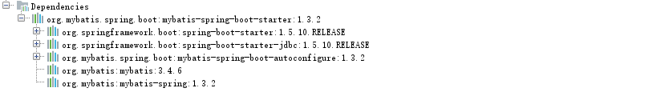
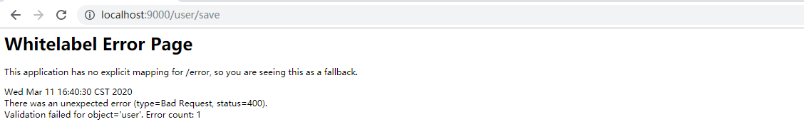
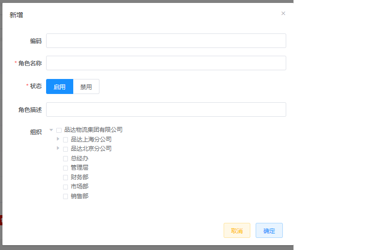
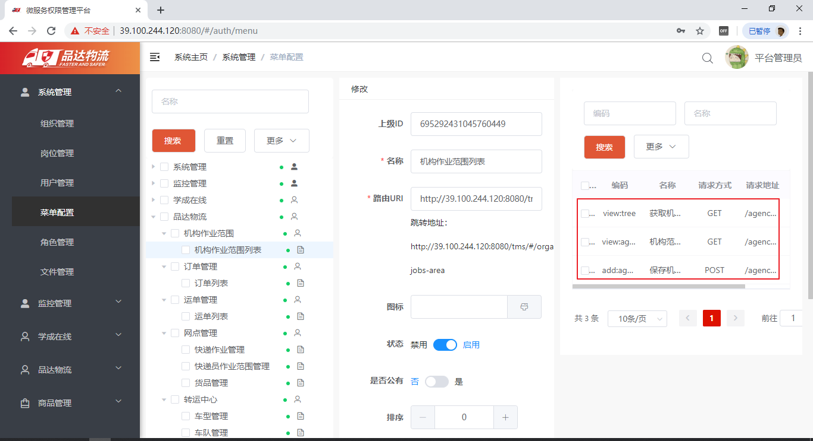

# 品达通用权限系统

## 1. 项目概述

### 1.1 项目介绍

对于企业中的项目绝大多数都需要进行用户权限管理、认证、鉴权、加密、解密、XSS防跨站攻击等。这些功能整体实现思路基本一致，但是大部分项目都需要实现一次，这无形中就形成了巨大的资源浪费。本项目就是针对这个问题，提供了一套通用的权限解决方案----品达通用权限系统。

品达通用权限系统基于SpringCloud(Hoxton.SR1)  +SpringBoot(2.2.2.RELEASE) 的微服务框架，具备通用的用户管理、资源权限管理、网关统一鉴权、XSS防跨站攻击等多个模块，支持多业务系统并行开发，支持多服务并行开发，可以作为后端服务的开发脚手架。核心技术采用SpringBoot、Zuul、Nacos、Fegin、Ribbon、Hystrix、JWT Token、Mybatis Plus等主要框架和中间件。

本项目具有两个主要功能特性：

- 用户权限管理

  具有用户、部门、岗位、角色、菜单管理，并通过网关进行统一的权限认证

- 微服务开发框架

  本项目同时也是一个微服务开发框架，集成了基础的公共组件，包括数据库、缓存、日志、表单验证、对象转换、防注入和接口文档管理等工具。

### 1.2 业务架构

### 1.3 技术架构

### 1.4 环境要求

- JDK ： 1.8 + 

- Maven： 3.3 + 

  http://maven.apache.org/download.cgi

- Mysql： 5.6.0 + 

  https://downloads.mysql.com/archives/community

- Redis： 4.0 + 

  https://redis.io/download

- Nacos： 1.1.4

  https://github.com/alibaba/nacos/releases

- Node： 11.3+（集成npm）

  https://nodejs.org/en/download

## 2. Spring Boot starter

我们知道Spring Boot大大简化了项目初始搭建以及开发过程，而这些都是通过Spring Boot提供的starter来完成的。品达通用权限系统就是基于Spring Boot进行开发，而且一些基础模块其本质就是starter，所以我们需要对Spring Boot的starter有一个全面深入的了解，这是我们开发品达通用权限系统的必备知识。

### 2.1 starter介绍

spring boot 在配置上相比spring要简单许多, 其核心在于spring-boot-starter, 在使用spring boot来搭建一个项目时, 只需要引入官方提供的starter, 就可以直接使用, 免去了各种配置。starter简单来讲就是引入了一些相关依赖和一些初始化的配置。

Spring官方提供了很多starter，第三方也可以定义starter。为了加以区分，starter从名称上进行了如下规范：

- [ ] Spring官方提供的starter名称为：spring-boot-starter-xxx

  例如Spring官方提供的spring-boot-starter-web

- [ ] 第三方提供的starter名称为：xxx-spring-boot-starter

  例如由mybatis提供的mybatis-spring-boot-starter

### 2.2 starter原理

Spring Boot之所以能够帮我们简化项目的搭建和开发过程，主要是基于它提供的起步依赖和自动配置。

#### 2.2.1 起步依赖

起步依赖，其实就是将具备某种功能的坐标打包到一起，可以简化依赖导入的过程。例如，我们导入spring-boot-starter-web这个starter，则和web开发相关的jar包都一起导入到项目中了。如下图所示：

#### 2.2.2 自动配置

自动配置，就是无须手动配置xml，自动配置并管理bean，可以简化开发过程。那么Spring Boot是如何完成自动配置的呢？

自动配置涉及到如下几个关键步骤：

- [ ] 基于Java代码的Bean配置
- [ ] 自动配置条件依赖
- [ ] Bean参数获取
- [ ] Bean的发现
- [ ] Bean的加载

我们可以通过一个实际的例子mybatis-spring-boot-starter来说明自动配置的实现过程。

##### 2.2.2.1 基于Java代码的Bean配置

当我们在项目中导入了mybatis-spring-boot-starter这个jar后，可以看到它包括了很多相关的jar包，如下图：

其中在mybatis-spring-boot-autoconfigure这个jar包中有如下一个**MybatisAutoConfiguration**自动配置类：

打开这个类，截取的关键代码如下：

**@Configuration**和**@Bean**这两个注解一起使用就可以创建一个基于java代码的配置类，可以用来替代传统的xml配置文件。

**@Configuration** 注解的类可以看作是能生产让Spring IoC容器管理的Bean实例的工厂。

**@Bean** 注解的方法返回的对象可以被注册到spring容器中。

所以上面的**MybatisAutoConfiguration**这个类，自动帮我们生成了SqlSessionFactory和SqlSessionTemplate这些Mybatis的重要实例并交给spring容器管理，从而完成bean的自动注册。

##### 2.2.2.2 自动配置条件依赖

从**MybatisAutoConfiguration**这个类中使用的注解可以看出，要完成自动配置是有依赖条件的。

所以要完成Mybatis的自动配置，需要在类路径中存在SqlSessionFactory.class、SqlSessionFactoryBean.class这两个类，同时需要存在DataSource这个bean且这个bean完成自动注册。

这些注解是spring boot特有的，常见的条件依赖注解有：

| 注解                            | 功能说明                                             |
| ------------------------------- | ---------------------------------------------------- |
| @ConditionalOnBean              | 仅在当前上下文中存在某个bean时，才会实例化这个Bean   |
| @ConditionalOnClass             | 某个class位于类路径上，才会实例化这个Bean            |
| @ConditionalOnExpression        | 当表达式为true的时候，才会实例化这个Bean             |
| @ConditionalOnMissingBean       | 仅在当前上下文中不存在某个bean时，才会实例化这个Bean |
| @ConditionalOnMissingClass      | 某个class在类路径上不存在的时候，才会实例化这个Bean  |
| @ConditionalOnNotWebApplication | 不是web应用时才会实例化这个Bean                      |
| @AutoConfigureAfter             | 在某个bean完成自动配置后实例化这个bean               |
| @AutoConfigureBefore            | 在某个bean完成自动配置前实例化这个bean               |

##### 2.2.2.3 Bean参数获取

要完成mybatis的自动配置，需要我们在配置文件中提供数据源相关的配置参数，例如数据库驱动、连接url、数据库用户名、密码等。那么spring boot是如何读取yml或者properites配置文件的的属性来创建数据源对象的？

在我们导入mybatis-spring-boot-starter这个jar包后会传递过来一个spring-boot-autoconfigure包，在这个包中有一个自动配置类**DataSourceAutoConfiguration**，如下所示：

我们可以看到这个类上加入了**EnableConfigurationProperties**这个注解，继续跟踪源码到**DataSourceProperties**这个类，如下：

可以看到这个类上加入了**ConfigurationProperties**注解，这个注解的作用就是把yml或者properties配置文件中的配置参数信息封装到**ConfigurationProperties**注解标注的bean(即**DataSourceProperties**)的相应属性上。

@**EnableConfigurationProperties**注解的作用是使@**ConfigurationProperties**注解生效。

#####  2.2.2.4 Bean的发现

spring boot默认扫描启动类所在的包下的主类与子类的所有组件，但并没有包括依赖包中的类，那么依赖包中的bean是如何被发现和加载的？

我们需要从Spring Boot项目的启动类开始跟踪，在启动类上我们一般会加入SpringBootApplication注解，此注解的源码如下：

重点介绍如下三个注解：

**SpringBootConfiguration**：作用就相当于**Configuration**注解，被注解的类将成为一个bean配置类

**ComponentScan**：作用就是自动扫描并加载符合条件的组件，最终将这些bean加载到spring容器中

**EnableAutoConfiguration** ：这个注解很重要，借助@**Import**的支持，收集和注册依赖包中相关的bean定义

继续跟踪**EnableAutoConfiguration**注解源码：

@**EnableAutoConfiguration**注解引入了@**Import**这个注解。

**Import**：导入需要自动配置的组件，此处为**EnableAutoConfigurationImportSelector**这个类

**EnableAutoConfigurationImportSelector**类源码如下：

**EnableAutoConfigurationImportSelector**继承了**AutoConfigurationImportSelector**类，继续跟踪**AutoConfigurationImportSelector**类源码：

**AutoConfigurationImportSelector**类的getCandidateConfigurations方法中的调用了SpringFactoriesLoader类的loadFactoryNames方法，继续跟踪源码：

**SpringFactoriesLoader**的**loadFactoryNames**静态方法可以从所有的jar包中读取META-INF/spring.factories文件，而自动配置的类就在这个文件中进行配置：

spring.factories文件内容如下：

这样Spring Boot就可以加载到**MybatisAutoConfiguration**这个配置类了。

##### 2.2.2.5 Bean的加载

在Spring Boot应用中要让一个普通类交给Spring容器管理，通常有以下方法：

1、使用 @Configuration与@Bean 注解

2、使用@Controller @Service @Repository @Component 注解标注该类并且启用@ComponentScan自动扫描

3、使用@Import 方法

其中Spring Boot实现自动配置使用的是@Import注解这种方式，AutoConfigurationImportSelector类的selectImports方法返回一组从META-INF/spring.factories文件中读取的bean的全类名，这样Spring Boot就可以加载到这些Bean并完成实例的创建工作。

#### 2.2.3 自动配置总结

我们可以将自动配置的关键几步以及相应的注解总结如下：

1、@Configuration与@Bean：基于Java代码的bean配置

2、@Conditional：设置自动配置条件依赖

3、@EnableConfigurationProperties与@ConfigurationProperties：读取配置文件转换为bean

4、@EnableAutoConfiguration与@Import：实现bean发现与加载

### 2.3 自定义starter

本小节我们通过自定义两个starter来加强starter的理解和应用。

#### 2.3.1 案例一

##### 2.3.1.1 开发starter

第一步：创建starter工程hello-spring-boot-starter并配置pom.xml文件

~~~xml
<?xml version="1.0" encoding="UTF-8"?>
<project xmlns="http://maven.apache.org/POM/4.0.0"
         xmlns:xsi="http://www.w3.org/2001/XMLSchema-instance"
         xsi:schemaLocation="http://maven.apache.org/POM/4.0.0 
                             http://maven.apache.org/xsd/maven-4.0.0.xsd">
    <modelVersion>4.0.0</modelVersion>
    <parent>
        <groupId>org.springframework.boot</groupId>
        <artifactId>spring-boot-starter-parent</artifactId>
        <version>2.2.2.RELEASE</version>
        <relativePath/>
    </parent>
    <groupId>cn.itcast</groupId>
    <artifactId>hello-spring-boot-starter</artifactId>
    <version>1.0-SNAPSHOT</version>
    <dependencies>
        <dependency>
            <groupId>org.springframework.boot</groupId>
            <artifactId>spring-boot-starter</artifactId>
        </dependency>
        <dependency>
            <groupId>org.springframework.boot</groupId>
            <artifactId>spring-boot-autoconfigure</artifactId>
        </dependency>
    </dependencies>
</project>
~~~

第二步：创建配置属性类HelloProperties

~~~java
package cn.itcast.config;

import org.springframework.boot.context.properties.ConfigurationProperties;

/*
 *读取配置文件转换为bean
 * */
@ConfigurationProperties(prefix = "hello")
public class HelloProperties {
    private String name;
    private String address;

    public String getName() {
        return name;
    }

    public void setName(String name) {
        this.name = name;
    }

    public String getAddress() {
        return address;
    }

    public void setAddress(String address) {
        this.address = address;
    }

    @Override
    public String toString() {
        return "HelloProperties{" +
                "name='" + name + '\'' +
                ", address='" + address + '\'' +
                '}';
    }
}
~~~

第三步：创建服务类HelloService

~~~java
package cn.itcast.service;

public class HelloService {
    private String name;
    private String address;

    public HelloService(String name, String address) {
        this.name = name;
        this.address = address;
    }

    public String sayHello(){
        return "你好！我的名字叫 " + name + "，我来自 " + address;
    }
}
~~~

第四步：创建自动配置类HelloServiceAutoConfiguration

~~~java
package cn.itcast.config;

import cn.itcast.service.HelloService;
import org.springframework.boot.autoconfigure.condition.ConditionalOnMissingBean;
import org.springframework.boot.context.properties.EnableConfigurationProperties;
import org.springframework.context.annotation.Bean;
import org.springframework.context.annotation.Configuration;

/*
* 配置类，基于Java代码的bean配置
* */

@Configuration
@EnableConfigurationProperties(HelloProperties.class)
public class HelloServiceAutoConfiguration {
    private HelloProperties helloProperties;

    //通过构造方法注入配置属性对象HelloProperties
    public HelloServiceAutoConfiguration(HelloProperties helloProperties) {
        this.helloProperties = helloProperties;
    }

    //实例化HelloService并载入Spring IoC容器
    @Bean
    @ConditionalOnMissingBean
    public HelloService helloService(){
        return new HelloService(helloProperties.getName(),helloProperties.getAddress());
    }
}
~~~

第五步：在resources目录下创建META-INF/spring.factories

~~~properties
org.springframework.boot.autoconfigure.EnableAutoConfiguration=\
cn.itcast.config.HelloServiceAutoConfiguration
~~~

至此starter已经开发完成了，可以将当前starter安装到本地maven仓库供其他应用来使用。

##### 2.3.1.2 使用starter

第一步：创建maven工程myapp并配置pom.xml文件

~~~xml
<?xml version="1.0" encoding="UTF-8"?>
<project xmlns="http://maven.apache.org/POM/4.0.0"
         xmlns:xsi="http://www.w3.org/2001/XMLSchema-instance"
         xsi:schemaLocation="http://maven.apache.org/POM/4.0.0 http://maven.apache.org/xsd/maven-4.0.0.xsd">
    <modelVersion>4.0.0</modelVersion>
    <parent>
        <groupId>org.springframework.boot</groupId>
        <artifactId>spring-boot-starter-parent</artifactId>
        <version>2.2.2.RELEASE</version>
        <relativePath/>
    </parent>
    <groupId>cn.itcast</groupId>
    <artifactId>myapp</artifactId>
    <version>1.0-SNAPSHOT</version>
    <dependencies>
        <dependency>
            <groupId>org.springframework.boot</groupId>
            <artifactId>spring-boot-starter-web</artifactId>
        </dependency>
        <!--导入自定义starter-->
        <dependency>
            <groupId>cn.itcast</groupId>
            <artifactId>hello-spring-boot-starter</artifactId>
            <version>1.0-SNAPSHOT</version>
        </dependency>
    </dependencies>
</project>
~~~

第二步：创建application.yml文件

~~~yaml
server:
  port: 8080
hello:
  name: xiaoming
  address: beijing
~~~

第三步：创建HelloController

~~~java
package cn.itcast.controller;

import cn.itcast.service.HelloService;
import org.springframework.beans.factory.annotation.Autowired;
import org.springframework.web.bind.annotation.GetMapping;
import org.springframework.web.bind.annotation.RequestMapping;
import org.springframework.web.bind.annotation.RestController;

@RestController
@RequestMapping("/hello")
public class HelloController {
    //HelloService在我们自定义的starter中已经完成了自动配置，所以此处可以直接注入
    @Autowired
    private HelloService helloService;

    @GetMapping("/say")
    public String sayHello(){
        return helloService.sayHello();
    }
}
~~~

第四步：创建启动类HelloApplication

~~~java
package cn.itcast;

import org.springframework.boot.SpringApplication;
import org.springframework.boot.autoconfigure.SpringBootApplication;

@SpringBootApplication
public class HelloApplication {
    public static void main(String[] args) {
        SpringApplication.run(HelloApplication.class,args);
    }
}
~~~

执行启动类main方法，访问地址http://localhost:8080/hello/say

#### 2.3.2 案例二

在前面的案例一中我们通过定义starter，自动配置了一个HelloService实例。本案例我们需要通过自动配置来创建一个拦截器对象，通过此拦截器对象来实现记录日志功能。

我们可以在案例一的基础上继续开发案例二。

##### 2.3.2.1 开发starter

第一步：在hello-spring-boot-starter的pom.xml文件中追加如下maven坐标

~~~xml
<dependency>
    <groupId>org.springframework.boot</groupId>
    <artifactId>spring-boot-starter-web</artifactId>
    <optional>true</optional>
</dependency>
<dependency>
    <groupId>org.springframework.boot</groupId>
    <artifactId>spring-boot-configuration-processor</artifactId>
</dependency>
~~~

第二步：自定义MyLog注解

~~~java
package cn.itcast.log;

import java.lang.annotation.ElementType;
import java.lang.annotation.Retention;
import java.lang.annotation.RetentionPolicy;
import java.lang.annotation.Target;

@Target(ElementType.METHOD)
@Retention(RetentionPolicy.RUNTIME)
public @interface MyLog {
    /**
     * 方法描述
     */
    String desc() default "";
}
~~~

第三步：自定义日志拦截器MyLogInterceptor

~~~java
package cn.itcast.log;

import org.springframework.web.method.HandlerMethod;
import org.springframework.web.servlet.ModelAndView;
import org.springframework.web.servlet.handler.HandlerInterceptorAdapter;
import javax.servlet.http.HttpServletRequest;
import javax.servlet.http.HttpServletResponse;
import java.lang.reflect.Method;

/**
 * 日志拦截器
 */
public class MyLogInterceptor extends HandlerInterceptorAdapter {
    private static final ThreadLocal<Long> startTimeThreadLocal = new ThreadLocal<>();

    public boolean preHandle(HttpServletRequest request, HttpServletResponse response, 
                             Object handler) throws Exception {
        HandlerMethod handlerMethod = (HandlerMethod)handler;
        Method method = handlerMethod.getMethod();//获得被拦截的方法对象
        MyLog myLog = method.getAnnotation(MyLog.class);//获得方法上的注解
        if(myLog != null){
            //方法上加了MyLog注解，需要进行日志记录
            long startTime = System.currentTimeMillis();
            startTimeThreadLocal.set(startTime);
        }
        return true;
    }

    public void postHandle(HttpServletRequest request, HttpServletResponse response, 
                           Object handler, ModelAndView modelAndView) throws Exception {
        HandlerMethod handlerMethod = (HandlerMethod)handler;
        Method method = handlerMethod.getMethod();//获得被拦截的方法对象
        MyLog myLog = method.getAnnotation(MyLog.class);//获得方法上的注解
        if(myLog != null){
            //方法上加了MyLog注解，需要进行日志记录
            long endTime = System.currentTimeMillis();
            Long startTime = startTimeThreadLocal.get();
            long optTime = endTime - startTime;

            String requestUri = request.getRequestURI();
            String methodName = method.getDeclaringClass().getName() + "." + 
                				method.getName();
            String methodDesc = myLog.desc();

            System.out.println("请求uri：" + requestUri);
            System.out.println("请求方法名：" + methodName);
            System.out.println("方法描述：" + methodDesc);
            System.out.println("方法执行时间：" + optTime + "ms");
        }
    }
}
~~~

第四步：创建自动配置类MyLogAutoConfiguration，用于自动配置拦截器、参数解析器等web组件

~~~java
package cn.itcast.config;

import cn.itcast.log.MyLogInterceptor;
import org.springframework.context.annotation.Configuration;
import org.springframework.web.servlet.config.annotation.InterceptorRegistry;
import org.springframework.web.servlet.config.annotation.WebMvcConfigurer;

/**
 * 配置类，用于自动配置拦截器、参数解析器等web组件
 */

@Configuration
public class MyLogAutoConfiguration implements WebMvcConfigurer{
    //注册自定义日志拦截器
    public void addInterceptors(InterceptorRegistry registry) {
        registry.addInterceptor(new MyLogInterceptor());
    }
}
~~~

第五步：在spring.factories中追加MyLogAutoConfiguration配置

~~~properties
org.springframework.boot.autoconfigure.EnableAutoConfiguration=\
cn.itcast.config.HelloServiceAutoConfiguration,\
cn.itcast.config.MyLogAutoConfiguration
~~~

注意：我们在hello-spring-boot-starter中追加了新的内容，需要重新打包安装到maven仓库。

##### 2.3.2.2 使用starter

在myapp工程的Controller方法上加入@MyLog注解

~~~java
package cn.itcast.controller;

import cn.itcast.log.MyLog;
import cn.itcast.service.HelloService;
import org.springframework.beans.factory.annotation.Autowired;
import org.springframework.web.bind.annotation.GetMapping;
import org.springframework.web.bind.annotation.RequestMapping;
import org.springframework.web.bind.annotation.RestController;

@RestController
@RequestMapping("/hello")
public class HelloController {
    //HelloService在我们自定义的starter中已经完成了自动配置，所以此处可以直接注入
    @Autowired
    private HelloService helloService;

    @MyLog(desc = "sayHello方法") //日志记录注解
    @GetMapping("/say")
    public String sayHello(){
        return helloService.sayHello();
    }
}
~~~

访问地址：http://localhost:8080/hello/say，查看控制台输出：

~~~makefile
请求uri：/hello/say
请求方法名：cn.itcast.controller.HelloController.sayHello
方法描述：sayHello方法
方法执行时间：36ms
~~~

## 3. lombok

### 3.1 lombok介绍

lombok是一个开源的代码生成库，能以简单的注解形式来简化Java类中的大量样板代码，提高开发人员的开发效率。例如开发中经常需要写的javabean，都需要花时间去添加相应的getter/setter，也许还要去写构造器、equals等方法，而且需要维护，当属性多时会出现大量的getter/setter方法，这些显得很冗长也没有太多技术含量。

lombok能通过注解的方式，在编译时自动为属性生成构造器、getter/setter、equals、hashcode、toString方法，使代码看起来更简洁。

lombok对应的maven坐标：

~~~xml
<dependency>
    <groupId>org.projectlombok</groupId>
    <artifactId>lombok</artifactId>
    <version>1.18.10</version>
</dependency>
~~~

### 3.2 安装lombok插件

要使用lombok需要在IDE中安装对应的lombok插件。本课程使用的开发工具为IntelliJ IDEA，安装插件过程如下：

1、打开IntelliJ IDEA后点击菜单栏中的File-->Settings进入到设置页面

2、点击设置页面中的Plugins进行插件的安装，在右侧选择Browse repositories...，然后在搜索页面输入lombok，可以查询到下方的Lombok Plugin，鼠标点击Lombok Plugin可在右侧看到Install按钮，点击该按钮便可安装

### 3.3 lombok常用注解

| 注解                     | 说明                                                         |
| ------------------------ | ------------------------------------------------------------ |
| @Setter                  | 注解在类或属性，注解在类时为所有属性生成setter方法，注解在属性上时只为该属性生成setter方法 |
| @Getter                  | 使用方法同@Setter，区别在于生成的是getter方法                |
| @ToString                | 注解在类，添加toString方法                                   |
| @EqualsAndHashCode       | 注解在类，生成hashCode和equals方法                           |
| @NoArgsConstructor       | 注解在类，生成无参的构造方法                                 |
| @RequiredArgsConstructor | 注解在类，为类中需要特殊处理的属性生成构造方法，比如final和被@NonNull注解的属性 |
| @AllArgsConstructor      | 注解在类，生成包含类中所有属性的构造方法                     |
| @Data                    | 注解在类，生成setter/getter、equals、canEqual、hashCode、toString方法，如为final属性，则不会为该属性生成setter方法 |
| @Slf4j                   | 注解在类，生成log变量，用于记录日志                          |
| @Builder                 | 将类转变为建造者模式                                         |

### 3.4 lombok入门案例

第一步：创建maven工程lombok_demo并配置pom.xml文件

~~~xml
<?xml version="1.0" encoding="UTF-8"?>
<project xmlns="http://maven.apache.org/POM/4.0.0"
         xmlns:xsi="http://www.w3.org/2001/XMLSchema-instance"
         xsi:schemaLocation="http://maven.apache.org/POM/4.0.0 http://maven.apache.org/xsd/maven-4.0.0.xsd">
    <modelVersion>4.0.0</modelVersion>
    <groupId>cn.itcast</groupId>
    <artifactId>lombok_demo</artifactId>
    <version>1.0-SNAPSHOT</version>
    <dependencies>
        <dependency>
            <groupId>org.projectlombok</groupId>
            <artifactId>lombok</artifactId>
            <version>1.18.10</version>
        </dependency>
    </dependencies>
</project>
~~~

第二步：创建User类并加入lombok提供的注解

~~~java
package cn.itcast.entity;

import lombok.*;

@Data
@Builder
@NoArgsConstructor
@AllArgsConstructor
public class User {
    private int id;
    private String name;
    private int age;
}
~~~

第三步：创建测试类TestLombok

~~~java
package cn.itcast;

import cn.itcast.entity.User;

public class TestLombok {
    public static void main(String[] args) {
        //无参构造方法
        User user1 = new User();

        /*
         setter方法
        */
        user1.setId(1);
        user1.setName("itcast");
        user1.setAge(18);

        /*
         getter方法
        */
        int id = user1.getId();
        String name = user1.getName();
        int age = user1.getAge();

        //带有所有参数的构造方法
        User user2 = new User(2,"itheima",20);

        //建造者模式
        User user3 = User.builder().id(3).name("boxuegu").age(22).build();

        /*
         toString方法
        */
        System.out.println(user1.toString());
        System.out.println(user2.toString());
        System.out.println(user3.toString());
    }
}
~~~

注：可以使用反编译工具查看生成的class文件内容

## 4. 项目搭建

### 4.1 导入初始工程

鉴于时间关系，我们不再手动创建工程，而是直接从课程资料中提供的初始工程pinda-authority导入即可。

导入步骤：

1、将初始工程pinda-authority复制到任意没有中文和空格的目录下

2、打开IDEA，选择Open，选择pinda-authority工程目录即可

导入的项目结构如下：

### 4.2 项目模块介绍

品达通用权限系统项目整体工程结构和模块功能如下：

~~~
pinda-authority              #聚合工程，用于聚合pd-parent、pd-apps、pd-tools等模块
├── pd-parent				 # 父工程，nacos配置及依赖包管理
├── pd-apps					 # 应用目录
	├── pd-auth				 # 权限服务父工程
		├── pd-auth-entity   # 权限实体
		├── pa-auth-server   # 权限服务
	├── pd-gateway			 # 网关服务
└── pd-tools				 # 工具工程
	├── pd-tools-common		 # 基础组件：基础配置类、函数、常量、统一异常处理、undertow服务器
	├── pd-tools-core		 # 核心组件：基础实体、返回对象、上下文、异常处理、分布式锁、函数、树
	├── pd-tools-databases	 # 数据源组件：数据源配置、数据权限、查询条件等
	├── pd-tools-dozer		 # 对象转换：dozer配置、工具
	├── pd-tools-j2cache	 # 缓存组件：j2cache、redis缓存
	├── pd-tools-jwt         # JWT组件：配置、属性、工具
	├── pd-tools-log	     # 日志组件：日志实体、事件、拦截器、工具
	├── pd-tools-swagger2	 # 文档组件：knife4j文档
	├── pd-tools-user        # 用户上下文：用户注解、模型和工具，当前登录用户信息注入模块
	├── pd-tools-validator	 # 表单验证： 后台表单规则验证
	├── pd-tools-xss		 # xss防注入组件
~~~

项目服务有两个：网关服务和权限服务：

| 应用           | 端口 | 说明     | 启动命令                       |
| -------------- | ---- | -------- | ------------------------------ |
| pd-gateway     | 8760 | 网关服务 | java -jar pd-gateway.jar &     |
| pd-auth-server | 8764 | 权限服务 | java -jar pd-auth-server.jar & |

由于本系统是基于当前非常流行的前后端分离开发方式开发，其中前端部分是由专门的前端开发人员负责，我们课程中直接使用即可。

### 4.3 服务注册和配置中心

本项目使用Nacos来作为服务的注册和配置中心。Nacos是阿里巴巴开源的一款支持服务注册与发现，配置管理以及微服务管理的组件。用来取代以前常用的注册中心（zookeeper , eureka等等），以及配置中心（spring cloud config等等）。Nacos是集成了注册中心和配置中心的功能，做到了二合一。

安装和配置过程如下：

第一步：下载Nacos安装包，地址https://github.com/alibaba/nacos/releases/download/1.1.4/nacos-server-1.1.4.zip

第二步：将下载的zip压缩文件解压

第三步：修改配置文件：NACOS_HOME/conf/application.properties

~~~properties
spring.datasource.platform=mysql
db.num=1
db.url.0=jdbc:mysql://127.0.0.1:3306/nacos?characterEncoding=utf8&connectTimeout=1000&socketTimeout=3000&autoReconnect=true
db.user=root
db.password=root
~~~

注意：Nacos在存储数据时既可以使用内置数据库存储，也可以通过第三方指定的数据库存储。我们上面指定了使用MySQL数据库来存储Nacos的相关数据，所以需要配置我们使用的MySQL数据库的数据源信息，这个可以根据自己的MySQL数据库进行相应调整，例如MySQL的地址、用户名、密码等。

第四步：创建数据库

~~~sql
CREATE DATABASE `nacos` CHARACTER SET utf8mb4 COLLATE utf8mb4_general_ci;
~~~

第五步：执行NACOS_HOME/conf/nacos-mysql.sql数据库脚本文件，完成后可以看到创建了如下表

第六步：启动Nacos服务，双击NACOS_HOME/bin/startup.cmd

第七步：访问Nacos控制台，地址http://localhost:8848/nacos，默认用户名/密码：nacos/nacos

第八步：新建命名空间pinda-dev，

**注意**，命名空间的id需要替换到项目文件**pd-parent/pom.xml**中对应的nacos命名空间的id：

第九步：导入配置文件，选择nacos配置中心的命名空间，点击导入配置按钮，选择文件：docs/nacos/nacos_config_export_2020-03-23 17_31_42.zip。导入完成后如下：

### 4.4 Redis

在项目开发阶段我们使用windows版的Redis，直接解压授课资料中redis-win32-win64.zip压缩文件，然后双击REDIS_HOME/64bit/redis-server.exe启动Redis服务即可使用。

### 4.5 开发方式介绍

通过前面导入的初始项目可以看到，pd-tools工程中的各个子模块已经完成了开发，这些子模块属于项目的基础组件，为我们后续开发网关服务和权限服务提供支持，而且有一些子模块在其他项目中也可以复用。由于这些子模块会涉及到一些新技术或者框架，所以本课程会先讲解这些新技术或者框架的使用方法，然后再带领大家通读pd-tools中的相关模块的代码实现，从而了解此模块的作用和开发过程。

本课程会按照如下顺序介绍pd-tools中的各个模块：

- [ ] pd-tools-swagger2	 # 文档组件：knife4j文档
- [ ] pd-tools-common		 # 基础组件：基础配置类、函数、常量、统一异常处理、undertow服务器
- [ ] pd-tools-core		 # 核心组件：基础实体、返回对象、上下文、异常处理、分布式锁、函数、树
- [ ] pd-tools-databases	 # 数据源组件：数据源配置、数据权限、查询条件等
- [ ] pd-tools-dozer		 # 对象转换：dozer配置、工具
- [ ] pd-tools-j2cache	 # 缓存组件：j2cache、redis缓存
- [ ] pd-tools-jwt         # JWT组件：配置、属性、工具
- [ ] pd-tools-log	     # 日志组件：日志实体、事件、拦截器、工具
- [ ] pd-tools-user        # 用户上下文：用户注解、模型和工具，当前登录用户信息注入模块
- [ ] pd-tools-validator	 # 表单验证： 后台表单规则验证
- [ ] pd-tools-xss		 # xss防注入组件

学习完这些模块之后就可以开发后面的网关服务和权限服务了。

## 5. pd-tools-swagger2

pd-tools-swagger2模块定位为文档组件，前后端开发人员可以查看接口文档，为前后端开发人员的开发统一接口，方便后续的前后端联调对接工作。

### 5.1 swagger介绍

相信无论是前端还是后端开发，都或多或少地被接口文档折磨过。前端经常抱怨后端给的接口文档与实际情况不一致。后端又觉得编写及维护接口文档会耗费不少精力，经常来不及更新。其实无论是前端调用后端，还是后端调用后端，都期望有一个好的接口文档。但是这个接口文档对于程序员来说，就跟注释一样，经常会抱怨别人写的代码没有写注释，然而自己写起代码起来，最讨厌的，也是写注释。所以仅仅只通过强制来规范大家是不够的，随着时间推移，版本迭代，接口文档往往很容易就跟不上代码了。

使用Swagger你只需要按照它的规范去定义接口及接口相关的信息。再通过Swagger衍生出来的一系列项目和工具，就可以做到生成各种格式的接口文档，生成多种语言的客户端和服务端的代码，以及在线接口调试页面等等。这样，如果按照新的开发模式，在开发新版本或者迭代版本的时候，只需要更新Swagger描述文件，就可以自动生成接口文档和客户端服务端代码，做到调用端代码、服务端代码以及接口文档的一致性。

为了简化swagger的使用，Spring框架对swagger进行了整合，建立了Spring-swagger项目，后面改成了现在的Springfox。通过在项目中引入Springfox，可以扫描相关的代码，生成描述文件，进而生成与代码一致的接口文档和客户端代码。

Springfox对应的maven坐标如下：

~~~xml
<dependency>
    <groupId>io.springfox</groupId>
    <artifactId>springfox-swagger-ui</artifactId>
    <version>2.9.2</version>
</dependency>
<dependency>
    <groupId>io.springfox</groupId>
    <artifactId>springfox-swagger2</artifactId>
    <version>2.9.2</version>
</dependency>
~~~

### 5.2 swagger常用注解

| 注解               | 说明                                                     |
| ------------------ | -------------------------------------------------------- |
| @Api               | 用在请求的类上，例如Controller，表示对类的说明           |
| @ApiModel          | 用在类上，通常是实体类，表示一个返回响应数据的信息       |
| @ApiModelProperty  | 用在属性上，描述响应类的属性                             |
| @ApiOperation      | 用在请求的方法上，说明方法的用途、作用                   |
| @ApiImplicitParams | 用在请求的方法上，表示一组参数说明                       |
| @ApiImplicitParam  | 用在@ApiImplicitParams注解中，指定一个请求参数的各个方面 |

### 5.3 swagger入门案例

第一步：创建maven工程swagger_demo并配置pom.xml文件

~~~xml
<?xml version="1.0" encoding="UTF-8"?>
<project xmlns="http://maven.apache.org/POM/4.0.0" xmlns:xsi="http://www.w3.org/2001/XMLSchema-instance"
	xsi:schemaLocation="http://maven.apache.org/POM/4.0.0 https://maven.apache.org/xsd/maven-4.0.0.xsd">
	<modelVersion>4.0.0</modelVersion>
	<parent>
		<groupId>org.springframework.boot</groupId>
		<artifactId>spring-boot-starter-parent</artifactId>
		<version>2.2.2.RELEASE</version>
		<relativePath/>
	</parent>
	<groupId>cn.itcast</groupId>
	<artifactId>swagger_demo</artifactId>
	<version>0.0.1-SNAPSHOT</version>
	<name>swagger_demo</name>
	<description>Demo project for Spring Boot</description>
	<properties>
		<java.version>1.8</java.version>
	</properties>
	<dependencies>
		<dependency>
			<groupId>org.springframework.boot</groupId>
			<artifactId>spring-boot-starter-web</artifactId>
		</dependency>
		<dependency>
			<groupId>io.springfox</groupId>
			<artifactId>springfox-swagger-ui</artifactId>
			<version>2.9.2</version>
		</dependency>
		<dependency>
			<groupId>io.springfox</groupId>
			<artifactId>springfox-swagger2</artifactId>
			<version>2.9.2</version>
		</dependency>
        <dependency>
            <groupId>org.projectlombok</groupId>
            <artifactId>lombok</artifactId>
        </dependency>
	</dependencies>
</project>
~~~

第二步：创建application.yml文件

~~~yaml
server:
  port: 9000
~~~

第三步： 创建实体类User和Menu

~~~java
package cn.itcast.entity;

import io.swagger.annotations.ApiModel;
import io.swagger.annotations.ApiModelProperty;
import lombok.Data;

@Data
@ApiModel(description = "用户实体")
public class User {
    @ApiModelProperty(value = "主键")
    private int id;
    @ApiModelProperty(value = "姓名")
    private String name;
    @ApiModelProperty(value = "年龄")
    private int age;
    @ApiModelProperty(value = "地址")
    private String address;
}
~~~

~~~java
package cn.itcast.entity;

import io.swagger.annotations.ApiModel;
import io.swagger.annotations.ApiModelProperty;
import lombok.Data;

@Data
@ApiModel(description = "菜单实体")
public class Menu {
    @ApiModelProperty(value = "主键")
    private int id;
    @ApiModelProperty(value = "菜单名称")
    private String name;
}
~~~

第四步：创建UserController和MenuController

~~~java
package cn.itcast.controller.user;

import cn.itcast.entity.User;
import io.swagger.annotations.Api;
import io.swagger.annotations.ApiImplicitParam;
import io.swagger.annotations.ApiImplicitParams;
import io.swagger.annotations.ApiOperation;
import org.springframework.web.bind.annotation.*;
import java.util.ArrayList;
import java.util.List;

@RestController
@RequestMapping("/user")
@Api(tags = "用户控制器")
public class UserController {
    @GetMapping("/getUsers")
    @ApiOperation(value = "查询所有用户", notes = "查询所有用户信息")
    public List<User> getAllUsers(){
        User user = new User();
        user.setId(100);
        user.setName("itcast");
        user.setAge(20);
        user.setAddress("bj");
        List<User> list = new ArrayList<>();
        list.add(user);
        return list;
    }

    @PostMapping("/save")
    @ApiOperation(value = "新增用户", notes = "新增用户信息")
    public String save(@RequestBody User user){
        return "OK";
    }

    @PutMapping("/update")
    @ApiOperation(value = "修改用户", notes = "修改用户信息")
    public String update(@RequestBody User user){
        return "OK";
    }

    @DeleteMapping("/delete")
    @ApiOperation(value = "删除用户", notes = "删除用户信息")
    public String delete(int id){
        return "OK";
    }

    @ApiImplicitParams({
   		@ApiImplicitParam(name = "pageNum", value = "页码", 
                       required = true, type = "Integer"),
    	@ApiImplicitParam(name = "pageSize", value = "每页条数", 
                       required = true, type = "Integer"),
    })
    @ApiOperation(value = "分页查询用户信息")
    @GetMapping(value = "page/{pageNum}/{pageSize}")
    public String findByPage(@PathVariable Integer pageNum,
                             @PathVariable Integer pageSize) {
        return "OK";
    }
}
~~~

~~~java
package cn.itcast.controller.menu;

import cn.itcast.entity.Menu;
import io.swagger.annotations.Api;
import io.swagger.annotations.ApiImplicitParam;
import io.swagger.annotations.ApiImplicitParams;
import io.swagger.annotations.ApiOperation;
import org.springframework.web.bind.annotation.*;
import java.util.ArrayList;
import java.util.List;

@RestController
@RequestMapping("/menu")
@Api(tags = "菜单控制器")
public class MenuController {
    @GetMapping("/getMenus")
    @ApiOperation(value = "查询所有菜单", notes = "查询所有菜单信息")
    public List<Menu> getMenus(){
        Menu menu = new Menu();
        menu.setId(100);
        menu.setName("itcast");
        List<Menu> list = new ArrayList<>();
        list.add(menu);
        return list;
    }

    @PostMapping("/save")
    @ApiOperation(value = "新增菜单", notes = "新增菜单信息")
    public String save(@RequestBody Menu menu){
        return "OK";
    }

    @PutMapping("/update")
    @ApiOperation(value = "修改菜单", notes = "修改菜单信息")
    public String update(@RequestBody Menu menu){
        return "OK";
    }

    @DeleteMapping("/delete")
    @ApiOperation(value = "删除菜单", notes = "删除菜单信息")
    public String delete(int id){
        return "OK";
    }

    @ApiImplicitParams({
    	@ApiImplicitParam(name = "pageNum", value = "页码", 
                         required = true, type = "Integer"),
    	@ApiImplicitParam(name = "pageSize", value = "每页条数", 
                         required = true, type = "Integer"),
    })
    @ApiOperation(value = "分页查询菜单信息")
    @GetMapping(value = "page/{pageNum}/{pageSize}")
    public String findByPage(@PathVariable Integer pageNum,
                             @PathVariable Integer pageSize) {
        return "OK";
    }
}
~~~

第五步：创建配置类SwaggerAutoConfiguration

~~~java
package cn.itcast.config;

import org.springframework.context.annotation.Bean;
import org.springframework.context.annotation.Configuration;
import springfox.documentation.builders.ApiInfoBuilder;
import springfox.documentation.builders.RequestHandlerSelectors;
import springfox.documentation.service.ApiInfo;
import springfox.documentation.service.Contact;
import springfox.documentation.spi.DocumentationType;
import springfox.documentation.spring.web.plugins.Docket;
import springfox.documentation.swagger2.annotations.EnableSwagger2;

@Configuration
@EnableSwagger2
public class SwaggerAutoConfiguration {
    @Bean
    public Docket createRestApi1() {
        Docket docket = new Docket(DocumentationType.SWAGGER_2)
                .apiInfo(apiInfo()).groupName("用户接口组")
                .select()
                //为当前包路径
                .apis(RequestHandlerSelectors.basePackage("cn.itcast.controller.user"))
                .build();
        return docket;
    }

    @Bean
    public Docket createRestApi2() {
        Docket docket = new Docket(DocumentationType.SWAGGER_2)
                .apiInfo(apiInfo()).groupName("菜单接口组")
                .select()
                //为当前包路径
                .apis(RequestHandlerSelectors.basePackage("cn.itcast.controller.menu"))
                .build();
        return docket;
    }
    
    //构建 api文档的详细信息
    private ApiInfo apiInfo() {
        return new ApiInfoBuilder()
                //页面标题
                .title("API接口文档")
                //创建人
                .contact(new Contact("黑马程序员", "http://www.itheima.com", ""))
                //版本号
                .version("1.0")
                //描述
                .description("API 描述")
                .build();
    }
}
~~~

第六步：创建启动类SwaggerDemoApplication

~~~java
package cn.itcast;

import org.springframework.boot.SpringApplication;
import org.springframework.boot.autoconfigure.SpringBootApplication;

@SpringBootApplication
public class SwaggerDemoApplication {
	public static void main(String[] args) {
		SpringApplication.run(SwaggerDemoApplication.class, args);
	}
}
~~~

执行启动类main方法启动项目，访问地址：http://localhost:9000/swagger-ui.html

### 5.4 knife4j介绍

knife4j是为Java MVC框架集成Swagger生成Api文档的增强解决方案,前身是swagger-bootstrap-ui,取名knife4j是希望它能像一把匕首一样小巧,轻量,并且功能强悍!其底层是对Springfox的封装，使用方式也和Springfox一致，只是对接口文档UI进行了优化。

**核心功能**：

- **文档说明**：根据Swagger的规范说明，详细列出接口文档的说明，包括接口地址、类型、请求示例、请求参数、响应示例、响应参数、响应码等信息，对该接口的使用情况一目了然。

- **在线调试**：提供在线接口联调的强大功能，自动解析当前接口参数,同时包含表单验证，调用参数可返回接口响应内容、headers、响应时间、响应状态码等信息，帮助开发者在线调试。

### 5.5 knife4j入门案例

第一步：创建maven工程knife4j_demo并配置pom.xml文件

~~~xml
<?xml version="1.0" encoding="UTF-8"?>
<project xmlns="http://maven.apache.org/POM/4.0.0"
         xmlns:xsi="http://www.w3.org/2001/XMLSchema-instance"
         xsi:schemaLocation="http://maven.apache.org/POM/4.0.0 
                             http://maven.apache.org/xsd/maven-4.0.0.xsd">
    <modelVersion>4.0.0</modelVersion>
    <parent>
        <groupId>org.springframework.boot</groupId>
        <artifactId>spring-boot-starter-parent</artifactId>
        <version>2.2.2.RELEASE</version>
        <relativePath/>
    </parent>
    <groupId>cn.itcast</groupId>
    <artifactId>knife4j_demo</artifactId>
    <version>1.0-SNAPSHOT</version>
    <dependencies>
        <dependency>
            <groupId>org.springframework.boot</groupId>
            <artifactId>spring-boot-starter-web</artifactId>
        </dependency>
        <dependency>
            <groupId>com.github.xiaoymin</groupId>
            <artifactId>knife4j-spring-boot-starter</artifactId>
            <version>2.0.1</version>
        </dependency>
        <dependency>
            <groupId>org.projectlombok</groupId>
            <artifactId>lombok</artifactId>
        </dependency>
    </dependencies>
</project>
~~~

第二步： 创建实体类User和Menu

~~~java
package cn.itcast.entity;

import io.swagger.annotations.ApiModel;
import io.swagger.annotations.ApiModelProperty;
import lombok.Data;

@Data
@ApiModel(description = "用户实体")
public class User {
    @ApiModelProperty(value = "主键")
    private int id;
    @ApiModelProperty(value = "姓名")
    private String name;
    @ApiModelProperty(value = "年龄")
    private int age;
    @ApiModelProperty(value = "地址")
    private String address;
}
~~~

~~~java
package cn.itcast.entity;

import io.swagger.annotations.ApiModel;
import io.swagger.annotations.ApiModelProperty;
import lombok.Data;

@Data
@ApiModel(description = "菜单实体")
public class Menu {
    @ApiModelProperty(value = "主键")
    private int id;
    @ApiModelProperty(value = "菜单名称")
    private String name;
}
~~~

第三步：创建UserController和MenuController

~~~java
package cn.itcast.controller.user;

import cn.itcast.entity.User;
import io.swagger.annotations.Api;
import io.swagger.annotations.ApiImplicitParam;
import io.swagger.annotations.ApiImplicitParams;
import io.swagger.annotations.ApiOperation;
import org.springframework.web.bind.annotation.*;
import java.util.ArrayList;
import java.util.List;

@RestController
@RequestMapping("/user")
@Api(tags = "用户控制器")
public class UserController {
    @GetMapping("/getUsers")
    @ApiOperation(value = "查询所有用户", notes = "查询所有用户信息")
    public List<User> getAllUsers(){
        User user = new User();
        user.setId(100);
        user.setName("itcast");
        user.setAge(20);
        user.setAddress("bj");
        List<User> list = new ArrayList<>();
        list.add(user);
        return list;
    }

    @PostMapping("/save")
    @ApiOperation(value = "新增用户", notes = "新增用户信息")
    public String save(@RequestBody User user){
        return "OK";
    }

    @PutMapping("/update")
    @ApiOperation(value = "修改用户", notes = "修改用户信息")
    public String update(@RequestBody User user){
        return "OK";
    }

    @DeleteMapping("/delete")
    @ApiOperation(value = "删除用户", notes = "删除用户信息")
    public String delete(int id){
        return "OK";
    }

    @ApiImplicitParams({
   		@ApiImplicitParam(name = "pageNum", value = "页码", 
                       required = true, type = "Integer"),
    	@ApiImplicitParam(name = "pageSize", value = "每页条数", 
                       required = true, type = "Integer"),
    })
    @ApiOperation(value = "分页查询用户信息")
    @GetMapping(value = "page/{pageNum}/{pageSize}")
    public String findByPage(@PathVariable Integer pageNum,
                             @PathVariable Integer pageSize) {
        return "OK";
    }
}
~~~

~~~java
package cn.itcast.controller.menu;

import cn.itcast.entity.Menu;
import io.swagger.annotations.Api;
import io.swagger.annotations.ApiImplicitParam;
import io.swagger.annotations.ApiImplicitParams;
import io.swagger.annotations.ApiOperation;
import org.springframework.web.bind.annotation.*;
import java.util.ArrayList;
import java.util.List;

@RestController
@RequestMapping("/menu")
@Api(tags = "菜单控制器")
public class MenuController {
    @GetMapping("/getMenus")
    @ApiOperation(value = "查询所有菜单", notes = "查询所有菜单信息")
    public List<Menu> getMenus(){
        Menu menu = new Menu();
        menu.setId(100);
        menu.setName("itcast");
        List<Menu> list = new ArrayList<>();
        list.add(menu);
        return list;
    }

    @PostMapping("/save")
    @ApiOperation(value = "新增菜单", notes = "新增菜单信息")
    public String save(@RequestBody Menu menu){
        return "OK";
    }

    @PutMapping("/update")
    @ApiOperation(value = "修改菜单", notes = "修改菜单信息")
    public String update(@RequestBody Menu menu){
        return "OK";
    }

    @DeleteMapping("/delete")
    @ApiOperation(value = "删除菜单", notes = "删除菜单信息")
    public String delete(int id){
        return "OK";
    }

    @ApiImplicitParams({
    	@ApiImplicitParam(name = "pageNum", value = "页码", 
                         required = true, type = "Integer"),
    	@ApiImplicitParam(name = "pageSize", value = "每页条数", 
                         required = true, type = "Integer"),
    })
    @ApiOperation(value = "分页查询菜单信息")
    @GetMapping(value = "page/{pageNum}/{pageSize}")
    public String findByPage(@PathVariable Integer pageNum,
                             @PathVariable Integer pageSize) {
        return "OK";
    }
}
~~~

第四步：创建配置属性类SwaggerProperties

~~~java
package cn.itcast.config;

import lombok.*;
import org.springframework.boot.context.properties.ConfigurationProperties;
import java.util.ArrayList;
import java.util.LinkedHashMap;
import java.util.List;
import java.util.Map;

/*
*配置属性类，用于封装接口文档相关属性，从配置文件读取信息封装成当前对象
*/

@Data
@ConfigurationProperties(prefix = "pinda.swagger")
public class SwaggerProperties {
    private String title = "在线文档"; //标题
    private String group = ""; //自定义组名
    private String description = "在线文档"; //描述
    private String version = "1.0"; //版本
    private Contact contact = new Contact(); //联系人
    private String basePackage = "com.itheima.pinda"; //swagger会解析的包路径
    private List<String> basePath = new ArrayList<>(); //swagger会解析的url规则
    private List<String> excludePath = new ArrayList<>();//在basePath基础上需要排除的url规则
    private Map<String, DocketInfo> docket = new LinkedHashMap<>(); //分组文档
	public String getGroup() {
        if (group == null || "".equals(group)) {
            return title;
        }
        return group;
    }
    @Data
    public static class DocketInfo {
        private String title = "在线文档"; //标题
        private String group = ""; //自定义组名
        private String description = "在线文档"; //描述
        private String version = "1.0"; //版本
        private Contact contact = new Contact(); //联系人
        private String basePackage = ""; //swagger会解析的包路径
        private List<String> basePath = new ArrayList<>(); //swagger会解析的url规则
        private List<String> excludePath = new ArrayList<>();//在basePath基础上需要排除的url
        public String getGroup() {
            if (group == null || "".equals(group)) {
                return title;
            }
            return group;
        }
    }
    @Data
    public static class Contact {
        private String name = "pinda"; //联系人
        private String url = ""; //联系人url
        private String email = ""; //联系人email
    }
}
~~~

第五步：创建application.yml文件

~~~yaml
server:
  port: 7788
pinda:
  swagger:
    enabled: true #是否启用swagger
    docket:
      user:
        title: 用户模块
        base-package: cn.itcast.controller.user
      menu:
        title: 菜单模块
        base-package: cn.itcast.controller.menu
~~~

第六步：创建配置类SwaggerAutoConfiguration

~~~java
package cn.itcast.config;

import com.google.common.base.Predicate;
import com.google.common.base.Predicates;
import org.springframework.beans.BeansException;
import org.springframework.beans.factory.BeanFactory;
import org.springframework.beans.factory.BeanFactoryAware;
import org.springframework.beans.factory.annotation.Autowired;
import org.springframework.beans.factory.config.ConfigurableBeanFactory;
import org.springframework.boot.autoconfigure.condition.ConditionalOnMissingBean;
import org.springframework.boot.autoconfigure.condition.ConditionalOnProperty;
import org.springframework.boot.context.properties.EnableConfigurationProperties;
import org.springframework.context.annotation.Bean;
import org.springframework.context.annotation.Configuration;
import org.springframework.web.bind.annotation.RequestMethod;
import springfox.documentation.builders.ApiInfoBuilder;
import springfox.documentation.builders.PathSelectors;
import springfox.documentation.builders.RequestHandlerSelectors;
import springfox.documentation.service.ApiInfo;
import springfox.documentation.service.Contact;
import springfox.documentation.spi.DocumentationType;
import springfox.documentation.spring.web.plugins.Docket;
import springfox.documentation.swagger2.annotations.EnableSwagger2;
import java.util.ArrayList;
import java.util.LinkedList;
import java.util.List;

@Configuration
@ConditionalOnProperty(name = "pinda.swagger.enabled", havingValue = "true", 
                       matchIfMissing = true)
@EnableSwagger2
@EnableConfigurationProperties(SwaggerProperties.class)
public class SwaggerAutoConfiguration implements BeanFactoryAware {
    @Autowired
    SwaggerProperties swaggerProperties;
    private BeanFactory beanFactory;
    @Bean
    @ConditionalOnMissingBean
    public List<Docket> createRestApi(){
        ConfigurableBeanFactory configurableBeanFactory = 
            								(ConfigurableBeanFactory) beanFactory;
        List<Docket> docketList = new LinkedList<>();
        // 没有分组
        if (swaggerProperties.getDocket().isEmpty()) {
            Docket docket = createDocket(swaggerProperties);
            configurableBeanFactory.registerSingleton(swaggerProperties.getTitle(), 
                                                      docket);
            docketList.add(docket);
            return docketList;
        }
        // 分组创建
        for (String groupName : swaggerProperties.getDocket().keySet()){
            SwaggerProperties.DocketInfo docketInfo = 
                swaggerProperties.getDocket().get(groupName);
            ApiInfo apiInfo = new ApiInfoBuilder()
                    //页面标题
                    .title(docketInfo.getTitle())
                    //创建人
                    .contact(new Contact(docketInfo.getContact().getName(),
                            docketInfo.getContact().getUrl(),
                            docketInfo.getContact().getEmail()))
                    //版本号
                    .version(docketInfo.getVersion())
                    //描述
                    .description(docketInfo.getDescription())
                    .build();

            // base-path处理
            // 当没有配置任何path的时候，解析/**
            if (docketInfo.getBasePath().isEmpty()) {
                docketInfo.getBasePath().add("/**");
            }
            List<Predicate<String>> basePath = new ArrayList<>();
            for (String path : docketInfo.getBasePath()) {
                basePath.add(PathSelectors.ant(path));
            }

            // exclude-path处理
            List<Predicate<String>> excludePath = new ArrayList<>();
            for (String path : docketInfo.getExcludePath()) {
                excludePath.add(PathSelectors.ant(path));
            }

            Docket docket = new Docket(DocumentationType.SWAGGER_2)
                    .apiInfo(apiInfo)
                	.groupName(docketInfo.getGroup())
                    .select()
                    //为当前包路径
                    .apis(RequestHandlerSelectors.basePackage(docketInfo.getBasePackage()))
                    .paths(Predicates.and(Predicates.not(Predicates.or(excludePath)),Predicates.or(basePath)))
                    .build();
            configurableBeanFactory.registerSingleton(groupName, docket);
            docketList.add(docket);
        }
        return docketList;
    }

    //构建 api文档的详细信息
    private ApiInfo apiInfo(SwaggerProperties swaggerProperties) {
        return new ApiInfoBuilder()
                //页面标题
                .title(swaggerProperties.getTitle())
                //创建人
                .contact(new Contact(swaggerProperties.getContact().getName(),
                                        swaggerProperties.getContact().getUrl(),
                                        swaggerProperties.getContact().getEmail()))
                //版本号
                .version(swaggerProperties.getVersion())
                //描述
                .description(swaggerProperties.getDescription())
                .build();
    }

    //创建接口文档对象
    private Docket createDocket(SwaggerProperties swaggerProperties) {
        //API 基础信息
        ApiInfo apiInfo = apiInfo(swaggerProperties);

        // base-path处理
        // 当没有配置任何path的时候，解析/**
        if (swaggerProperties.getBasePath().isEmpty()) {
            swaggerProperties.getBasePath().add("/**");
        }
        List<Predicate<String>> basePath = new ArrayList<>();
        for (String path : swaggerProperties.getBasePath()) {
            basePath.add(PathSelectors.ant(path));
        }

        // exclude-path处理
        List<Predicate<String>> excludePath = new ArrayList<>();
        for (String path : swaggerProperties.getExcludePath()) {
            excludePath.add(PathSelectors.ant(path));
        }

        return new Docket(DocumentationType.SWAGGER_2)
                .apiInfo(apiInfo)
                .groupName(swaggerProperties.getGroup())
                .select()
                .apis(RequestHandlerSelectors.basePackage(swaggerProperties.getBasePackage()))
                .paths(Predicates.and(Predicates.not(Predicates.or(excludePath)),Predicates.or(basePath)))
                .build();
    }

    @Override
    public void setBeanFactory(BeanFactory beanFactory) throws BeansException {
        this.beanFactory = beanFactory;
    }
}
~~~

第七步：创建启动类SwaggerDemoApplication

~~~java
package cn.itcast;

import org.springframework.boot.SpringApplication;
import org.springframework.boot.autoconfigure.SpringBootApplication;

@SpringBootApplication
public class SwaggerDemoApplication {
	public static void main(String[] args) {
		SpringApplication.run(SwaggerDemoApplication.class, args);
	}
}
~~~

执行启动类main方法启动项目，访问地址：http://localhost:7788/doc.html

如果接口文档不分组，我们可以修改application.yml文件：

~~~yaml
server:
  port: 7788
pinda:
  swagger:
    enabled: true #是否启用swagger
    title: test模块
    base-package: cn.itcast.controller
~~~

再次访问地址：http://localhost:7788/doc.html

可以看到所有的接口在一个分组中。

### 5.6 pd-tools-swagger2使用

通过上面的入门案例我们已经完成了接口文档的相关开发，而pd-tools-swagger2模块就是使用这种方式开发的，并且按照Spring boot starter的规范在/resources/META-INF中提供spring.factories文件，内容如下：

~~~properties
org.springframework.boot.autoconfigure.EnableAutoConfiguration=\
    com.itheima.pinda.swagger2.SwaggerAutoConfiguration
~~~

这样我们在其他模块中如果需要使用swagger接口文档功能，只需要引入这个starter并且在application.yml中进行swagger的相关配置即可，例如：

~~~yaml
pinda:
  swagger:
    enabled: true #是否启用swagger
    docket:
      user:
        title: 用户模块
        base-package: cn.itcast.controller.user
      menu:
        title: 菜单模块
        base-package: cn.itcast.controller.menu
~~~

**具体使用过程：**

第一步：创建maven工程mySwaggerApp并配置pom.xml

~~~xml
<?xml version="1.0" encoding="UTF-8"?>
<project xmlns="http://maven.apache.org/POM/4.0.0"
         xmlns:xsi="http://www.w3.org/2001/XMLSchema-instance"
         xsi:schemaLocation="http://maven.apache.org/POM/4.0.0 http://maven.apache.org/xsd/maven-4.0.0.xsd">
    <modelVersion>4.0.0</modelVersion>
    <parent>
        <groupId>org.springframework.boot</groupId>
        <artifactId>spring-boot-starter-parent</artifactId>
        <version>2.2.2.RELEASE</version>
        <relativePath/>
    </parent>
    <groupId>com.itheima</groupId>
    <artifactId>mySwaggerApp</artifactId>
    <version>1.0-SNAPSHOT</version>
    <dependencies>
        <!--引入我们自己定义的swagger基础模块-->
        <dependency>
            <groupId>com.itheima</groupId>
            <artifactId>pd-tools-swagger2</artifactId>
            <version>1.0-SNAPSHOT</version>
        </dependency>
        <dependency>
            <groupId>org.projectlombok</groupId>
            <artifactId>lombok</artifactId>
        </dependency>
    </dependencies>
</project>
~~~

第二步：创建User实体类

~~~java
package com.itheima.entity;

import io.swagger.annotations.ApiModel;
import io.swagger.annotations.ApiModelProperty;
import lombok.Data;

@Data
@ApiModel(description = "用户实体")
public class User {
    @ApiModelProperty(value = "主键")
    private int id;
    @ApiModelProperty(value = "姓名")
    private String name;
    @ApiModelProperty(value = "年龄")
    private int age;
    @ApiModelProperty(value = "地址")
    private String address;
}
~~~

第三步：创建UserController

~~~java
package com.itheima.controller;

import com.itheima.entity.User;
import io.swagger.annotations.Api;
import io.swagger.annotations.ApiImplicitParam;
import io.swagger.annotations.ApiImplicitParams;
import io.swagger.annotations.ApiOperation;
import org.springframework.web.bind.annotation.*;
import java.util.ArrayList;
import java.util.List;

@RestController
@RequestMapping("/user")
@Api(tags = "用户控制器")
public class UserController {
    @GetMapping("/getUsers")
    @ApiOperation(value = "查询所有用户", notes = "查询所有用户信息")
    public List<User> getAllUsers(){
        User user = new User();
        user.setId(100);
        user.setName("itcast");
        user.setAge(20);
        user.setAddress("bj");
        List<User> list = new ArrayList<>();
        list.add(user);
        return list;
    }

    @PostMapping("/save")
    @ApiOperation(value = "新增用户", notes = "新增用户信息")
    public String save(@RequestBody User user){
        return "OK";
    }

    @PutMapping("/update")
    @ApiOperation(value = "修改用户", notes = "修改用户信息")
    public String update(@RequestBody User user){
        return "OK";
    }

    @DeleteMapping("/delete")
    @ApiOperation(value = "删除用户", notes = "删除用户信息")
    public String delete(int id){
        return "OK";
    }

    @ApiImplicitParams({
            @ApiImplicitParam(name = "pageNum", value = "页码",
                    required = true, type = "Integer"),
            @ApiImplicitParam(name = "pageSize", value = "每页条数",
                    required = true, type = "Integer"),
    })
    @ApiOperation(value = "分页查询用户信息")
    @GetMapping(value = "page/{pageNum}/{pageSize}")
    public String findByPage(@PathVariable Integer pageNum,
                             @PathVariable Integer pageSize) {
        return "OK";
    }
}
~~~

第四步：创建application.yml

~~~yaml
server:
  port: 8080
pinda:
  swagger:
    enabled: true
    title: 在线接口文档
    base-package: com.itheima.controller
~~~

第五步：创建启动类

~~~java
package com.itheima;

import org.springframework.boot.SpringApplication;
import org.springframework.boot.autoconfigure.SpringBootApplication;

@SpringBootApplication
public class MySwaggerApplication {
    public static void main(String[] args) {
        SpringApplication.run(MySwaggerApplication.class,args);
    }
}
~~~

启动项目，访问地址：http://localhost:8080/doc.html

## 6. pd-tools-dozer

pd-tools-dozer模块定位为对象转换，其本质就是一个Spring Boot starter，其他模块可以直接导入此模块就可以直接完成对象转换了。

### 6.1 dozer介绍

Dozer是Java Bean到Java Bean映射器，它以递归方式将数据从一个对象复制到另一个对象。 dozer是用来对两个对象之间属性转换的工具，有了这个工具之后，我们将一个对象的所有属性值转给另一个对象时，就不需要再去写重复的调用set和get方法了。dozer其实是对我们熟知的beanutils的封装。

dozer的maven坐标：

~~~xml
<dependency>
    <groupId>com.github.dozermapper</groupId>
    <artifactId>dozer-core</artifactId>
    <version>6.5.0</version>
</dependency>
~~~

为了简化使用方式，dozer还提供了starter，其maven坐标为：

~~~xml
<dependency>
    <groupId>com.github.dozermapper</groupId>
    <artifactId>dozer-spring-boot-starter</artifactId>
    <version>6.5.0</version>
</dependency>
~~~

### 6.2 dozer入门案例

第一步：创建maven工程dozer_demo并配置pom.xml文件

~~~xml
<?xml version="1.0" encoding="UTF-8"?>
<project xmlns="http://maven.apache.org/POM/4.0.0"
         xmlns:xsi="http://www.w3.org/2001/XMLSchema-instance"
         xsi:schemaLocation="http://maven.apache.org/POM/4.0.0 http://maven.apache.org/xsd/maven-4.0.0.xsd">
    <modelVersion>4.0.0</modelVersion>
    <parent>
        <groupId>org.springframework.boot</groupId>
        <artifactId>spring-boot-starter-parent</artifactId>
        <version>2.2.2.RELEASE</version>
        <relativePath/>
    </parent>
    <groupId>cn.itcast</groupId>
    <artifactId>dozer_demo</artifactId>
    <version>1.0-SNAPSHOT</version>
    <dependencies>
        <dependency>
            <groupId>com.github.dozermapper</groupId>
            <artifactId>dozer-spring-boot-starter</artifactId>
            <version>6.5.0</version>
        </dependency>
        <dependency>
            <groupId>junit</groupId>
            <artifactId>junit</artifactId>
        </dependency>
        <dependency>
            <groupId>org.springframework.boot</groupId>
            <artifactId>spring-boot-starter-test</artifactId>
        </dependency>
        <dependency>
            <groupId>org.projectlombok</groupId>
            <artifactId>lombok</artifactId>
        </dependency>
    </dependencies>
</project>
~~~

第二步：创建UserDTO和UserEntity

~~~java
package com.itheima.dto;
import lombok.Data;
@Data
public class UserDTO {
    private String userId;
    private String userName;
    private int userAge;
    private String address;
    private String birthday;
}
~~~

~~~java
package com.itheima.entity;
import lombok.Data;
import java.util.Date;
@Data
public class UserEntity {
    private String id;
    private String name;
    private int age;
    private String address;
    private Date birthday;
}
~~~

第三步：在resources/dozer/目录下创建dozer的全局配置文件global.dozer.xml

~~~xml
<?xml version="1.0" encoding="UTF-8"?>
<mappings xmlns:xsi="http://www.w3.org/2001/XMLSchema-instance"
          xmlns="http://dozermapper.github.io/schema/bean-mapping"
          xsi:schemaLocation="http://dozermapper.github.io/schema/bean-mapping 
                              http://dozermapper.github.io/schema/bean-mapping.xsd">
    <!--
    全局配置:
    <date-format>表示日期格式
     -->
    <configuration>
        <date-format>yyyy-MM-dd</date-format>
    </configuration>
</mappings>
~~~

注：全局配置文件名称可以任意

第四步：在resources/dozer/目录下创建dozer的映射文件biz.dozer.xml

~~~xml
<?xml version="1.0" encoding="UTF-8"?>
<mappings xmlns:xsi="http://www.w3.org/2001/XMLSchema-instance"
          xmlns="http://dozermapper.github.io/schema/bean-mapping"
          xsi:schemaLocation="http://dozermapper.github.io/schema/bean-mapping
                             http://dozermapper.github.io/schema/bean-mapping.xsd">
    <!--描述两个类中属性的对应关系，对于两个类中同名的属性可以不映射-->
    <mapping date-format="yyyy-MM-dd">
        <class-a>com.itheima.entity.UserEntity</class-a>
        <class-b>com.itheima.dto.UserDTO</class-b>
        <field>
            <a>id</a>
            <b>userId</b>
        </field>
        <field>
            <a>name</a>
            <b>userName</b>
        </field>
        <field>
            <a>age</a>
            <b>userAge</b>
        </field>
    </mapping>
	<!--
	可以使用map-id指定映射的标识，在程序中通过此标识来确定使用当前这个映射关系
	-->
    <mapping date-format="yyyy-MM-dd" map-id="user">
        <class-a>com.itheima.entity.UserEntity</class-a>
        <class-b>com.itheima.dto.UserDTO</class-b>
        <field>
            <a>id</a>
            <b>userId</b>
        </field>
        <field>
            <a>name</a>
            <b>userName</b>
        </field>
        <field>
            <a>age</a>
            <b>userAge</b>
        </field>
    </mapping>
</mappings>
~~~

注：映射文件名称可以任意

第五步：编写application.yml文件

~~~yaml
dozer:
  mappingFiles:
    - classpath:dozer/global.dozer.xml
    - classpath:dozer/biz.dozer.xml
~~~

第六步：编写启动类DozerApp

~~~java
package com.itheima;

import org.springframework.boot.SpringApplication;
import org.springframework.boot.autoconfigure.SpringBootApplication;

@SpringBootApplication
public class DozerApp {
    public static void main(String[] args) {
        SpringApplication.run(DozerApp.class,args);
    }
}
~~~

第七步：编写单元测试DozerTest

~~~java
package cn.itcast.test;

import com.github.dozermapper.core.DozerBeanMapper;
import com.github.dozermapper.core.DozerBeanMapperBuilder;
import com.github.dozermapper.core.Mapper;
import com.github.dozermapper.core.metadata.MappingMetadata;
import com.itheima.DozerApp;
import com.itheima.dto.UserDTO;
import com.itheima.entity.UserEntity;
import org.junit.Test;
import org.junit.runner.RunWith;
import org.springframework.beans.factory.annotation.Autowired;
import org.springframework.boot.test.context.SpringBootTest;
import org.springframework.test.context.junit4.SpringRunner;

@RunWith(SpringRunner.class)
@SpringBootTest(classes = DozerApp.class)
public class DozerTest {
    @Autowired
    private Mapper mapper;
    @Test
    public void testDozer1(){
        UserDTO userDTO = new UserDTO();
        userDTO.setUserId("100");
        userDTO.setUserName("itcast");
        userDTO.setUserAge(20);
        userDTO.setAddress("bj");
        userDTO.setBirthday("2010-11-20");

        UserEntity user = mapper.map(userDTO, UserEntity.class);
        System.out.println(user);
    }

    @Test
    public void testDozer2(){
        UserDTO userDTO = new UserDTO();
        userDTO.setUserId("100");
        userDTO.setUserName("itcast");
        userDTO.setUserAge(20);
        userDTO.setAddress("bj");
        userDTO.setBirthday("2010-11-20");

        UserEntity user = new UserEntity();
        user.setId("200");
        System.out.println(user);
        mapper.map(userDTO,user);
        System.out.println(user);
    }

    @Test
    public void testDozer3(){
        UserDTO userDTO = new UserDTO();
        userDTO.setUserId("100");
        userDTO.setUserName("itcast");
        userDTO.setUserAge(20);
        userDTO.setAddress("bj");

        UserEntity user = new UserEntity();
        System.out.println(user);
        mapper.map(userDTO,user,"user");
        System.out.println(user);
    }
}
~~~

### 6.3 pd-tools-dozer使用

在pd-tools-dozer模块中为了进一步简化操作，封装了一个工具类DozerUtils，其内部使用的就是Mapper对象进行的操作。并且按照Spring Boot starter的规范编写/resources/META-INF/spring.factories文件，内容如下：

~~~properties
org.springframework.boot.autoconfigure.EnableAutoConfiguration=\
    com.itheima.pinda.dozer.DozerAutoConfiguration
~~~

在配置类DozerAutoConfiguration中完成DozerUtils对象的创建，这样其他的程序如果需要使用dozer进行对象转换，只需要引入这个模块的maven坐标并且提供对应的映射文件就可以在程序中直接注入DozerUtils对象进行操作了。

**具体使用过程：**

第一步：创建maven工程myDozerApp并配置pom.xml

~~~xml
<?xml version="1.0" encoding="UTF-8"?>
<project xmlns="http://maven.apache.org/POM/4.0.0"
         xmlns:xsi="http://www.w3.org/2001/XMLSchema-instance"
         xsi:schemaLocation="http://maven.apache.org/POM/4.0.0 
                             http://maven.apache.org/xsd/maven-4.0.0.xsd">
    <modelVersion>4.0.0</modelVersion>
    <parent>
        <groupId>org.springframework.boot</groupId>
        <artifactId>spring-boot-starter-parent</artifactId>
        <version>2.2.2.RELEASE</version>
        <relativePath/>
    </parent>
    <groupId>com.itheima</groupId>
    <artifactId>myDozerApp</artifactId>
    <version>1.0-SNAPSHOT</version>
    <dependencies>
        <!--引入我们自己定义的dozer基础模块-->
        <dependency>
            <groupId>com.itheima</groupId>
            <artifactId>pd-tools-dozer</artifactId>
            <version>1.0-SNAPSHOT</version>
        </dependency>
        <dependency>
            <groupId>org.projectlombok</groupId>
            <artifactId>lombok</artifactId>
        </dependency>
        <dependency>
            <groupId>org.springframework.boot</groupId>
            <artifactId>spring-boot-starter-web</artifactId>
        </dependency>
    </dependencies>
</project>
~~~

第二步：创建UserEntity和UserDTO

~~~java
package com.itheima.entity;

import lombok.Data;

@Data
public class UserEntity {
    private Integer id;
    private String name;
    private int age;
}
~~~

~~~java
package com.itheima.dto;

import lombok.Data;

@Data
public class UserDTO {
    private Integer id;
    private String name;
    private int age;
}
~~~

第三步：创建UserController

~~~java
package com.itheima.controller;

import com.itheima.dto.UserDTO;
import com.itheima.entity.UserEntity;
import com.itheima.pinda.dozer.DozerUtils;
import org.springframework.beans.factory.annotation.Autowired;
import org.springframework.web.bind.annotation.GetMapping;
import org.springframework.web.bind.annotation.RequestMapping;
import org.springframework.web.bind.annotation.RestController;

@RestController
@RequestMapping("/user")
public class UserController {
    @Autowired
    private DozerUtils dozerUtils; //在pd-tools-dozer中已经完成了自动配置，可以直接注入

    @GetMapping("/mapper")
    public UserEntity mapper(){
        UserDTO userDTO = new UserDTO();
        userDTO.setId(10);
        userDTO.setName("itcast");
        userDTO.setAge(20);

        UserEntity userEntity = dozerUtils.map(userDTO, UserEntity.class);
        return userEntity;
    }
}
~~~

第四步：创建application.yml

~~~yaml
server:
  port: 8080
~~~

第五步：创建启动类

~~~java
package com.itheima;

import org.springframework.boot.SpringApplication;
import org.springframework.boot.autoconfigure.SpringBootApplication;

@SpringBootApplication
public class MyDozerApplication {
    public static void main(String[] args) {
        SpringApplication.run(MyDozerApplication.class,args);
    }
}
~~~

启动项目，访问地址：http://localhost:8080/user/mapper

注意：由于当前我们创建的UserEntity和UserDTO中的属性完全一致，所以并没有提供映射文件，如果这两个类中的属性存在不一致的情况，需要创建映射文件进行映射，并且还需要在application.yml中配置映射文件的位置，例如：

~~~yaml
dozer:
  mappingFiles:
    - classpath:dozer/biz.dozer.xml  #指定dozer的映射文件位置
~~~

## 7. pd-tools-validator

pd-tools-validator模块定位为后端表单数据校验，其他模块可以直接引入pd-tools-validator的maven坐标就可以使用其提供的表单校验功能。pd-tools-validator底层基于hibernate-validator实现。

### 7.1 hibernate-validator介绍

早期的网站，用户输入一个邮箱地址，需要将邮箱地址发送到服务端，服务端进行校验，校验成功后，给前端一个响应。

有了JavaScript后，校验工作可以放在前端去执行。那么为什么还需要服务端校验呢？ 因为前端传来的数据不可信。前端很容易获取到后端的接口，如果有人直接调用接口，就可能会出现非法数据，所以服务端也要数据校验。

总的来说：

- [ ] 前端校验：主要是提高用户体验
- [ ] 后端校验：主要是保证数据安全可靠

校验参数基本上是一个体力活，而且冗余代码繁多，也影响代码的可读性，我们需要一个比较优雅的方式来解决这个问题。Hibernate Validator 框架刚好解决了这个问题，可以以很优雅的方式实现参数的校验，让业务代码和校验逻辑分开,不再编写重复的校验逻辑。

hibernate-validator优势：

- [ ] 验证逻辑与业务逻辑之间进行了分离，降低了程序耦合度
- [ ] 统一且规范的验证方式，无需你再次编写重复的验证代码
- [ ] 你将更专注于你的业务，将这些繁琐的事情统统丢在一边

hibernate-validator的maven坐标：

~~~xml
<dependency>
      <groupId>org.hibernate</groupId>
      <artifactId>hibernate-validator</artifactId>
      <version>6.0.18.Final</version>
</dependency>
~~~

### 7.2 hibernate-validator常用注解

hibernate-validator提供的校验方式为在类的属性上加入相应的注解来达到校验的目的。hibernate-validator提供的用于校验的注解如下：

| 注解                      | 说明                                                         |
| ------------------------- | ------------------------------------------------------------ |
| @AssertTrue               | 用于boolean字段，该字段只能为true                            |
| @AssertFalse              | 用于boolean字段，该字段只能为false                           |
| @CreditCardNumber         | 对信用卡号进行一个大致的验证                                 |
| @DecimalMax               | 只能小于或等于该值                                           |
| @DecimalMin               | 只能大于或等于该值                                           |
| @Email                    | 检查是否是一个有效的email地址                                |
| @Future                   | 检查该字段的日期是否是属于将来的日期                         |
| @Length(min=,max=)        | 检查所属的字段的长度是否在min和max之间,只能用于字符串        |
| @Max                      | 该字段的值只能小于或等于该值                                 |
| @Min                      | 该字段的值只能大于或等于该值                                 |
| @NotNull                  | 不能为null                                                   |
| @NotBlank                 | 不能为空，检查时会将空格忽略                                 |
| @NotEmpty                 | 不能为空，这里的空是指空字符串                               |
| @Pattern(regex=)          | 被注释的元素必须符合指定的正则表达式                         |
| @URL(protocol=,host,port) | 检查是否是一个有效的URL，如果提供了protocol，host等，则该URL还需满足提供的条件 |

### 7.3 hibernate-validator入门案例

第一步：创建maven工程hibernate-validator_demo并配置pom.xml文件

~~~xml
<?xml version="1.0" encoding="UTF-8"?>
<project xmlns="http://maven.apache.org/POM/4.0.0"
         xmlns:xsi="http://www.w3.org/2001/XMLSchema-instance"
         xsi:schemaLocation="http://maven.apache.org/POM/4.0.0 
                             http://maven.apache.org/xsd/maven-4.0.0.xsd">
    <modelVersion>4.0.0</modelVersion>
    <parent>
        <groupId>org.springframework.boot</groupId>
        <artifactId>spring-boot-starter-parent</artifactId>
        <version>2.2.2.RELEASE</version>
        <relativePath/>
    </parent>
    <groupId>cn.itcast</groupId>
    <artifactId>hibernate-validator_demo</artifactId>
    <version>1.0-SNAPSHOT</version>
    <dependencies>
        <!--
		spring-boot-starter-web中已经依赖了hibernate-validator
		-->
        <dependency>
            <groupId>org.springframework.boot</groupId>
            <artifactId>spring-boot-starter-web</artifactId>
        </dependency>
        <!--
		<dependency>
              <groupId>org.hibernate</groupId>
              <artifactId>hibernate-validator</artifactId>
              <version>6.0.18.Final</version>
        </dependency>
		-->
    </dependencies>
</project>
~~~

注意：spring-boot-starter-web中已经依赖了hibernate-validator，所以无需再次导入。

第二步：创建User类

~~~java
package cn.itcast.entity;

import lombok.Data;
import org.hibernate.validator.constraints.Length;
import javax.validation.constraints.*;

@Data
public class User {
    @NotNull(message = "用户id不能为空")
    private Integer id;

    @NotEmpty(message = "用户名不能为空")
    @Length(max = 50, message = "用户名长度不能超过50")
    private String username;

    @Max(value = 80,message = "年龄最大为80")
    @Min(value = 18,message = "年龄最小为18")
    private int age;

    @Pattern(regexp = "[a-zA-Z0-9_-]+@[a-zA-Z0-9_-]+(\\.[a-zA-Z0-9_-]+)+$",
             message = "邮箱格式不正确")
    private String email;
}
~~~

第三步：创建UserController

~~~java
package cn.itcast.controller;

import cn.itcast.entity.User;
import org.springframework.validation.annotation.Validated;
import org.springframework.web.bind.annotation.RequestMapping;
import org.springframework.web.bind.annotation.RestController;
import javax.validation.constraints.NotBlank;

@RestController
@RequestMapping("/user")
@Validated //开启校验功能
public class UserController {
    //简单数据类型校验
    @RequestMapping("/delete")
    public String delete(@NotBlank(message = "id不能为空") String id){
        System.out.println("delete..." + id);
        return "OK";
    }

    //对象属性校验
    @RequestMapping("/save")
    public String save(@Validated User user){
        System.out.println("save..." + user);
        return "OK";
    }
}
~~~

第四步：创建application.yml

~~~yaml
server:
  port: 9100
~~~

第五步：创建启动类

~~~java
package cn.itcast;

import org.springframework.boot.SpringApplication;
import org.springframework.boot.autoconfigure.SpringBootApplication;

@SpringBootApplication
public class HibernateValidatorApp {
    public static void main(String[] args) {
        SpringApplication.run(HibernateValidatorApp.class,args);
    }
}
~~~

启动项目，访问地址：http://localhost:9100/user/save，通过控制台输出可以看到已经可以进行数据校验了，如下：

~~~makefile
Field error in object 'user' on field 'age': rejected value [3]; codes [Min.user.age,Min.age,Min.int,Min]; arguments [org.springframework.context.support.DefaultMessageSourceResolvable: codes [user.age,age]; arguments []; default message [age],18]; default message [年龄最小为18]]
2020-03-02 16:44:35.504  WARN 14896 --- [nio-9100-exec-3] .w.s.m.s.DefaultHandlerExceptionResolver : Resolved [org.springframework.validation.BindException: org.springframework.validation.BeanPropertyBindingResult: 3 errors
Field error in object 'user' on field 'id': rejected value [null]; codes [NotNull.user.id,NotNull.id,NotNull.java.lang.Integer,NotNull]; arguments [org.springframework.context.support.DefaultMessageSourceResolvable: codes [user.id,id]; arguments []; default message [id]]; default message [用户id不能为空]
Field error in object 'user' on field 'age': rejected value [0]; codes [Min.user.age,Min.age,Min.int,Min]; arguments [org.springframework.context.support.DefaultMessageSourceResolvable: codes [user.age,age]; arguments []; default message [age],18]; default message [年龄最小为18]
Field error in object 'user' on field 'username': rejected value [null]; codes [NotEmpty.user.username,NotEmpty.username,NotEmpty.java.lang.String,NotEmpty]; arguments [org.springframework.context.support.DefaultMessageSourceResolvable: codes [user.username,username]; arguments []; default message [username]]; default message [用户名不能为空]]
~~~

浏览器页面直接报错：

第六步：为了能够在页面友好的显示数据校验结果，可以通过全局异常处理来解决，创建全局异常处理类

~~~java
package cn.itcast.config;

import org.springframework.context.annotation.Configuration;
import org.springframework.stereotype.Controller;
import org.springframework.validation.BindException;
import org.springframework.web.bind.annotation.ControllerAdvice;
import org.springframework.web.bind.annotation.ExceptionHandler;
import org.springframework.web.bind.annotation.ResponseBody;
import org.springframework.web.bind.annotation.RestController;
import javax.servlet.http.HttpServletRequest;
import javax.validation.ConstraintViolation;
import javax.validation.ConstraintViolationException;
import java.util.Set;

/**
 * 全局异常处理
 */
@ControllerAdvice(annotations = {RestController.class, Controller.class})
@ResponseBody
public class ExceptionConfiguration {
    @ExceptionHandler({ConstraintViolationException.class,BindException.class})
    public String validateException(Exception ex, HttpServletRequest request) {
        ex.printStackTrace();
        String msg = null;
        if(ex instanceof ConstraintViolationException){
            ConstraintViolationException constraintViolationException = 
                (ConstraintViolationException)ex;
            Set<ConstraintViolation<?>> violations = 
                constraintViolationException.getConstraintViolations();
            ConstraintViolation<?> next = violations.iterator().next();
            msg = next.getMessage();
        }else if(ex instanceof BindException){
            BindException bindException = (BindException)ex;
            msg = bindException.getBindingResult().getFieldError().getDefaultMessage();
        }
        return msg;
    }
}
~~~

重启程序可以发现此时页面可以友好的显示校验信息了：

通过控制台的输出可以看到，校验框架将我们的多个属性都进行了数据校验（默认行为），如果我们希望只要有一个属性校验失败就直接返回提示信息，后面的属性不再进行校验了该如何实现呢？

第七步：创建ValidatorConfiguration类，指定校验时使用快速失败返回模式

~~~java
package cn.itcast.config;

import org.hibernate.validator.HibernateValidator;
import org.springframework.context.annotation.Bean;
import org.springframework.validation.beanvalidation.MethodValidationPostProcessor;
import javax.validation.Validation;
import javax.validation.Validator;
import javax.validation.ValidatorFactory;

public class ValidatorConfiguration {
    @Bean
    public Validator validator() {
        ValidatorFactory validatorFactory = 
            Validation.byProvider(HibernateValidator.class)
                .configure()
                //快速失败返回模式
                .addProperty("hibernate.validator.fail_fast", "true")
                .buildValidatorFactory();
        return validatorFactory.getValidator();
    }

    /**
     * 开启快速返回
     * 如果参数校验有异常，直接抛异常，不会进入到 controller，使用全局异常拦截进行拦截
     */
    @Bean
    public MethodValidationPostProcessor methodValidationPostProcessor() {
        MethodValidationPostProcessor postProcessor = 
            new MethodValidationPostProcessor();
        /**设置validator模式为快速失败返回*/
        postProcessor.setValidator(validator());
        return postProcessor;
    }
}
~~~

注意：上面创建的类并不是配置类，所以到目前为止快速失败返回模式并不会生效，为了使其生效需要创建一个注解用于控制此模式的开启

第八步：创建注解EnableFormValidator用于控制快速失败返回模式的开启

~~~java
package cn.itcast.config;

import org.springframework.context.annotation.Import;
import java.lang.annotation.ElementType;
import java.lang.annotation.Retention;
import java.lang.annotation.RetentionPolicy;
import java.lang.annotation.Target;

/**
 * 在启动类上添加该注解来启动表单验证功能---快速失败返回模式
 */
@Target(ElementType.TYPE)
@Retention(RetentionPolicy.RUNTIME)
@Import(ValidatorConfiguration.class)
public @interface EnableFormValidator {
}
~~~

第九步：在启动类上加入EnableFormValidator注解，开启快速失败返回模式

~~~java
package cn.itcast;

import cn.itcast.config.EnableFormValidator;
import org.springframework.boot.SpringApplication;
import org.springframework.boot.autoconfigure.SpringBootApplication;

@SpringBootApplication
@EnableFormValidator
public class HibernateValidatorApp {
    public static void main(String[] args) {
        SpringApplication.run(HibernateValidatorApp.class,args);
    }
}
~~~

通过控制台的输出可以看到，虽然我们输入的数据有多个都不符合校验规则，但是只有一个校验失败异常信息，这说明已经开启了快速失败返回模式。

### 7.4 pd-tools-validator使用

pd-tools-validator的实现和我们上面的入门案例是一致的，只是没有提供全局异常处理，这是因为不同的系统对于校验结果的处理方式可能不一样，所以需要各个系统自己进行个性化的处理，而pd-tools-validator只是提供数据校验功能。

**具体使用过程：**

第一步：创建maven工程并配置pom.xml文件

~~~xml
<?xml version="1.0" encoding="UTF-8"?>
<project xmlns="http://maven.apache.org/POM/4.0.0"
         xmlns:xsi="http://www.w3.org/2001/XMLSchema-instance"
         xsi:schemaLocation="http://maven.apache.org/POM/4.0.0 
                             http://maven.apache.org/xsd/maven-4.0.0.xsd">
    <modelVersion>4.0.0</modelVersion>
    <parent>
        <groupId>org.springframework.boot</groupId>
        <artifactId>spring-boot-starter-parent</artifactId>
        <version>2.2.2.RELEASE</version>
        <relativePath/>
    </parent>
    <groupId>com.itheima</groupId>
    <artifactId>myHibernateValidatorApp</artifactId>
    <version>1.0-SNAPSHOT</version>
    <dependencies>
        <dependency>
            <groupId>com.itheima</groupId>
            <artifactId>pd-tools-validator</artifactId>
            <version>1.0-SNAPSHOT</version>
        </dependency>
        <dependency>
            <groupId>org.projectlombok</groupId>
            <artifactId>lombok</artifactId>
        </dependency>
    </dependencies>
</project>
~~~

第二步：创建User类

~~~java
package cn.itcast.entity;

import lombok.Data;
import org.hibernate.validator.constraints.Length;
import javax.validation.constraints.*;

@Data
public class User {
    @NotNull(message = "用户id不能为空")
    private Integer id;

    @NotEmpty(message = "用户名不能为空")
    @Length(max = 50, message = "用户名长度不能超过50")
    private String username;

    @Max(value = 80,message = "年龄最大为80")
    @Min(value = 18,message = "年龄最小为18")
    private int age;

    @Pattern(regexp = "[a-zA-Z0-9_-]+@[a-zA-Z0-9_-]+(\\.[a-zA-Z0-9_-]+)+$",
             message = "邮箱格式不正确")
    private String email;
}
~~~

第三步：创建UserController

~~~java
package cn.itcast.controller;

import cn.itcast.entity.User;
import org.springframework.validation.annotation.Validated;
import org.springframework.web.bind.annotation.RequestMapping;
import org.springframework.web.bind.annotation.RestController;
import javax.validation.constraints.NotBlank;

@RestController
@RequestMapping("/user")
@Validated //开启校验功能
public class UserController {
    //简单数据类型校验
    @RequestMapping("/delete")
    public String delete(@NotBlank(message = "id不能为空") String id){
        System.out.println("delete..." + id);
        return "OK";
    }

    //对象属性校验
    @RequestMapping("/save")
    public String save(@Validated User user){
        System.out.println("save..." + user);
        return "OK";
    }
}
~~~

第四步：创建application.yml

~~~yaml
server:
  port: 9000
~~~

第五步：创建启动类

~~~java
package cn.itcast;

import com.itheima.pinda.validator.config.EnableFormValidator;
import org.springframework.boot.SpringApplication;
import org.springframework.boot.autoconfigure.SpringBootApplication;

@SpringBootApplication
@EnableFormValidator
public class MyHibernateValidatorApplication {
    public static void main(String[] args) {
        SpringApplication.run(MyHibernateValidatorApplication.class,args);
    }
}
~~~

启动项目，访问地址：http://localhost:9000/user/save，可以看到控制台输出：

~~~makefile
2020-03-11 16:40:30.288  WARN 17428 --- [nio-9000-exec-4] .w.s.m.s.DefaultHandlerExceptionResolver : Resolved [org.springframework.validation.BindException: org.springframework.validation.BeanPropertyBindingResult: 1 errors
Field error in object 'user' on field 'age': rejected value [0]; codes [Min.user.age,Min.age,Min.int,Min]; arguments [org.springframework.context.support.DefaultMessageSourceResolvable: codes [user.age,age]; arguments []; default message [age],18]; default message [年龄最小为18]]
~~~

页面效果：

这说明已经开始进行输入校验了，而且根据控制台输出可以看出已经开启快速失败返回模式。

为了能够给页面一个友好的提示，也可以加入全局异常处理。

## 8. pd-tools-xss

pd-tools-xss模块定位为防跨站脚本攻击（XSS），通过对用户在页面输入的 HTML / CSS / JavaScript 等内容进行检验和清理，确保输入内容符合应用规范，保障系统的安全。

### 8.1 XSS介绍

XSS：跨站脚本攻击(Cross Site Scripting)，为不和 CSS混淆，故将跨站脚本攻击缩写为XSS。XSS是指恶意攻击者往Web页面里插入恶意Script代码，当用户浏览该页时，嵌入其中Web里面的Script代码会被执行，从而达到恶意攻击用户的目的。有点类似于sql注入。

XSS攻击原理：

HTML是一种超文本标记语言，通过将一些字符特殊地对待来区别文本和标记，例如，小于符号（<）被看作是HTML标签的开始，<title>与</title>之间的字符是页面的标题等等。当动态页面中插入的内容含有这些特殊字符时，用户浏览器会将其误认为是插入了HTML标签，当这些HTML标签引入了一段JavaScript脚本时，这些脚本程序就将会在用户浏览器中执行。所以，当这些特殊字符不能被动态页面检查或检查出现失误时，就将会产生XSS漏洞。

### 8.2 AntiSamy介绍

AntiSamy是OWASP的一个开源项目，通过对用户输入的 HTML / CSS / JavaScript 等内容进行检验和清理，确保输入符合应用规范。AntiSamy被广泛应用于Web服务对存储型和反射型XSS的防御中。

AntiSamy的maven坐标：

~~~xml
<dependency>
  <groupId>org.owasp.antisamy</groupId>
  <artifactId>antisamy</artifactId>
  <version>1.5.7</version>
</dependency>
~~~

### 8.3 AntiSamy入门案例

第一步：创建maven工程antiSamy_demo并配置pom.xml文件

~~~xml
<?xml version="1.0" encoding="UTF-8"?>
<project xmlns="http://maven.apache.org/POM/4.0.0"
         xmlns:xsi="http://www.w3.org/2001/XMLSchema-instance"
         xsi:schemaLocation="http://maven.apache.org/POM/4.0.0 
                             http://maven.apache.org/xsd/maven-4.0.0.xsd">
    <modelVersion>4.0.0</modelVersion>
    <parent>
        <groupId>org.springframework.boot</groupId>
        <artifactId>spring-boot-starter-parent</artifactId>
        <version>2.2.2.RELEASE</version>
        <relativePath/>
    </parent>
    <groupId>cn.itcast</groupId>
    <artifactId>antiSamy_demo</artifactId>
    <version>1.0-SNAPSHOT</version>
    <dependencies>
        <dependency>
            <groupId>org.springframework.boot</groupId>
            <artifactId>spring-boot-starter-web</artifactId>
        </dependency>
        <dependency>
            <groupId>org.owasp.antisamy</groupId>
            <artifactId>antisamy</artifactId>
            <version>1.5.7</version>
        </dependency>
        <dependency>
            <groupId>org.projectlombok</groupId>
            <artifactId>lombok</artifactId>
        </dependency>
    </dependencies>
</project>
~~~

第二步：创建application.yml

~~~yaml
server:
  port: 9000
~~~

第三步：创建策略文件/resources/antisamy-test.xml，文件内容可以从antisamy的jar包中获取

注：AntiSamy对“恶意代码”的过滤依赖于策略文件。策略文件规定了AntiSamy对各个标签、属性的处理方法，策略文件定义的严格与否，决定了AntiSamy对XSS漏洞的防御效果。在AntiSamy的jar包中，包含了几个常用的策略文件

第四步：创建User实体类

~~~java
package cn.itcast.entity;

import lombok.Data;

@Data
public class User {
    private int id;
    private String name;
    private int age;
}
~~~

第五步：创建UserController

~~~java
package cn.itcast.controller;

import cn.itcast.entity.User;
import org.springframework.web.bind.annotation.RequestMapping;
import org.springframework.web.bind.annotation.RestController;

@RestController
@RequestMapping("/user")
public class UserController {
    @RequestMapping("/save")
    public String save(User user){
        System.out.println("UserController save.... " + user);
        return user.getName();
    }
}
~~~

第六步：创建/resources/static/index.html页面

~~~html
<!DOCTYPE html>
<html lang="en">
    <head>
        <meta charset="UTF-8">
        <title>Title</title>
    </head>
    <body>
        <form method="post" action="/user/save">
            id:<input type="text" name="id"> 
            name:<input type="text" name="name"> 
            age:<input type="text" name="age"> 
            <input type="submit" value="submit">
        </form>
    </body>
</html>
~~~

第七步：创建启动类

~~~java
package cn.itcast;

import org.springframework.boot.SpringApplication;
import org.springframework.boot.autoconfigure.SpringBootApplication;

@SpringBootApplication
public class AntiSamyApp {
    public static void main(String[] args) {
        SpringApplication.run(AntiSamyApp.class,args);
    }
}
~~~

此时我们可以启动项目进行访问，但是还没有进行参数的过滤，所以如果我们输入任意参数都可以正常传递到Controller中，这在实际项目中是非常不安全的。为了对我们输入的数据进行过滤清理，需要通过过滤器来实现。

第八步：创建过滤器，用于过滤所有提交到服务器的请求参数

~~~java
package cn.itcast.filter;

import cn.itcast.wrapper.XssRequestWrapper;
import javax.servlet.*;
import javax.servlet.http.HttpServletRequest;
import java.io.IOException;

/*
*过滤所有提交到服务器的请求参数
*/
public class XssFilter implements Filter{
    @Override
    public void doFilter(ServletRequest servletRequest, ServletResponse servletResponse, 
                         FilterChain filterChain) throws IOException, ServletException {
        HttpServletRequest request = (HttpServletRequest)servletRequest;
        //传入重写后的Request
        filterChain.doFilter(new XssRequestWrapper(request),servletResponse);
    }
}
~~~

注意：通过上面的过滤器可以发现我们并没有在过滤器中直接进行请求参数的过滤清理，而是直接放行了，那么我们还怎么进行请求参数的过滤清理呢？其实过滤清理的工作是在另外一个类XssRequestWrapper中进行的，当上面的过滤器放行时需要调用filterChain.doFilter()方法，此方法需要传入请求Request对象，此时我们可以将当前的request对象进行包装，而XssRequestWrapper就是Request对象的包装类，在过滤器放行时会自动调用包装类的getParameterValues方法，我们可以在包装类的getParameterValues方法中进行统一的请求参数过滤清理。

第九步：创建XssRequestWrapper类

~~~java
package cn.itcast.wrapper;

import org.owasp.validator.html.*;
import javax.servlet.http.HttpServletRequest;
import javax.servlet.http.HttpServletRequestWrapper;

public class XssRequestWrapper extends HttpServletRequestWrapper {
    /*
     * 策略文件 需要将要使用的策略文件放到项目资源文件路径下
    */
    private static String antiSamyPath = XssRequestWrapper.class.getClassLoader()
            .getResource( "antisamy-test.xml").getFile();

    public static  Policy policy = null;
    static {
        // 指定策略文件
        try {
            policy = Policy.getInstance(antiSamyPath);
        } catch (PolicyException e) {
            e.printStackTrace();
        }
    }

    /**
     * AntiSamy过滤数据
     * @param taintedHTML 需要进行过滤的数据
     * @return 返回过滤后的数据
     * */
    private String xssClean( String taintedHTML){
        try{
            // 使用AntiSamy进行过滤
            AntiSamy antiSamy = new AntiSamy();
            CleanResults cr = antiSamy.scan( taintedHTML, policy);
            taintedHTML = cr.getCleanHTML();
        }catch( ScanException e) {
            e.printStackTrace();
        }catch( PolicyException e) {
            e.printStackTrace();
        }
        return taintedHTML;
    }

    public XssRequestWrapper(HttpServletRequest request) {
        super(request);
    }

    @Override
    public String[] getParameterValues(String name){
        String[] values = super.getParameterValues(name);
        if ( values == null){
            return null;
        }
        int len = values.length;
        String[] newArray = new String[len];
        for (int j = 0; j < len; j++){
            System.out.println("Antisamy过滤清理，清理之前的参数值：" + values[j]);
            // 过滤清理
            newArray[j] = xssClean(values[j]);
            System.out.println("Antisamy过滤清理，清理之后的参数值：" + newArray[j]);
        }
        return newArray;
    }
}
~~~

第十步：为了使上面定义的过滤器生效，需要创建配置类，用于初始化过滤器对象

~~~java
package cn.itcast.config;

import cn.itcast.filter.XssFilter;
import org.springframework.boot.web.servlet.FilterRegistrationBean;
import org.springframework.context.annotation.Bean;
import org.springframework.context.annotation.Configuration;

@Configuration
public class AntiSamyConfiguration {
    /**
     * 配置跨站攻击过滤器
     */
    @Bean
    public FilterRegistrationBean filterRegistrationBean() {
        FilterRegistrationBean filterRegistration = 
            new FilterRegistrationBean(new XssFilter());
        filterRegistration.addUrlPatterns("/*");
        filterRegistration.setOrder(1);

        return filterRegistration;
    }
}
~~~

启动项目，页面输入非法数据，可以看到非法数据被清理掉了。

注意：当前我们在进行请求参数过滤时只是在包装类的getParameterValues方法中进行了处理，真实项目中可能用户提交的数据在请求头中，也可能用户提交的是json数据，所以如果考虑所有情况，我们可以在包装类中的多个方法中都进行清理处理即可，如下：

~~~java
package cn.itcast.wrapper;

import org.owasp.validator.html.*;
import javax.servlet.http.HttpServletRequest;
import javax.servlet.http.HttpServletRequestWrapper;
import java.util.Map;

public class XssRequestWrapper extends HttpServletRequestWrapper {
    /**
     * 策略文件 需要将要使用的策略文件放到项目资源文件路径下
     * */
    private static String antiSamyPath = XssRequestWrapper.class.getClassLoader()
            .getResource( "antisamy-ebay.xml").getFile();

    public static  Policy policy = null;
    static {
        // 指定策略文件
        try {
            policy = Policy.getInstance(antiSamyPath);
        } catch (PolicyException e) {
            e.printStackTrace();
        }
    }

    /**
     * AntiSamy过滤数据
     * @param taintedHTML 需要进行过滤的数据
     * @return 返回过滤后的数据
     * */
    private String xssClean( String taintedHTML){
        try{
            // 使用AntiSamy进行过滤
            AntiSamy antiSamy = new AntiSamy();
            CleanResults cr = antiSamy.scan( taintedHTML, policy);
            taintedHTML = cr.getCleanHTML();
        }catch( ScanException e) {
            e.printStackTrace();
        }catch( PolicyException e) {
            e.printStackTrace();
        }
        return taintedHTML;
    }

    public XssRequestWrapper(HttpServletRequest request) {
        super(request);
    }
    @Override
    public String[] getParameterValues(String name){
        String[] values = super.getParameterValues(name);
        if ( values == null){
            return null;
        }
        int len = values.length;
        String[] newArray = new String[len];
        for (int j = 0; j < len; j++){
            // 过滤清理
            newArray[j] = xssClean(values[j]);
        }
        return newArray;
    }

    @Override
    public String getParameter(String paramString) {
        String str = super.getParameter(paramString);
        if (str == null) {
            return null;
        }
        return xssClean(str);
    }

    @Override
    public String getHeader(String paramString) {
        String str = super.getHeader(paramString);
        if (str == null) {
            return null;
        }
        return xssClean(str);
    }

    @Override
    public Map<String, String[]> getParameterMap() {
        Map<String, String[]> requestMap = super.getParameterMap();
        for (Map.Entry<String, String[]> me : requestMap.entrySet()) {
            String[] values = me.getValue();
            for (int i = 0; i < values.length; i++) {
                values[i] = xssClean(values[i]);
            }
        }
        return requestMap;
    }
}
~~~

### 8.4 pd-tools-xss使用

pd-tools-xss的实现和我们上面的入门案例是一致的，底层也是基于AntiSamy对输入参数进行检验和清理，确保输入符合应用规范。

为了方便使用，pd-tools-xss已经定义为了starter，其他应用只需要导入其maven坐标，不需要额外进行任何配置就可以使用。

**具体使用过程：**

第一步：创建maven工程并配置pom.xml文件

~~~xml
<?xml version="1.0" encoding="UTF-8"?>
<project xmlns="http://maven.apache.org/POM/4.0.0"
         xmlns:xsi="http://www.w3.org/2001/XMLSchema-instance"
         xsi:schemaLocation="http://maven.apache.org/POM/4.0.0 
                             http://maven.apache.org/xsd/maven-4.0.0.xsd">
    <modelVersion>4.0.0</modelVersion>
    <parent>
        <groupId>org.springframework.boot</groupId>
        <artifactId>spring-boot-starter-parent</artifactId>
        <version>2.2.2.RELEASE</version>
        <relativePath/>
    </parent>
    <groupId>com.itheima</groupId>
    <artifactId>myXssApp</artifactId>
    <version>1.0-SNAPSHOT</version>
    <dependencies>
        <dependency>
            <groupId>com.itheima</groupId>
            <artifactId>pd-tools-xss</artifactId>
            <version>1.0-SNAPSHOT</version>
        </dependency>
        <dependency>
            <groupId>org.springframework.boot</groupId>
            <artifactId>spring-boot-starter-web</artifactId>
        </dependency>
    </dependencies>
</project>
~~~

第二步：创建XSSController

~~~java
package com.itheima.controller;

import org.springframework.web.bind.annotation.GetMapping;
import org.springframework.web.bind.annotation.RequestMapping;
import org.springframework.web.bind.annotation.RestController;

@RestController
@RequestMapping("/xss")
public class XSSController {
    @GetMapping("/get")
    public String get(String text){
        return "处理之后的文本内容为：" + text;
    }
}
~~~

第三步：创建启动类

~~~java
package com.itheima;

import org.springframework.boot.SpringApplication;
import org.springframework.boot.autoconfigure.SpringBootApplication;

@SpringBootApplication
public class XssApplication {
    public static void main(String[] args) {
        SpringApplication.run(XssApplication.class,args);
    }
}
~~~

启动项目，访问如下地址：

可以看到，如果输入的是普通文本则不做任何处理。如果输入的是特殊标签则被清理掉了。

## 9. pd-tools-log

pd-tools-log模块定位为日志模块，本质也是一个starter。提供的日志功能主要有两个方面：

1、通过logback框架可以在控制台或者日志文件记录日志信息

2、拦截用户请求，将操作日志保存到数据库

pd-tools-log涉及到的技术点：
1、切面Aspect、切点PointCut、通知Advice
2、Spring Event 异步监听事件
3、logback日志组件
4、函数式接口
5、ThreadLocal

### 9.1 logback

#### 9.1.1 logback介绍

Logback继承自log4j。Logback的架构非常的通用，适用于不同的使用场景。

通过上图可以看到logback和Log4j都是slf4j规范的具体实现，我们在程序中直接调用的API其实都是slf4j的api，底层则是真正的日志实现组件---logback或者log4j。

Logback 构建在三个主要的类上：Logger，Appender 和 Layout。这三个不同类型的组件一起作用能够让开发者根据消息的类型以及日志的级别来打印日志。 

**Logger**作为日志的记录器，把它关联到应用的对应的context后，主要用于存放日志对象，也可以定义日志类型、级别。各个logger 都被关联到一个 LoggerContext，LoggerContext负责制造logger，也负责以树结构排列各 logger。

**Appender**主要用于指定日志输出的目的地，目的地可以是控制台、文件、 数据库等。

**Layout** 负责把事件转换成字符串，输出格式化的日志信息。

logback的maven坐标：

~~~xml
<dependency>
    <groupId>ch.qos.logback</groupId>
    <artifactId>logback-classic</artifactId>
    <version>1.2.3</version>
</dependency>
<dependency>
    <groupId>ch.qos.logback</groupId>
    <artifactId>logback-core</artifactId>
    <version>1.2.3</version>
</dependency>
~~~

#### 9.1.2 logback层级

在 logback中每一个 logger 都依附在 LoggerContext 上，它负责产生 logger，并且通过一个**树状**的层级结构来进行管理。

一个 Logger 被当作为一个实体，它们的命名是大小写敏感的，并且遵循以下规则：

~~~makefile
如果一个logger的名字加上一个.作为另一个logger名字的前缀，那么该logger就是另一个logger的祖先。如果一个logger与另一个logger之间没有其它的logger，则该logger就是另一个logger的父级。

举例：
名为cn.itcast的logger是名为cn.itcast.service的logger的父级
名为cn的logger是名为cn.itcast的logger的父级，是名为cn.itcast.service的logger的祖先
~~~

在logback中有一个root logger，它是logger层次结构的最高层，它是一个特殊的logger，因为它是每一个层次结构的一部分。

#### 9.1.3 logback日志输出等级

logback的日志输出等级分为：TRACE, DEBUG, INFO, WARN, ERROR。

如果一个给定的logger没有指定一个日志输出等级，那么它就会继承离它最近的一个祖先的层级。

为了确保所有的logger都有一个日志输出等级，root logger会有一个默认输出等级 --- DEBUG。

#### 9.1.4 logback初始化步骤

1. logback会在类路径下寻找名为logback-test.xml的文件
2. 如果没有找到，logback会继续寻找名为logback.groovy的文件
3. 如果没有找到，logback会继续寻找名为logback.xml的文件
4. 如果没有找到，将会在类路径下寻找文件META-INFO/services/ch.qos.logback.classic.spi.Configurator，该文件的内容为实现了Configurator接口的实现类的全限定类名
5. 如果以上都没有成功，logback会通过BasicConfigurator为自己进行配置，并且日志将会全部在控制台打印出来

最后一步的目的是为了保证在所有的配置文件都没有被找到的情况下，提供一个默认的配置。

#### 9.1.5 logback入门案例

##### 9.1.5.1 案例一

本案例是一个logback简单应用，并且不提供配置文件而使用其提供的默认配置。

第一步：创建maven工程logback_demo并配置pom.xml文件

~~~xml
<?xml version="1.0" encoding="UTF-8"?>
<project xmlns="http://maven.apache.org/POM/4.0.0"
         xmlns:xsi="http://www.w3.org/2001/XMLSchema-instance"
         xsi:schemaLocation="http://maven.apache.org/POM/4.0.0 
                             http://maven.apache.org/xsd/maven-4.0.0.xsd">
    <modelVersion>4.0.0</modelVersion>
    <groupId>cn.itcast</groupId>
    <artifactId>logback_demo</artifactId>
    <version>1.0-SNAPSHOT</version>
    <dependencies>
        <dependency>
            <groupId>ch.qos.logback</groupId>
            <artifactId>logback-classic</artifactId>
            <version>1.2.3</version>
        </dependency>
        <dependency>
            <groupId>ch.qos.logback</groupId>
            <artifactId>logback-core</artifactId>
            <version>1.2.3</version>
        </dependency>
        <dependency>
            <groupId>junit</groupId>
            <artifactId>junit</artifactId>
            <version>4.12</version>
        </dependency>
    </dependencies>
</project>
~~~

第二步：编写单元测试

~~~java
package cn.itcast.logback;

import ch.qos.logback.classic.Level;
import ch.qos.logback.classic.LoggerContext;
import ch.qos.logback.core.util.StatusPrinter;
import org.junit.Test;
import org.slf4j.Logger;
import org.slf4j.LoggerFactory;

/**
* logback使用方法
*/
public class LogbackTest {
    //简单使用
    @Test
    public void test1(){
        Logger logger = LoggerFactory.getLogger("cn.itcast.logback.HelloWorld");
        logger.debug("debug ...");
    }

    //打印日志内部状态
    @Test
    public void test2(){
        Logger logger = LoggerFactory.getLogger("cn.itcast.logback.HelloWorld");
        logger.debug("debug ...");
        // 打印内部的状态
        LoggerContext lc = (LoggerContext)LoggerFactory.getILoggerFactory();
        StatusPrinter.print(lc);
    }

    /*
    * 日志输出级别：ERROR > WARN > INFO > DEBUG > TRACE
    * */

    //测试默认的日志输出级别
    @Test
    public void test3(){
        Logger logger = LoggerFactory.getLogger("cn.itcast.logback.HelloWorld");
        logger.error("error ...");
        logger.warn("warn ...");
        logger.info("info ...");
        logger.debug("debug ...");
        //因为默认的输出级别为debug，所以这一条日志不会输出
        logger.trace("trace ...");
    }

    //设置日志输出级别
    @Test
    public void test4(){
        ch.qos.logback.classic.Logger logger = (ch.qos.logback.classic.Logger) LoggerFactory.getLogger("cn.itcast.logback.HelloWorld");
        logger.setLevel(Level.WARN);
        logger.error("error ...");
        logger.warn("warn ...");
        logger.info("info ...");
        logger.debug("debug ...");
        logger.trace("trace ...");
    }

    //测试Logger的继承
    @Test
    public void test5(){
        ch.qos.logback.classic.Logger logger = 
            (ch.qos.logback.classic.Logger) LoggerFactory.getLogger("cn.itcast");
        logger.setLevel(Level.INFO);
        logger.error("error ...");
        logger.warn("warn ...");
        logger.info("info ...");
        logger.debug("debug ...");
        logger.trace("trace ...");

        // "cn.itcast.logback" 会继承 "cn.itcast" 的有效级别
        Logger barLogger = LoggerFactory.getLogger("cn.itcast.logback");
        // 这条日志会打印，因为 INFO >= INFO
        barLogger.info("子级信息");
        // 这条日志不会打印，因为 DEBUG < INFO
        barLogger.debug("子级调试信息");
    }

    //Logger获取，根据同一个名称获得的logger都是同一个实例
    @Test
    public void test6(){
        Logger logger1 = LoggerFactory.getLogger("cn.itcast");
        Logger logger2 = LoggerFactory.getLogger("cn.itcast");
        System.out.println(logger1 == logger2);
    }

    //参数化日志
    @Test
    public void test7(){
        Logger logger = LoggerFactory.getLogger("cn.itcast");
        logger.debug("hello {}","world");
    }
}
~~~

##### 9.1.5.2 案例二

本案例是logback中Spring Boot项目中的应用。

第一步：创建maven工程springboot_logback_demo并配置pom文件

~~~xml
<?xml version="1.0" encoding="UTF-8"?>
<project xmlns="http://maven.apache.org/POM/4.0.0"
         xmlns:xsi="http://www.w3.org/2001/XMLSchema-instance"
         xsi:schemaLocation="http://maven.apache.org/POM/4.0.0 
                             http://maven.apache.org/xsd/maven-4.0.0.xsd">
    <modelVersion>4.0.0</modelVersion>
    <parent>
        <groupId>org.springframework.boot</groupId>
        <artifactId>spring-boot-starter-parent</artifactId>
        <version>2.2.2.RELEASE</version>
        <relativePath/>
    </parent>
    <groupId>cn.itcast</groupId>
    <artifactId>springboot_logback_demo</artifactId>
    <version>1.0-SNAPSHOT</version>
    <dependencies>
        <dependency>
            <groupId>ch.qos.logback</groupId>
            <artifactId>logback-classic</artifactId>
            <version>1.2.3</version>
        </dependency>
        <dependency>
            <groupId>ch.qos.logback</groupId>
            <artifactId>logback-core</artifactId>
            <version>1.2.3</version>
        </dependency>
        <dependency>
            <groupId>junit</groupId>
            <artifactId>junit</artifactId>
            <version>4.12</version>
        </dependency>
        <dependency>
            <groupId>org.springframework.boot</groupId>
            <artifactId>spring-boot-starter-web</artifactId>
        </dependency>
    </dependencies>
</project>
~~~

第二步：在resources下编写logback配置文件logback-base.xml和logback-spring.xml

logback-base.xml

~~~xml
<?xml version="1.0" encoding="UTF-8"?>
<included>
    <contextName>logback</contextName>
    <!-- 
		name的值是变量的名称，value的值时变量定义的值
		定义变量后，可以使“${}”来使用变量
	-->
    <property name="log.path" value="d:\\logs" />

    <!-- 彩色日志 -->
    <!-- 彩色日志依赖的渲染类 -->
    <conversionRule 
              conversionWord="clr" 
              converterClass="org.springframework.boot.logging.logback.ColorConverter" />
    <conversionRule 
              conversionWord="wex" converterClass="org.springframework.boot.logging.logback.WhitespaceThrowableProxyConverter" />
    <conversionRule conversionWord="wEx" converterClass="org.springframework.boot.logging.logback.ExtendedWhitespaceThrowableProxyConverter" />
    <!-- 彩色日志格式 -->
    <property name="CONSOLE_LOG_PATTERN" value="${CONSOLE_LOG_PATTERN:-%clr(%d{yyyy-MM-dd HH:mm:ss.SSS}){faint} %clr(${LOG_LEVEL_PATTERN:-%5p}) %clr(${PID:- }){magenta} %clr(---){faint} %clr([%15.15t]){faint} %clr(%-40.40logger{39}){cyan} %clr(:){faint} %m%n${LOG_EXCEPTION_CONVERSION_WORD:-%wEx}}"/>

    <!--输出到控制台-->
    <appender name="LOG_CONSOLE" class="ch.qos.logback.core.ConsoleAppender">
        <encoder>
            <Pattern>${CONSOLE_LOG_PATTERN}</Pattern>
            <!-- 设置字符集 -->
            <charset>UTF-8</charset>
        </encoder>
    </appender>

    <!--输出到文件-->
    <appender name="LOG_FILE" class="ch.qos.logback.core.rolling.RollingFileAppender">
        <!-- 正在记录的日志文件的路径及文件名 -->
        <file>${log.path}/logback.log</file>
        <!--日志文件输出格式-->
        <encoder>
            <pattern>%d{yyyy-MM-dd HH:mm:ss.SSS} [%thread] %-5level %logger{50} - %msg%n</pattern>
            <charset>UTF-8</charset>
        </encoder>
        <!-- 日志记录器的滚动策略，按日期，按大小记录 -->
        <rollingPolicy class="ch.qos.logback.core.rolling.TimeBasedRollingPolicy">
            <!-- 每天日志归档路径以及格式 -->
            <fileNamePattern>${log.path}/info/log-info-%d{yyyy-MM-dd}.%i.log</fileNamePattern>
            <timeBasedFileNamingAndTriggeringPolicy class="ch.qos.logback.core.rolling.SizeAndTimeBasedFNATP">
                <maxFileSize>100MB</maxFileSize>
            </timeBasedFileNamingAndTriggeringPolicy>
            <!--日志文件保留天数-->
            <maxHistory>15</maxHistory>
        </rollingPolicy>
    </appender>
</included>
~~~

logback-spring.xml

~~~xml
<?xml version="1.0" encoding="UTF-8"?>
<configuration>
    <!--引入其他配置文件-->
    <include resource="logback-base.xml" />
    <!--
    <logger>用来设置某一个包或者具体的某一个类的日志打印级别、
    以及指定<appender>。<logger>仅有一个name属性，
    一个可选的level和一个可选的addtivity属性。
    name:用来指定受此logger约束的某一个包或者具体的某一个类。
    level:用来设置打印级别，大小写无关：TRACE, DEBUG, INFO, WARN, ERROR, ALL 和 OFF，
          如果未设置此属性，那么当前logger将会继承上级的级别。
    addtivity:是否向上级logger传递打印信息。默认是true。
     -->

    <!--开发环境-->
    <springProfile name="dev">
        <logger name="cn.itcast.controller" additivity="false" level="debug">
            <appender-ref ref="LOG_CONSOLE"/>
        </logger>
    </springProfile>
    <!--生产环境-->
    <springProfile name="pro">
        <logger name="cn.itcast.controller" additivity="false" level="info">
            <appender-ref ref="LOG_FILE"/>
        </logger>
    </springProfile>

    <!--
    root节点是必选节点，用来指定最基础的日志输出级别，只有一个level属性
    level:设置打印级别，大小写无关：TRACE, DEBUG, INFO, WARN, ERROR, ALL 和 OFF 默认是DEBUG
    可以包含零个或多个元素，标识这个appender将会添加到这个logger。
    -->
    <root level="info">
        <appender-ref ref="LOG_CONSOLE" />
        <appender-ref ref="LOG_FILE" />
    </root>
</configuration>
~~~

第三步：编写application.yml

~~~yaml
server:
  port: 9000
logging:
  #在Spring Boot项目中默认加载类路径下的logback-spring.xml文件
  config: classpath:logback-spring.xml
spring:
  profiles:
    active: dev
~~~

第四步：创建UserController

~~~java
package cn.itcast.controller;

import org.slf4j.Logger;
import org.slf4j.LoggerFactory;
import org.springframework.web.bind.annotation.GetMapping;
import org.springframework.web.bind.annotation.RequestMapping;
import org.springframework.web.bind.annotation.RestController;

@RestController
@RequestMapping("/user")
public class UserController {
    Logger logger = LoggerFactory.getLogger(UserController.class);

    @GetMapping("/get")
    public String get(){
        logger.trace("trace...");
        logger.debug("debug...");
        logger.info("info...");
        logger.warn("warn...");
        logger.error("error...");
        return "OK";
    }
}
~~~

第五步：创建启动类

~~~java
package cn.itcast;

import org.springframework.boot.SpringApplication;
import org.springframework.boot.autoconfigure.SpringBootApplication;

@SpringBootApplication
public class LogbackApp {
    public static void main(String[] args) {
        SpringApplication.run(LogbackApp.class,args);
    }
}
~~~

启动项目，访问地址：http://localhost:9000/user/get

可以看到控制台已经开始输出日志信息。

修改application.yml文件中的开发模式为pro，重启项目这日志输出到了文件中。

### 9.2 Spring Event

#### 9.2.1 Spring Event介绍

Spring Event是Spring的事件通知机制，可以将相互耦合的代码解耦，从而方便功能的修改与添加。Spring Event是监听者模式的一个具体实现。

监听者模式包含了监听者Listener、事件Event、事件发布者EventPublish，过程就是EventPublish发布一个事件，被监听者捕获到，然后执行事件相应的方法。

Spring Event的相关API在spring-context包中。

#### 9.2.2 Spring Event入门案例

第一步：创建maven工程springevent_demo并配置pom.xml文件

~~~xml
<?xml version="1.0" encoding="UTF-8"?>
<project xmlns="http://maven.apache.org/POM/4.0.0"
         xmlns:xsi="http://www.w3.org/2001/XMLSchema-instance"
         xsi:schemaLocation="http://maven.apache.org/POM/4.0.0 
                             http://maven.apache.org/xsd/maven-4.0.0.xsd">
    <modelVersion>4.0.0</modelVersion>
    <parent>
        <groupId>org.springframework.boot</groupId>
        <artifactId>spring-boot-starter-parent</artifactId>
        <version>2.2.2.RELEASE</version>
        <relativePath/>
    </parent>
    <groupId>cn.itcast</groupId>
    <artifactId>springevent_demo</artifactId>
    <version>1.0-SNAPSHOT</version>
    <dependencies>
        <dependency>
            <groupId>org.springframework.boot</groupId>
            <artifactId>spring-boot-starter-web</artifactId>
        </dependency>
    </dependencies>
</project>
~~~

第二步：创建OptLogDTO类，用于封装操作日志信息

~~~java
package cn.itcast.dto;

import lombok.Data;

@Data
public class OptLogDTO {
    private String requestIp; //操作IP
    private String type; //日志类型 LogType{OPT:操作类型;EX:异常类型}
    private String userName; //操作人
    private String description; //操作描述
}
~~~

第三步：创建事件类SysLogEvent

~~~java
package cn.itcast.event;

import cn.itcast.dto.OptLogDTO;
import org.springframework.context.ApplicationEvent;
/**
* 定义系统日志事件
*/
public class SysLogEvent extends ApplicationEvent {
    public SysLogEvent(OptLogDTO optLogDTO) {
        super(optLogDTO);
    }
}
~~~

第四步：创建监听器类SysLogListener

~~~java
package cn.itcast.listener;

import cn.itcast.dto.OptLogDTO;
import cn.itcast.event.SysLogEvent;
import org.springframework.context.event.EventListener;
import org.springframework.scheduling.annotation.Async;
import org.springframework.stereotype.Component;

/**
* 异步监听日志事件
*/
@Component
public class SysLogListener {
    @Async//异步处理
    @EventListener(SysLogEvent.class)
    public void saveSysLog(SysLogEvent event) {
        OptLogDTO sysLog = (OptLogDTO) event.getSource();
        long id = Thread.currentThread().getId();
        System.out.println("监听到日志操作事件：" + sysLog + " 线程id：" + id);
        //将日志信息保存到数据库...
    }
}
~~~

第五步：创建Controller，用于发布事件

~~~java
package cn.itcast.controller;

import cn.itcast.dto.OptLogDTO;
import cn.itcast.event.SysLogEvent;
import org.springframework.beans.factory.annotation.Autowired;
import org.springframework.context.ApplicationContext;
import org.springframework.context.ApplicationEvent;
import org.springframework.web.bind.annotation.GetMapping;
import org.springframework.web.bind.annotation.RequestMapping;
import org.springframework.web.bind.annotation.RestController;

@RestController
@RequestMapping("/user")
public class UserController {
    @Autowired
    private ApplicationContext applicationContext;
    @GetMapping("/getUser")
    public String getUser(){
        //构造操作日志信息
        OptLogDTO logInfo = new OptLogDTO();
        logInfo.setRequestIp("127.0.0.1");
        logInfo.setUserName("admin");
        logInfo.setType("OPT");
        logInfo.setDescription("查询用户信息");
		
        //构造事件对象
        ApplicationEvent event = new SysLogEvent(logInfo);
        
        //发布事件
        applicationContext.publishEvent(event);
        
        long id = Thread.currentThread().getId();
        System.out.println("发布事件,线程id：" + id);
        return "OK";
    }
}
~~~

第六步：创建启动类

~~~java
package cn.itcast;

import org.springframework.boot.SpringApplication;
import org.springframework.boot.autoconfigure.SpringBootApplication;
import org.springframework.scheduling.annotation.EnableAsync;

@SpringBootApplication
@EnableAsync//启用异步处理
public class SpringEventApp {
    public static void main(String[] args) {
        SpringApplication.run(SpringEventApp.class,args);
    }
}
~~~

启动项目并访问Controller可以发现监听器触发了。

### 9.3 pd-tools-log使用

pd-tools-log的开发步骤为：

1、定义日志操作事件类SysLogEvent

2、定义@SysLog注解，用于在Controller的方法上标注当前方法需要进行操作日志的保存处理

3、定义切面类SysLogAspect

4、在切面类SysLogAspect中定义切点，拦截Controller中添加@SysLog注解的方法

5、在切面类SysLogAspect中定义前置通知，在前置通知方法recordLog中收集操作日志相关信息封装为OptLogDTO对象并保存到ThreadLocal中

6、在切面类SysLogAspect中定义后置通知，在后置通知方法doAfterReturning中通过ThreadLocal 获取OptLogDTO并继续设置其他的操作信息到OptLogDTO

7、在切面类SysLogAspect的后置通知方法doAfterReturning中发布事件SysLogEvent

8、定义监听器SysLogListener，监听日志发布事件SysLogEvent

9、定义配置类LogAutoConfiguration，用于自动配置切面SysLogAspect对象

10、定义starter所需的META-INF/spring.factories文件，并配置自动配置类LogAutoConfiguration

**问题思考：**

通过分析pd-tools-log的代码可以发现，它只是将日志信息进行收集然后发布日志事件，最后通过监听器来监听日志事件，并没有真正将日志信息保存到数据库，这是为什么呢？

这是因为不同的系统对于操作日志的处理方式可能不同，比如有的系统可能将日志保存到数据库，有的系统可能将日志保存到文件。pd-tools-log作为通用的日志组件不可能将具体的日志处理逻辑限制死，所以他只是将日志信息进行收集，具体的处理方式需要交给我们的应用系统来完成。

**具体使用过程：**

第一步：创建maven工程myLogApp并配置pom.xml文件

~~~xml
<?xml version="1.0" encoding="UTF-8"?>
<project xmlns="http://maven.apache.org/POM/4.0.0"
         xmlns:xsi="http://www.w3.org/2001/XMLSchema-instance"
         xsi:schemaLocation="http://maven.apache.org/POM/4.0.0 
                             http://maven.apache.org/xsd/maven-4.0.0.xsd">
    <modelVersion>4.0.0</modelVersion>
    <parent>
        <groupId>org.springframework.boot</groupId>
        <artifactId>spring-boot-starter-parent</artifactId>
        <version>2.2.2.RELEASE</version>
        <relativePath/>
    </parent>
    <groupId>com.itheima</groupId>
    <artifactId>myLogApp</artifactId>
    <version>1.0-SNAPSHOT</version>
    <dependencies>
        <dependency>
            <groupId>com.itheima</groupId>
            <artifactId>pd-tools-log</artifactId>
            <version>1.0-SNAPSHOT</version>
            <exclusions>
                <exclusion>
                    <groupId>com.alibaba.cloud</groupId>
                    <artifactId>spring-cloud-starter-alibaba-nacos-config</artifactId>
                </exclusion>
            </exclusions>
        </dependency>
        <dependency>
            <groupId>org.springframework.boot</groupId>
            <artifactId>spring-boot-starter-web</artifactId>
        </dependency>
        <dependency>
            <groupId>org.projectlombok</groupId>
            <artifactId>lombok</artifactId>
        </dependency>
    </dependencies>
</project>
~~~

第二步：创建logback配置文件logback-base.xml和logback-spring.xml

logback-base.xml

~~~xml
<?xml version="1.0" encoding="UTF-8"?>
<included>
    <contextName>logback</contextName>
    <!--
		name的值是变量的名称，value的值时变量定义的值
		定义变量后，可以使“${}”来使用变量
	-->
    <property name="log.path" value="d:\\logs" />

    <!-- 彩色日志 -->
    <!-- 彩色日志依赖的渲染类 -->
    <conversionRule
            conversionWord="clr"
            converterClass="org.springframework.boot.logging.logback.ColorConverter" />
    <conversionRule
            conversionWord="wex" converterClass="org.springframework.boot.logging.logback.WhitespaceThrowableProxyConverter" />
    <conversionRule conversionWord="wEx" converterClass="org.springframework.boot.logging.logback.ExtendedWhitespaceThrowableProxyConverter" />
    <!-- 彩色日志格式 -->
    <property name="CONSOLE_LOG_PATTERN" value="${CONSOLE_LOG_PATTERN:-%clr(%d{yyyy-MM-dd HH:mm:ss.SSS}){faint} %clr(${LOG_LEVEL_PATTERN:-%5p}) %clr(${PID:- }){magenta} %clr(---){faint} %clr([%15.15t]){faint} %clr(%-40.40logger{39}){cyan} %clr(:){faint} %m%n${LOG_EXCEPTION_CONVERSION_WORD:-%wEx}}"/>

    <!--输出到控制台-->
    <appender name="LOG_CONSOLE" class="ch.qos.logback.core.ConsoleAppender">
        <encoder>
            <Pattern>${CONSOLE_LOG_PATTERN}</Pattern>
            <!-- 设置字符集 -->
            <charset>UTF-8</charset>
        </encoder>
    </appender>

    <!--输出到文件-->
    <appender name="LOG_FILE" class="ch.qos.logback.core.rolling.RollingFileAppender">
        <!-- 正在记录的日志文件的路径及文件名 -->
        <file>${log.path}/logback.log</file>
        <!--日志文件输出格式-->
        <encoder>
            <pattern>%d{yyyy-MM-dd HH:mm:ss.SSS} [%thread] %-5level %logger{50} - %msg%n</pattern>
            <charset>UTF-8</charset>
        </encoder>
        <!-- 日志记录器的滚动策略，按日期，按大小记录 -->
        <rollingPolicy class="ch.qos.logback.core.rolling.TimeBasedRollingPolicy">
            <!-- 每天日志归档路径以及格式 -->
            <fileNamePattern>${log.path}/info/log-info-%d{yyyy-MM-dd}.%i.log</fileNamePattern>
            <timeBasedFileNamingAndTriggeringPolicy class="ch.qos.logback.core.rolling.SizeAndTimeBasedFNATP">
                <maxFileSize>100MB</maxFileSize>
            </timeBasedFileNamingAndTriggeringPolicy>
            <!--日志文件保留天数-->
            <maxHistory>15</maxHistory>
        </rollingPolicy>
    </appender>
</included>
~~~

logback-spring.xml

~~~xml
<?xml version="1.0" encoding="UTF-8"?>
<configuration>
    <!--引入其他配置文件-->
    <include resource="logback-base.xml" />

    <!--开发环境-->
    <springProfile name="dev">
        <logger name="com.itheima" additivity="false" level="debug">
            <appender-ref ref="LOG_CONSOLE"/>
        </logger>
    </springProfile>
    <!--生产环境-->
    <springProfile name="pro">
        <logger name="com.itheima" additivity="false" level="info">
            <appender-ref ref="LOG_FILE"/>
        </logger>
    </springProfile>

    <root level="info">
        <appender-ref ref="LOG_CONSOLE" />
        <appender-ref ref="LOG_FILE" />
    </root>
</configuration>
~~~

第三步：编写application.yml

~~~yaml
server:
  port: 8080
pinda:
  log:
    enabled: true
logging:
  #在Spring Boot项目中默认加载类路径下的logback-spring.xml文件
  config: classpath:logback-spring.xml
spring:
  profiles:
    active: dev
~~~

第四步：创建UserController

~~~java
package com.itheima.controller;

import com.itheima.pinda.log.annotation.SysLog;
import io.swagger.annotations.Api;
import io.swagger.annotations.ApiImplicitParam;
import io.swagger.annotations.ApiImplicitParams;
import io.swagger.annotations.ApiOperation;
import org.springframework.web.bind.annotation.*;

@RestController
@RequestMapping("/user")
@Api(tags = "用户控制器")
public class UserController {
    @SysLog("分页查询用户")//记录操作日志
    @ApiImplicitParams({
            @ApiImplicitParam(name = "pageNum", value = "页码",
                    required = true, type = "Integer"),
            @ApiImplicitParam(name = "pageSize", value = "每页条数",
                    required = true, type = "Integer"),
    })
    @ApiOperation(value = "分页查询用户信息")
    @GetMapping(value = "page/{pageNum}/{pageSize}")
    public String findByPage(@PathVariable Integer pageNum,
                             @PathVariable Integer pageSize) {
        return "OK";
    }
}
~~~

第五步：创建LogService

~~~java
package com.itheima.service;

import com.itheima.pinda.log.entity.OptLogDTO;
import lombok.extern.slf4j.Slf4j;
import org.springframework.stereotype.Service;

@Service
@Slf4j
public class LogService {
    //将日志信息保存到数据库
    public void saveLog(OptLogDTO optLogDTO){
        //此处只是将日志信息进行输出，实际项目中可以将日志信息保存到数据库
        log.debug("保存日志信息：" + optLogDTO);
    }
}
~~~

第六步：创建配置类

~~~java
package com.itheima.config;

import com.itheima.pinda.log.event.SysLogListener;
import com.itheima.service.LogService;
import org.springframework.boot.autoconfigure.condition.ConditionalOnMissingBean;
import org.springframework.context.annotation.Bean;
import org.springframework.context.annotation.Configuration;

/*
*日志配置类
*/

@Configuration
public class LogAutoConfiguration {
    //自动配置日志监听器组件
    @Bean
    @ConditionalOnMissingBean
    public SysLogListener sysLogListener(LogService logService){
        return new SysLogListener(optLogDTO -> logService.saveLog(optLogDTO));
    }
}
~~~

第七步：编写启动类

~~~java
package com.itheima;

import org.springframework.boot.SpringApplication;
import org.springframework.boot.autoconfigure.SpringBootApplication;

@SpringBootApplication
public class MyLogApplication {
    public static void main(String[] args) {
        SpringApplication.run(MyLogApplication.class,args);
    }
}
~~~

启动项目，访问地址：http://localhost:8080/user/page/1/10

可以看到LogService的saveLog方法已经被调用了。

## 10. pd-tools-jwt

pd-tools-jwt模块的定位是对于jwt令牌相关操作进行封装，为认证、鉴权提供支撑。

提供的功能：生成jwt token、解析jwt token

### 10.1 认证机制介绍

#### 10.1.1 HTTP Basic Auth

HTTP Basic Auth 是一种简单的登录认证方式，Web浏览器或其他客户端程序在请求时提供用户名和密码，通常用户名和密码会通过HTTP头传递。简单点说就是每次请求时都提供用户的username和password

这种方式是先把用户名、冒号、密码拼接起来，并将得出的结果字符串用Base64算法编码。

例如，提供的用户名是 `bill` 、口令是 `123456` ，则拼接后的结果就是 `bill:123456` ，然后再将其用Base64编码，得到 `YmlsbDoxMjM0NTY=` 。最终将Base64编码的字符串发送出去，由接收者解码得到一个由冒号分隔的用户名和口令的字符串。

**优点：**

基本上所有流行的网页浏览器都支持基本认证。

**缺点：**

由于用户名和密码都是Base64编码的，而Base64编码是可逆的，所以用户名和密码可以认为是明文。所以只有在客户端和服务器主机之间的连接是安全可信的前提下才可以使用。

#### 10.1.2 Cookie-Session Auth

Cookie-session 认证机制是通过浏览器带上来Cookie对象来与服务器端的session对象匹配来实现状态管理。

第一次请求认证在服务端创建一个Session对象，同时在用户的浏览器端创建了一个Cookie对象；当我们关闭浏览器的时候，cookie会被删除。但可以通过修改cookie 的expire time使cookie在一定时间内有效。

**优点：**

相对HTTP Basic Auth更加安全。

**缺点：**

这种基于cookie-session的认证使应用本身很难得到扩展，随着不同客户端用户的增加，独立的服务器已无法承载更多的用户，而这时候基于session认证应用的问题就会暴露出来。

#### 10.1.3 OAuth

OAuth 是一个关于授权（authorization）的开放网络标准。允许用户提供一个令牌，而不是用户名和密码来访问他们存放在特定服务提供者的数据。现在的版本是2.0版。

严格来说，OAuth2不是一个标准协议，而是一个安全的授权框架。它详细描述了系统中不同角色、用户、服务前端应用（比如API），以及客户端（比如网站或移动App）之间怎么实现相互认证。

OAuth流程如下图：

**优点：**

- 快速开发，代码量小，维护工作少。
- 如果API要被不同的App使用，并且每个App使用的方式也不一样，使用OAuth2是个不错的选择。

**缺点：**

OAuth2是一个安全框架，描述了在各种不同场景下，多个应用之间的授权问题。有海量的资料需要学习，要完全理解需要花费大量时间。OAuth2不是一个严格的标准协议，因此在实施过程中更容易出错。

#### 10.1.4 Token Auth

基于token的认证鉴权机制类似于http协议，也是无状态的。这种方式不需要在服务端去保留用户的认证信息或者会话信息。这就意味着基于token认证机制的应用不需要去考虑用户在哪一台服务器登录了，这就为应用的扩展提供了便利。

这个token必须要在每次请求时传递给服务端，它应该保存在请求头中，Token Auth 流程如下图：

**优点：**

- 支持跨域访问
- Token机制在服务端不需要存储session信息：Token 自身包含了所有登录用户的信息，只需要在客户端的cookie或本地介质存储状态信息
- 去耦：不需要绑定到一个特定的身份验证方案。Token可以在任何地方生成，只要在你的API被调用的时候，你可以进行Token生成调用即可
- 更适用于移动应用：Cookie是不被客户端（iOS, Android，Windows 8等）支持的。
- 基于标准化：
  API可以采用标准化的 JSON Web Token (JWT)。这个标准已经存在多个后端库（.NET, Ruby, Java,Python, PHP）和多家公司的支持（如：Firebase,Google, Microsoft）

**缺点：**

- 占带宽
  正常情况下要比 session_id 更大，需要消耗更多流量，挤占更多带宽，假如你的网站每月有 10 万次的浏览器，就意味着要多开销几十兆的流量。听起来并不多，但日积月累也是不小一笔开销。实际上，许多人会在 JWT 中存储的信息会更多
- 无法在服务端注销，因为服务端是无状态的，并没有保存客户端用户登录信息
- 对于有着严格性能要求的 Web 应用并不理想，尤其对于单线程环境 

### 10.2 JWT

#### 10.2.1 JWT介绍

JWT全称为JSON Web Token，是目前最流行的跨域身份验证解决方案。JWT是为了在网络应用环境间传递声明而制定的一种基于JSON的开放标准。

JWT特别适用于分布式站点的单点登录（SSO）场景。JWT的声明一般被用来在身份提供者和服务提供者间传递被认证的用户身份信息，以便于从资源服务器获取资源，也可被加密。

#### 10.2.2 JWT的数据结构

JWT其实就是一个很长的字符串，字符之间通过"."分隔符分为三个子串，各字串之间没有换行符。每一个子串表示了一个功能块，总共有三个部分：**JWT头(header)**、**有效载荷(payload)**、**签名(signature)**，如下图所示：

##### 10.2.2.1 JWT头

JWT头是一个描述JWT元数据的JSON对象，通常如下所示：

~~~json
{"alg": "HS256","typ": "JWT"}
~~~

alg：表示签名使用的算法，默认为HMAC SHA256（写为HS256）

typ：表示令牌的类型，JWT令牌统一写为JWT

最后，使用Base64 URL算法将上述JSON对象转换为字符串

##### 10.2.2.2 有效载荷

有效载荷，是JWT的主体内容部分，也是一个JSON对象，包含需要传递的数据。 

有效载荷部分规定有如下七个默认字段供选择：

~~~makefile
iss：发行人
exp：到期时间
sub：主题
aud：用户
nbf：在此之前不可用
iat：发布时间
jti：JWT ID用于标识该JWT
~~~

除以上默认字段外，还可以自定义私有字段。

最后，同样使用Base64 URL算法将有效载荷部分JSON对象转换为字符串

##### 10.2.2.3 签名

签名实际上是一个加密的过程，是对上面两部分数据通过指定的算法生成哈希，以确保数据不会被篡改。

首先需要指定一个密码（secret），该密码仅仅保存在服务器中，并且不能向用户公开。然后使用JWT头中指定的签名算法（默认情况下为HMAC SHA256），根据以下公式生成签名哈希：

~~~dockerfile
HMACSHA256(base64UrlEncode(header) + "." + base64UrlEncode(payload),secret)
~~~

在计算出签名哈希后，JWT头，有效载荷和签名哈希的三个部分组合成一个字符串，每个部分用"."分隔，就构成整个JWT对象。

#### 10.2.3 JWT签名算法

JWT签名算法中，一般有两个选择：HS256和RS256。

HS256 (带有 SHA-256 的 HMAC )是一种对称加密算法, 双方之间仅共享一个密钥。由于使用相同的密钥生成签名和验证签名, 因此必须注意确保密钥不被泄密。

RS256 (采用SHA-256 的 RSA 签名) 是一种非对称加密算法, 它使用公共/私钥对: JWT的提供方采用私钥生成签名, JWT 的使用方获取公钥以验证签名。

#### 10.2.4 jjwt介绍

jjwt是一个提供JWT创建和验证的Java库。永远免费和开源(Apache License，版本2.0)，JJWT很容易使用和理解。

jjwt的maven坐标：

~~~xml
<dependency>
    <groupId>io.jsonwebtoken</groupId>
    <artifactId>jjwt</artifactId>
    <version>0.9.1</version>
</dependency>
~~~

### 10.4 jwt入门案例

本案例中会通过jjwt来生成和解析JWT令牌。

第一步：创建maven工程jwt_demo并配置pom.xml文件

~~~xml
<?xml version="1.0" encoding="UTF-8"?>
<project xmlns="http://maven.apache.org/POM/4.0.0"
         xmlns:xsi="http://www.w3.org/2001/XMLSchema-instance"
         xsi:schemaLocation="http://maven.apache.org/POM/4.0.0 
                             http://maven.apache.org/xsd/maven-4.0.0.xsd">
    <modelVersion>4.0.0</modelVersion>
    <groupId>cn.itcast</groupId>
    <artifactId>jwt_demo</artifactId>
    <version>1.0-SNAPSHOT</version>
    <dependencies>
        <dependency>
            <groupId>io.jsonwebtoken</groupId>
            <artifactId>jjwt</artifactId>
            <version>0.9.1</version>
        </dependency>
        <dependency>
            <groupId>junit</groupId>
            <artifactId>junit</artifactId>
            <version>4.12</version>
        </dependency>
        <dependency>
            <groupId>cn.hutool</groupId>
            <artifactId>hutool-all</artifactId>
            <version>5.1.0</version>
        </dependency>
    </dependencies>
</project>
~~~

第二步：编写单元测试

~~~java
package cn.itcast.test;

import cn.hutool.core.io.FileUtil;
import io.jsonwebtoken.*;
import org.junit.Test;
import java.io.DataInputStream;
import java.io.InputStream;
import java.security.*;
import java.security.spec.PKCS8EncodedKeySpec;
import java.security.spec.X509EncodedKeySpec;
import java.util.HashMap;
import java.util.Map;

public class JwtTest {
    //生成jwt，不使用签名
    @Test
    public void test1(){
        //添加构成JWT的参数
        Map<String, Object> headMap = new HashMap();
        headMap.put("alg", "none");//不使用签名算法
        headMap.put("typ", "JWT");

        Map body = new HashMap();
        body.put("userId","1");
        body.put("username","xiaoming");
        body.put("role","admin");
        String jwt = Jwts.builder()
                .setHeader(headMap)
                .setClaims(body)
                .setId("jwt001")
                .compact();
        System.out.println(jwt);

        //解析jwt
        Jwt result = Jwts.parser().parse(jwt);
        Object jwtBody = result.getBody();
        Header header = result.getHeader();

        System.out.println(result);
        System.out.println(jwtBody);
        System.out.println(header);
    }

    //生成jwt时使用签名算法生成签名部分----基于HS256签名算法
    @Test
    public void test2(){
        //添加构成JWT的参数
        Map<String, Object> headMap = new HashMap();
        headMap.put("alg", SignatureAlgorithm.HS256.getValue());//使用HS256签名算法
        headMap.put("typ", "JWT");

        Map body = new HashMap();
        body.put("userId","1");
        body.put("username","xiaoming");
        body.put("role","admin");

        String jwt = Jwts.builder()
                        .setHeader(headMap)
                        .setClaims(body)
                        .setId("jwt001")
            			.signWith(SignatureAlgorithm.HS256,"itcast")
            			.compact();
        System.out.println(jwt);

        //解析jwt
        Jwt result = Jwts.parser().setSigningKey("itcast").parse(jwt);
        Object jwtBody = result.getBody();
        Header header = result.getHeader();

        System.out.println(result);
        System.out.println(jwtBody);
        System.out.println(header);
    }

    //生成jwt时使用签名算法生成签名部分----基于RS256签名算法
    @Test
    public void test3() throws Exception{
        //添加构成JWT的参数
        Map<String, Object> headMap = new HashMap();
        headMap.put("alg", SignatureAlgorithm.RS256.getValue());//使用RS256签名算法
        headMap.put("typ", "JWT");

        Map body = new HashMap();
        body.put("userId","1");
        body.put("username","xiaoming");
        body.put("role","admin");

        String jwt = Jwts.builder()
                .setHeader(headMap)
                .setClaims(body)
                .setId("jwt001")
                .signWith(SignatureAlgorithm.RS256,getPriKey())
                .compact();
        System.out.println(jwt);

        //解析jwt
        Jwt result = Jwts.parser().setSigningKey(getPubKey()).parse(jwt);
        Object jwtBody = result.getBody();
        Header header = result.getHeader();

        System.out.println(result);
        System.out.println(jwtBody);
        System.out.println(header);
    }

    //获取私钥
    public PrivateKey getPriKey() throws Exception{
        InputStream resourceAsStream = 
            this.getClass().getClassLoader().getResourceAsStream("pri.key");
        DataInputStream dis = new DataInputStream(resourceAsStream);
        byte[] keyBytes = new byte[resourceAsStream.available()];
        dis.readFully(keyBytes);
        PKCS8EncodedKeySpec spec = new PKCS8EncodedKeySpec(keyBytes);
        KeyFactory kf = KeyFactory.getInstance("RSA");
        return kf.generatePrivate(spec);
    }

    //获取公钥
    public PublicKey getPubKey() throws Exception{
        InputStream resourceAsStream = 
            this.getClass().getClassLoader().getResourceAsStream("pub.key");
        DataInputStream dis = new DataInputStream(resourceAsStream);
        byte[] keyBytes = new byte[resourceAsStream.available()];
        dis.readFully(keyBytes);
        X509EncodedKeySpec spec = new X509EncodedKeySpec(keyBytes);
        KeyFactory kf = KeyFactory.getInstance("RSA");
        return kf.generatePublic(spec);
    }

    //生成自己的 秘钥/公钥 对
    @Test
    public void test4() throws Exception{
        //自定义 随机密码,  请修改这里
        String password = "itcast";

        KeyPairGenerator keyPairGenerator = KeyPairGenerator.getInstance("RSA");
        SecureRandom secureRandom = new SecureRandom(password.getBytes());
        keyPairGenerator.initialize(1024, secureRandom);
        KeyPair keyPair = keyPairGenerator.genKeyPair();

        byte[] publicKeyBytes = keyPair.getPublic().getEncoded();
        byte[] privateKeyBytes = keyPair.getPrivate().getEncoded();

        FileUtil.writeBytes(publicKeyBytes, "d:\\pub.key");
        FileUtil.writeBytes(privateKeyBytes, "d:\\pri.key");
    }
}
~~~

### 10.5 pd-tools-jwt使用

pd-tools-jwt底层是基于jjwt进行jwt令牌的生成和解析的。为了方便使用，在pd-tools-jwt模块中封装了两个工具类：JwtTokenServerUtils和JwtTokenClientUtils。

JwtTokenServerUtils主要是提供给权限服务的，类中包含生成jwt和解析jwt两个方法

JwtTokenClientUtils主要是提供给网关服务的，类中只有一个解析jwt的方法

需要注意的是pd-tools-jwt并不是starter，所以如果只是在项目中引入他的maven坐标并不能直接使用其提供的工具类。需要在启动类上加入pd-tools-jwt模块中定义的注解@EnableAuthServer或者@EnableAuthClient。

pd-tools-jwt使用的签名算法为RS256，需要我们自己的应用来提供一对公钥和私钥，然后在application.yml中进行配置即可。

**具体使用过程：**

第一步：创建maven工程myJwtApp并配置pom.xml文件

~~~xml
<?xml version="1.0" encoding="UTF-8"?>
<project xmlns="http://maven.apache.org/POM/4.0.0"
         xmlns:xsi="http://www.w3.org/2001/XMLSchema-instance"
         xsi:schemaLocation="http://maven.apache.org/POM/4.0.0 
                             http://maven.apache.org/xsd/maven-4.0.0.xsd">
    <modelVersion>4.0.0</modelVersion>
    <parent>
        <groupId>org.springframework.boot</groupId>
        <artifactId>spring-boot-starter-parent</artifactId>
        <version>2.2.2.RELEASE</version>
        <relativePath/>
    </parent>
    <groupId>com.itheima</groupId>
    <artifactId>myJwtApp</artifactId>
    <version>1.0-SNAPSHOT</version>
    <dependencies>
        <dependency>
            <groupId>com.itheima</groupId>
            <artifactId>pd-tools-jwt</artifactId>
            <version>1.0-SNAPSHOT</version>
            <exclusions>
                <exclusion>
                    <groupId>com.alibaba.cloud</groupId>
                    <artifactId>spring-cloud-starter-alibaba-nacos-config</artifactId>
                </exclusion>
            </exclusions>
        </dependency>
        <dependency>
            <groupId>org.springframework.boot</groupId>
            <artifactId>spring-boot-starter-web</artifactId>
        </dependency>
    </dependencies>
</project>
~~~

第二步：创建resources/keys目录，将通过RSA算法生成的公钥和私钥复制到此目录下

第三步： 创建application.yml文件

~~~yaml
server:
  port: 8080
# JWT相关配置
authentication:
  user:
    expire: 3600 #令牌失效时间
    priKey: keys/pri.key #私钥
    pubKey: keys/pub.key #公钥
~~~

第四步：创建UserController

~~~java
package com.itheima.controller;

import com.itheima.pinda.auth.server.utils.JwtTokenServerUtils;
import com.itheima.pinda.auth.utils.JwtUserInfo;
import com.itheima.pinda.auth.utils.Token;
import org.springframework.beans.factory.annotation.Autowired;
import org.springframework.web.bind.annotation.GetMapping;
import org.springframework.web.bind.annotation.RequestMapping;
import org.springframework.web.bind.annotation.RestController;

@RestController
@RequestMapping("/user")
public class UserController {
    @Autowired
    private JwtTokenServerUtils jwtTokenServerUtils;

    //用户登录功能，如果登录成功则签发jwt令牌给客户端
    @GetMapping("/login")
    public Token login(){
        String userName = "admin";
        String password = "admin123";
        //查询数据库进行用户名密码校验...

        //如果校验通过，则为客户端生成jwt令牌
        JwtUserInfo jwtUserInfo = new JwtUserInfo();
        jwtUserInfo.setName(userName);
        jwtUserInfo.setOrgId(10L);
        jwtUserInfo.setUserId(1L);
        jwtUserInfo.setAccount(userName);
        jwtUserInfo.setStationId(20L);
        Token token = jwtTokenServerUtils.generateUserToken(jwtUserInfo, null);

        //实际应该是在过滤器中进行jwt令牌的解析
        JwtUserInfo userInfo = jwtTokenServerUtils.getUserInfo(token.getToken());
        System.out.println(userInfo);
        return token;
    }
}
~~~

第五步：创建启动类

~~~java
package com.itheima;

import com.itheima.pinda.auth.server.EnableAuthServer;
import org.springframework.boot.SpringApplication;
import org.springframework.boot.autoconfigure.SpringBootApplication;

@SpringBootApplication
@EnableAuthServer //启用jwt服务端认证功能
public class MyJwtApplication {
    public static void main(String[] args) {
        SpringApplication.run(MyJwtApplication.class,args);
    }
}
~~~

启动项目，访问地址：http://localhost:8080/user/login

可以看到jwt令牌已经生成了。

## 11. pd-tools-user

pd-tools-user模块的主要功能是自动注入登录人信息。其他应用可以通过本模块提供的@LoginUser注解来注入当前系统登录用户。要实现此功能需要使用到Spring提供的参数解析器组件。

本模块涉及到的技术点：

1、参数解析器

2、拦截器

### 11.1 参数解析器介绍

参数解析器属于spring-web包中提供的组件，springmvc框架中对应提供了很多参数解析器。例如我们开发的Controller代码如下：

~~~java
@RestController
@RequestMapping("/user")
public class UserController{
    @PostMapping("/save")
    //此处request对象就是通过Springmvc提供的参数解析器帮我们注入的
    public String saveUser(HttpServletRequest request){
        return "success";
    }
}
~~~

在上面的saveUser方法中，我们声明了一个类型为`HttpServletRequest`的参数，这个对象就是通过springmvc提供的`ServletRequestMethodArgumentResolver`这个参数解析器帮我们注入的。同样如果我们需要使用HttpServletResponse对象，也可以直接在方法上加入这个参数即可，此时springmvc会通过ServletResponseMethodArgumentResolver这个参数解析器帮我们注入。

在项目开发中我们也可以根据需要自定义参数解析器，需要实现`HandlerMethodArgumentResolver`接口：

~~~java
public interface HandlerMethodArgumentResolver {
    boolean supportsParameter(MethodParameter var1);

    @Nullable
    Object resolveArgument(MethodParameter var1, 
                            @Nullable ModelAndViewContainer var2, 
                            NativeWebRequest var3, 
                            @Nullable WebDataBinderFactory var4) throws Exception;
}
~~~

可以看到此接口包含两个接口方法：`supportsParameter`和`resolveArgument`。

当`supportsParameter`方法返回true时，才会调用`resolveArgument`方法。

### 11.2 参数解析器入门案例

本案例要实现的功能为：通过在Controller的方法参数上加入@CurrentUser注解来注入当前登录用户对象。

第一步：创建maven工程argumentResolver_demo并配置pom.xml文件

~~~xml
<?xml version="1.0" encoding="UTF-8"?>
<project xmlns="http://maven.apache.org/POM/4.0.0"
         xmlns:xsi="http://www.w3.org/2001/XMLSchema-instance"
         xsi:schemaLocation="http://maven.apache.org/POM/4.0.0 
                             http://maven.apache.org/xsd/maven-4.0.0.xsd">
    <modelVersion>4.0.0</modelVersion>
    <parent>
        <groupId>org.springframework.boot</groupId>
        <artifactId>spring-boot-starter-parent</artifactId>
        <version>2.2.2.RELEASE</version>
        <relativePath/>
    </parent>
    <groupId>cn.itcast</groupId>
    <artifactId>argumentResolver_demo</artifactId>
    <version>1.0-SNAPSHOT</version>
    <dependencies>
        <dependency>
            <groupId>org.springframework.boot</groupId>
            <artifactId>spring-boot-starter-web</artifactId>
        </dependency>
        <dependency>
            <groupId>org.projectlombok</groupId>
            <artifactId>lombok</artifactId>
        </dependency>
    </dependencies>
</project>
~~~

第二步：创建application.yml

~~~yaml
server:
  port: 9000
~~~

第三步：创建User实体类

~~~java
package cn.itcast.entity;

import lombok.AllArgsConstructor;
import lombok.Data;
import java.io.Serializable;

@Data
@AllArgsConstructor
public class User implements Serializable {
    private Long id;
    private String username;
}
~~~

第四步：创建UserController

~~~java
package cn.itcast.controller;

import cn.itcast.entity.User;
import org.springframework.web.bind.annotation.*;

@RestController
@RequestMapping(value = "/user")
public class UserController {
    //获取当前系统登录用户
    @GetMapping("/getCurrentUser")
    public String getCurrentUser(User user) {
        String name = user.getUsername();
        System.out.println("UserController getCurrentUser方法...");
        return user.toString();
    }
}
~~~

第五步：创建启动类

~~~java
package cn.itcast;

import org.springframework.boot.SpringApplication;
import org.springframework.boot.autoconfigure.SpringBootApplication;

@SpringBootApplication
public class ArgumentResolverApp {
    public static void main(String[] args) {
        SpringApplication.run(ArgumentResolverApp.class,args);
    }
}
~~~

此时可以启动项目并且访问：http://localhost:9000/user/getCurrentUser，可以发现虽然能够访问成功，但是user对象的属性都是空的。为了能够获得当前系统登录用户，我们可以通过Spring提供的参数解析器来实现。

第六步：创建CurrentUser注解

~~~java
package cn.itcast.anno;

import java.lang.annotation.*;

/**
* 绑定当前登录用户
*/
@Target({ElementType.PARAMETER})
@Retention(RetentionPolicy.RUNTIME)
@Documented
public @interface CurrentUser {
}
~~~

第七步：创建参数解析器类，需要实现HandlerMethodArgumentResolver接口

~~~java
package cn.itcast.resolver;

import cn.itcast.anno.CurrentUser;
import cn.itcast.entity.User;
import org.springframework.core.MethodParameter;
import org.springframework.web.bind.support.WebDataBinderFactory;
import org.springframework.web.context.request.NativeWebRequest;
import org.springframework.web.method.support.HandlerMethodArgumentResolver;
import org.springframework.web.method.support.ModelAndViewContainer;

/**
 * 自定义参数解析器
 */
public class CurrentUserMethodArgumentResolver implements HandlerMethodArgumentResolver {
    public CurrentUserMethodArgumentResolver() {
        System.out.println("CurrentUserMethodArgumentResolver自定义参数解析器初始化...");
    }

    @Override
    public boolean supportsParameter(MethodParameter parameter) {
        //如果Controller的方法参数类型为User同时还加入了CurrentUser注解，则返回true
        if (parameter.getParameterType().equals(User.class) &&
                parameter.hasParameterAnnotation(CurrentUser.class)) {
            return true;
        }
        return false;
    }

    //当supportsParameter方法返回true时执行此方法
    @Override
    public Object resolveArgument(MethodParameter parameter, 
                                  ModelAndViewContainer mavContainer,
                                  NativeWebRequest webRequest, 
                                  WebDataBinderFactory binderFactory) throws Exception {
        System.out.println("参数解析器...");
        //此处直接模拟了一个User对象，实际项目中可能需要从请求头中获取登录用户的令牌然后进行解析，
        //最终封装成User对象返回即可，这样在Controller的方法形参就可以直接引用到User对象了
        User user = new User(1L,"admin");
        
        return user;
    }
}
~~~

第八步：创建配置类，用于注册自定义参数解析器

~~~java
package cn.itcast.config;

import cn.itcast.resolver.CurrentUserMethodArgumentResolver;
import org.springframework.context.annotation.Configuration;
import org.springframework.web.method.support.HandlerMethodArgumentResolver;
import org.springframework.web.servlet.config.annotation.WebMvcConfigurer;
import java.util.List;

@Configuration
public class ArgumentResolverConfiguration implements WebMvcConfigurer {
    public CurrentUserMethodArgumentResolver getCurrentUserMethodArgumentResolver(){
        return new CurrentUserMethodArgumentResolver();
    }

    @Override
    //注册自定义参数解析器
    public void addArgumentResolvers(List<HandlerMethodArgumentResolver> resolvers) {
        resolvers.add(getCurrentUserMethodArgumentResolver());
    }
}
~~~

第九步：修改UserController，在User参数前加入@CurrentUser注解

~~~java
package cn.itcast.controller;

import cn.itcast.anno.CurrentUser;
import cn.itcast.entity.User;
import org.springframework.web.bind.annotation.*;

@RestController
@RequestMapping(value = "/user")
public class UserController {
    //获取当前系统登录用户
    @GetMapping("/getCurrentUser")
    //注意：需要在User参数前加入CurrentUser注解
    public String getCurrentUser(@CurrentUser User user) {
        String name = user.getUsername();
        System.out.println("UserController getCurrentUser方法...");
        return user.toString();
    }
}
~~~

重新启动项目访问，发现user对象的属性已经有值了，这是因为我们在Controller方法的User参数前加入了@CurrentUser注解，在我们访问Controller的方法时Spring框架会调用我们自定义的参数解析器的supportsParameter方法来判断是否执行resolveArgument方法，如果Controller方法的参数类型为User并且加入了@CurrentUser注解则执行resolverArgument方法，此方法的返回结果将赋值给我们的Controller方法中声明的user参数，即完成了参数绑定。

### 11.3 pd-tools-user使用

pd-tools-user的实现和我们上面的入门案例是一致的，都是通过自定义参数解析器来为Controller的方法注入当前登录用户对象。

实现思路：

1、定义LoginUser注解，用于标注在Controller的方法参数上

2、自定义拦截器，从请求头中获取用户信息并设置到上下文（通过ThreadLocal实现）中

3、自定义参数解析器，从上下文中获取用户信息并封装为SysUser对象给Controller的方法参数

4、定义配置类，用于注册自定义拦截器和参数解析器

注意：pd-tools-user模块并不是starter，所以如果要使用其提供的功能，需要在应用的启动类上加入@EnableLoginArgResolver注解。

**具体使用过程：**

第一步：创建maven工程myCurrentUserApp并配置pom.xml文件

~~~xml
<?xml version="1.0" encoding="UTF-8"?>
<project xmlns="http://maven.apache.org/POM/4.0.0"
         xmlns:xsi="http://www.w3.org/2001/XMLSchema-instance"
         xsi:schemaLocation="http://maven.apache.org/POM/4.0.0 
                             http://maven.apache.org/xsd/maven-4.0.0.xsd">
    <modelVersion>4.0.0</modelVersion>
    <parent>
        <groupId>org.springframework.boot</groupId>
        <artifactId>spring-boot-starter-parent</artifactId>
        <version>2.2.2.RELEASE</version>
        <relativePath/>
    </parent>
    <groupId>com.itheima</groupId>
    <artifactId>myCurrentUserApp</artifactId>
    <version>1.0-SNAPSHOT</version>
    <dependencies>
        <dependency>
            <groupId>com.itheima</groupId>
            <artifactId>pd-tools-user</artifactId>
            <version>1.0-SNAPSHOT</version>
            <exclusions>
                <exclusion>
                    <groupId>com.alibaba.cloud</groupId>
                    <artifactId>spring-cloud-starter-alibaba-nacos-config</artifactId>
                </exclusion>
            </exclusions>
        </dependency>
        <dependency>
            <groupId>org.springframework.boot</groupId>
            <artifactId>spring-boot-starter-web</artifactId>
        </dependency>
    </dependencies>
</project>
~~~

第二步：编写启动类

~~~java
package com.itheima;

import com.itheima.pinda.user.annotation.EnableLoginArgResolver;
import org.springframework.boot.SpringApplication;
import org.springframework.boot.autoconfigure.SpringBootApplication;

@SpringBootApplication
@EnableLoginArgResolver //开启自动登录用户对象注入
public class MyCurrentUserApplication {
    public static void main(String[] args) {
        SpringApplication.run(MyCurrentUserApplication.class,args);
    }
}
~~~

第三步：创建UserController

~~~java
package com.itheima.controller;

import com.itheima.pinda.user.annotation.LoginUser;
import com.itheima.pinda.user.model.SysUser;
import org.springframework.web.bind.annotation.GetMapping;
import org.springframework.web.bind.annotation.RequestMapping;
import org.springframework.web.bind.annotation.RestController;

@RestController
@RequestMapping("/user")
public class UserController {
    @GetMapping("/getCurrentUser")
    public SysUser getCurrentUser(@LoginUser SysUser user){//注入当前登录用户
        System.out.println(user);
        return user;
    }
}
~~~

启动项目，因为pd-tools-user模块需要从请求头中获取用户信息，所以需要使用postman进行测试：

可以通过debug断点调试的方式来跟踪程序的执行过程。

## 12. pd-tools-core

pd-tools-core是所有模块的基础，定义了一些基础父类供其他模块继承。

## 13. pd-tools-common

pd-tools-common模块中定义了一些公共类，例如BaseConfig基础配置类、DefaultGlobalExceptionHandler全局异常处理类、各种类型转换器等。

### 13.1 异常处理介绍

软件开发过程中不可避免的需要处理各种异常，代码中会出现大量的`try {...} catch {...} finally {...}` 代码块，不仅有大量的冗余代码，而且还影响代码的可读性。

Spring从3.2版本开始增加了一个注解`@ControllerAdvice`，可以与`@ExceptionHandler`、`@InitBinder`、`@ModelAttribute` 等注解配套使用，可以统一进行异常处理。

### 13.2 异常处理入门案例

第一步：创建maven工程exceptionHandler_demo并配置pom.xml文件

~~~xml
<?xml version="1.0" encoding="UTF-8"?>
<project xmlns="http://maven.apache.org/POM/4.0.0"
         xmlns:xsi="http://www.w3.org/2001/XMLSchema-instance"
         xsi:schemaLocation="http://maven.apache.org/POM/4.0.0 
                             http://maven.apache.org/xsd/maven-4.0.0.xsd">
    <modelVersion>4.0.0</modelVersion>
    <parent>
        <groupId>org.springframework.boot</groupId>
        <artifactId>spring-boot-starter-parent</artifactId>
        <version>2.2.2.RELEASE</version>
        <relativePath/>
    </parent>
    <groupId>cn.itcast</groupId>
    <artifactId>exceptionHandler_demo</artifactId>
    <version>1.0-SNAPSHOT</version>
    <dependencies>
        <dependency>
            <groupId>org.springframework.boot</groupId>
            <artifactId>spring-boot-starter-web</artifactId>
        </dependency>
    </dependencies>
</project>
~~~

第二步：编写UserController

~~~java
package cn.itcast.controller;

import org.springframework.web.bind.annotation.GetMapping;
import org.springframework.web.bind.annotation.RequestMapping;
import org.springframework.web.bind.annotation.RestController;

@RestController
@RequestMapping("/user")
public class UserController {
    @GetMapping("/get")
    public String get(){
        int i = 1 / 0;
        return "success";
    }
}
~~~

第三步：创建application.yml

~~~yaml
server:
  port: 9000
~~~

第四步：创建启动类

~~~java
package cn.itcast;

import org.springframework.boot.SpringApplication;
import org.springframework.boot.autoconfigure.SpringBootApplication;

@SpringBootApplication
public class ExceptionHandlerApp {
    public static void main(String[] args) {
        SpringApplication.run(ExceptionHandlerApp.class,args);
    }
}
~~~

启动项目，访问地址：http://localhost:9000/user/get

可以看到异常信息直接显示到了页面上。接下来需要进行异常处理。

第五步：创建异常处理类，统一进行异常处理

~~~java
package cn.itcast.exception;

import org.springframework.web.bind.annotation.ControllerAdvice;
import org.springframework.web.bind.annotation.ExceptionHandler;
import org.springframework.web.bind.annotation.ResponseBody;
/**
 * 全局异常处理
 */
@ControllerAdvice
@ResponseBody
public class GlobalExceptionHandler {
    //异常处理方法，Controller发生异常后会执行此方法，在此进行统一处理
    @ExceptionHandler(Exception.class)
    public String handleException(Exception e){
        System.out.println("统一处理异常信息:" + e.getMessage());
        return "系统错误";
    }
}
~~~

重新启动项目，访问地址：http://localhost:9000/user/get

可以看到页面中不再显示异常信息，而是我们在异常处理类中返回的提示信息。

### 13.3 pd-tools-common使用

可以在上面入门案例的基础上简单修改即可。

第一步：修改pom.xml文件，引入pd-tools-common的maven坐标

~~~xml
<?xml version="1.0" encoding="UTF-8"?>
<project xmlns="http://maven.apache.org/POM/4.0.0"
         xmlns:xsi="http://www.w3.org/2001/XMLSchema-instance"
         xsi:schemaLocation="http://maven.apache.org/POM/4.0.0 
                             http://maven.apache.org/xsd/maven-4.0.0.xsd">
    <modelVersion>4.0.0</modelVersion>
    <parent>
        <groupId>org.springframework.boot</groupId>
        <artifactId>spring-boot-starter-parent</artifactId>
        <version>2.2.2.RELEASE</version>
        <relativePath/>
    </parent>
    <groupId>cn.itcast</groupId>
    <artifactId>exceptionHandler_demo</artifactId>
    <version>1.0-SNAPSHOT</version>
    <dependencies>
        <dependency>
            <groupId>org.springframework.boot</groupId>
            <artifactId>spring-boot-starter-web</artifactId>
        </dependency>
        <dependency>
            <groupId>com.itheima</groupId>
            <artifactId>pd-tools-common</artifactId>
            <version>1.0-SNAPSHOT</version>
            <exclusions>
                <exclusion>
                    <groupId>com.alibaba.cloud</groupId>
                    <artifactId>spring-cloud-starter-alibaba-nacos-config</artifactId>
                </exclusion>
            </exclusions>
        </dependency>
    </dependencies>
</project>
~~~

第二步：修改全局异常处理类，只需要继承pd-tools-common中提供的父类即可

~~~java
package cn.itcast.exception;

import com.itheima.pinda.common.handler.DefaultGlobalExceptionHandler;
import org.springframework.web.bind.annotation.ControllerAdvice;
import org.springframework.web.bind.annotation.ResponseBody;
/**
 * 全局异常处理
 */
@ControllerAdvice
@ResponseBody
public class GlobalExceptionHandler extends DefaultGlobalExceptionHandler{
}
~~~

重新启动项目，访问地址：http://localhost:9000/user/get

## 14. pd-tools-databases

pd-tools-databases模块中提供的都是跟数据库操作相关的类。其他模块可以直接引入maven坐标并继承相关父类就可以复用其提供的基础配置。

## 15. pd-tools-j2cache

pd-tools-j2cache模块提供的功能为缓存功能，其本质是一个starter，其他模块如果需要使用缓存功能直接引入maven坐标并提供相应配置文件即可使用。

### 15.1 j2cache介绍

j2cache是OSChina目前正在使用的两级缓存框架。

j2cache的两级缓存结构：

- L1： 进程内缓存 caffeine/ehcache
- L2： 集中式缓存 Redis/Memcached

j2cache其实并不是在重复造轮子，而是作资源整合，即将Ehcache、Caffeine、redis、Spring Cache等进行整合。

由于大量的缓存读取会导致L2的网络成为整个系统的瓶颈，因此L1的目标是降低对L2的读取次数。该缓存框架主要用于集群环境中。单机也可使用，用于避免应用重启导致的ehcache缓存数据丢失。

j2cache从1.3.0版本开始支持JGroups和Redis Pub/Sub两种方式进行缓存事件的通知。

数据读取顺序 -> L1 -> L2 -> DB

使用j2cache需要导入的maven坐标：

~~~xml
<dependency>
    <groupId>net.oschina.j2cache</groupId>
    <artifactId>j2cache-spring-boot2-starter</artifactId>
    <version>2.8.0-release</version>
</dependency>
<dependency>
    <groupId>net.oschina.j2cache</groupId>
    <artifactId>j2cache-core</artifactId>
    <version>2.8.0-release</version>
    <exclusions>
        <exclusion>
            <groupId>org.slf4j</groupId>
            <artifactId>slf4j-simple</artifactId>
        </exclusion>
        <exclusion>
            <groupId>org.slf4j</groupId>
            <artifactId>slf4j-api</artifactId>
        </exclusion>
    </exclusions>
</dependency>
~~~

### 15.2 j2cache入门案例

第一步：创建maven工程j2cache_demo并配置pom.xml文件

~~~xml
<?xml version="1.0" encoding="UTF-8"?>
<project xmlns="http://maven.apache.org/POM/4.0.0"
         xmlns:xsi="http://www.w3.org/2001/XMLSchema-instance"
         xsi:schemaLocation="http://maven.apache.org/POM/4.0.0 
                             http://maven.apache.org/xsd/maven-4.0.0.xsd">
    <modelVersion>4.0.0</modelVersion>
    <parent>
        <groupId>org.springframework.boot</groupId>
        <artifactId>spring-boot-starter-parent</artifactId>
        <version>2.2.2.RELEASE</version>
        <relativePath/>
    </parent>
    <groupId>cn.itcast</groupId>
    <artifactId>j2cache_demo</artifactId>
    <version>1.0-SNAPSHOT</version>
    <dependencies>
        <dependency>
            <groupId>org.springframework.boot</groupId>
            <artifactId>spring-boot-starter-web</artifactId>
        </dependency>
        <dependency>
            <groupId>net.oschina.j2cache</groupId>
            <artifactId>j2cache-spring-boot2-starter</artifactId>
            <version>2.8.0-release</version>
        </dependency>
        <dependency>
            <groupId>net.oschina.j2cache</groupId>
            <artifactId>j2cache-core</artifactId>
            <version>2.8.0-release</version>
            <exclusions>
                <exclusion>
                    <groupId>org.slf4j</groupId>
                    <artifactId>slf4j-simple</artifactId>
                </exclusion>
                <exclusion>
                    <groupId>org.slf4j</groupId>
                    <artifactId>slf4j-api</artifactId>
                </exclusion>
            </exclusions>
        </dependency>
    </dependencies>
</project>
~~~

第二步：创建application.yml

~~~yaml
server:
  port: 9000
# redis 通用配置， 不同的环境，需要配置不同的链接信息，
# 只需要将这段信息复制到具体环境的配置文件中进行修改即可
# 如：复制到pd-auth-server-dev.yml中将数据库名和ip改掉
pinda:
  redis:
    ip: 127.0.0.1
    port: 6379
    password:
    database: 0

spring:
  cache:
    type: GENERIC
  redis:
    host: ${pinda.redis.ip}
    password: ${pinda.redis.password}
    port: ${pinda.redis.port}
    database: ${pinda.redis.database}

j2cache:
  #  config-location: /j2cache.properties
  open-spring-cache: true
  cache-clean-mode: passive
  allow-null-values: true
  redis-client: lettuce #指定redis客户端使用lettuce，也可以使用Jedis
  l2-cache-open: true #开启二级缓存
  broadcast: net.oschina.j2cache.cache.support.redis.SpringRedisPubSubPolicy
  #  broadcast: jgroups
  L1: #指定一级缓存提供者为caffeine
    provider_class: caffeine 
  L2: #指定二级缓存提供者为redis
    provider_class: net.oschina.j2cache.cache.support.redis.SpringRedisProvider
    config_section: lettuce
  sync_ttl_to_redis: true
  default_cache_null_object: false
  serialization: fst
caffeine:
  properties: /caffeine.properties   # 这个配置文件需要放在项目中
lettuce:
  mode: single
  namespace:
  storage: generic
  channel: j2cache
  scheme: redis
  hosts: ${pinda.redis.ip}:${pinda.redis.port}
  password: ${pinda.redis.password}
  database: ${pinda.redis.database}
  sentinelMasterId:
  maxTotal: 100
  maxIdle: 10
  minIdle: 10
  timeout: 10000
~~~

第三步：创建/resources/caffeine.properties文件

~~~properties
#########################################
# Caffeine configuration
# [name] = size, xxxx[s|m|h|d]
#########################################
default=2000, 2h
rx=50, 2h
~~~

第四步：创建MyController

~~~java
package cn.itcast.controller;

import net.oschina.j2cache.CacheChannel;
import net.oschina.j2cache.CacheObject;
import org.springframework.beans.factory.annotation.Autowired;
import org.springframework.web.bind.annotation.GetMapping;
import org.springframework.web.bind.annotation.RequestMapping;
import org.springframework.web.bind.annotation.RestController;
import java.util.ArrayList;
import java.util.List;

@RestController
@RequestMapping("/cache")
public class MyController {
    private String key = "myKey";
    private String region="rx";
    @Autowired
    private CacheChannel cacheChannel;

    @GetMapping("/getInfos")
    public List<String> getInfos(){
        CacheObject cacheObject = cacheChannel.get(region, key);
        if(cacheObject.getValue() == null){
            //缓存中没有找到，查询数据库获得
            List<String> data = new ArrayList<String>();
            data.add("info1");
            data.add("info2");
            //放入缓存
            cacheChannel.set(region,key,data);
            return data;
        }
        return (List<String>) cacheObject.getValue();
    }

    //清理指定缓存
    @GetMapping("/evict")
    public String evict(){
        cacheChannel.evict(region,key);
        return "evict success";
    }

    //检测存在那级缓存
    @GetMapping("/check")
    public String check(){
        int check = cacheChannel.check(region, key);
        return "level:" + check;
    }

    //检测缓存数据是否存在
    @GetMapping("/exists")
    public String exists(){
        boolean exists = cacheChannel.exists(region, key);
        return "exists:" + exists;
    }

    //清理指定区域的缓存
    @GetMapping("/clear")
    public String clear(){
        cacheChannel.clear(region);
        return "clear success";
    }
}
~~~

第五步：创建启动类

~~~java
package cn.itcast;

import org.springframework.boot.SpringApplication;
import org.springframework.boot.autoconfigure.SpringBootApplication;

@SpringBootApplication
public class J2CacheApp {
    public static void main(String[] args) {
        SpringApplication.run(J2CacheApp.class,args);
    }
}
~~~

注意：由于我们当前第二级缓存使用的是redis，所以需要启动redis服务才能正常运行入门案例。

启动项目，访问地址：http://localhost:9000/cache/getInfos

可以发现redis中已经缓存了数据：

重启项目，由于j2cache的一级缓存（caffeine）是进程级缓存，重启后一级缓存消失。但是二级缓存（redis）的数据还存在，再次访问上面地址，通过debug断点调试可以看到程序从redis中获取了缓存数据。

### 15.3 pd-tools-j2cache使用

pd-tools-j2cache其实就是一个starter，我们的应用直接引入其maven坐标并配置j2cache的配置文件就可以将CacheChannel对象直接注入到我们的程序中进行缓存数据操作了。

具体使用过程和入门案例一致，只需要更换j2cache的maven坐标为pd-tools-j2cache的maven坐标即可。

## 16. 数据模型

### 16.1 权限数据模型介绍

在项目中要进行权限控制，需要有一套权限相关的数据表来提供支持，这是整个权限控制的基础。本系统采用的权限数据模型是在经典的RBAC权限数据模型的基础之上进行的改进，共涉及到如下9张表：

~~~makefile
pd_core_org----------------组织表
pd_core_station------------岗位表
pd_auth_user---------------用户表
pd_auth_role---------------角色表
pd_auth_resource-----------资源表
pd_auth_menu---------------菜单表
pd_auth_user_role----------用户角色关系表
pd_auth_role_authority-----角色权限关系表
pd_auth_role_org-----------角色组织关系表
~~~

需要说明的是菜单和资源其实都属于权限，是两种不同类型的权限，即菜单权限和资源权限。具体说明如下：

- [ ] 菜单权限：对应的是系统的菜单，不同的用户可能拥有不同的菜单权限，这样登录系统后看到的菜单也不同
- [ ] 资源权限：对应的是某个功能的访问接口，拥有权限则可以访问此接口，没有权限则禁止访问此接口

### 16.2 导入表结构

在MySQL中创建pd-auth数据库，在此数据库中执行授课资料中的"pd_auth.sql"脚本即可。执行完后可以看到如下11张表：

#### 16.2.1 pd_common_login_log表

pd_common_login_log为用户登录日志表，具体的字段如下：

| 字段名           | 类型     | 说明         |
| ---------------- | -------- | ------------ |
| id               | bigint   | 主键         |
| request_ip       | varchar  | 操作IP       |
| user_id          | bigint   | 登录人ID     |
| user_name        | varchar  | 登录人姓名   |
| account          | varchar  | 登录人账号   |
| description      | varchar  | 登录描述     |
| login_date       | date     | 登录时间     |
| ua               | varchar  | 浏览器请求头 |
| browser          | varchar  | 浏览器名称   |
| browser_version  | varchar  | 浏览器版本   |
| operating_system | varchar  | 操作系统     |
| location         | varchar  | 登录地点     |
| create_time      | datetime | 创建时间     |
| create_user      | bigint   | 创建人ID     |

#### 16.2.2 pd_common_opt_log表

pd_common_opt_log为用户操作日志表，具体字段如下：

| 字段名         | 类型      | 说明                                                         |
| -------------- | --------- | ------------------------------------------------------------ |
| id             | bigint    | 主键                                                         |
| request_ip     | varchar   | 操作IP                                                       |
| type           | varchar   | 日志类型 OPT:操作类型 EX:异常类型                            |
| user_name      | varchar   | 操作人                                                       |
| description    | varchar   | 操作描述                                                     |
| class_path     | varchar   | 类路径                                                       |
| action_method  | varchar   | 请求方法                                                     |
| request_uri    | varchar   | 请求地址                                                     |
| http_method    | varchar   | 请求类型  GET:GET请求;POST:POST请求;PUT:PUT请求;DELETE:DELETE请求;PATCH:PATCH请求;TRACE:TRACE请求;HEAD:HEAD请求;OPTIONS:OPTIONS请求 |
| params         | longtext  | 请求参数                                                     |
| result         | longtext  | 返回值                                                       |
| ex_desc        | longtext  | 异常详情信息                                                 |
| ex_detail      | longtext  | 异常描述                                                     |
| start_time     | timestamp | 开始时间                                                     |
| finish_time    | timestamp | 完成时间                                                     |
| consuming_time | bigint    | 消耗时间                                                     |
| ua             | varchar   | 浏览器请求头                                                 |
| create_time    | datetime  | 创建时间                                                     |
| create_user    | bigint    | 创建人ID                                                     |

#### 16.2.3 pd_auth_menu表

pd_auth_menu为菜单表，具体字段如下：

| 字段名      | 类型     | 说明                  |
| ----------- | -------- | --------------------- |
| id          | bigint   | 主键                  |
| name        | varchar  | 菜单名称              |
| describe_   | varchar  | 功能描述              |
| is_public   | bit      | 是否是公开菜单        |
| path        | varchar  | 对应路由path          |
| component   | varchar  | 对应路由组件component |
| is_enable   | bit      | 是否启用              |
| sort_value  | int      | 排序                  |
| icon        | varchar  | 菜单图标              |
| group_      | varchar  | 菜单分组              |
| parent_id   | bigint   | 父级菜单id            |
| create_user | bigint   | 创建人id              |
| create_time | datetime | 创建时间              |
| update_user | bigint   | 更新人id              |
| update_time | datetime | 更新时间              |

#### 16.2.4 pd_auth_resource表

pd_auth_resource为资源表，具体字段如下：

| 字段名      | 类型     | 说明         |
| ----------- | -------- | ------------ |
| id          | bigint   | 主键         |
| code        | varchar  | 资源编码     |
| name        | varchar  | 接口名称     |
| menu_id     | bigint   | 菜单ID       |
| method      | varchar  | HTTP请求方式 |
| url         | varchar  | 接口请求url  |
| describe_   | varchar  | 接口描述     |
| create_user | bigint   | 创建人id     |
| create_time | datetime | 创建时间     |
| update_user | bigint   | 更新人id     |
| update_time | datetime | 更新时间     |

#### 16.2.5 pd_auth_role表

pd_auth_role为角色表，具体字段如下：

| 字段名称    | 类型     | 说明         |
| ----------- | -------- | ------------ |
| id          | bigint   | 主键         |
| name        | varchar  | 角色名称     |
| code        | varchar  | 角色编码     |
| describe_   | varchar  | 角色描述     |
| status      | bit      | 是否启用状态 |
| readonly    | bit      | 是否内置角色 |
| create_user | bigint   | 创建人id     |
| create_time | datetime | 创建时间     |
| update_user | bigint   | 更新人id     |
| update_time | datetime | 更新时间     |

#### 16.2.6 pd_auth_user表

pd_auth_user表为用户表，具体字段如下：

| 字段名                   | 类型     | 说明                 |
| ------------------------ | -------- | -------------------- |
| id                       | bigint   | 主键                 |
| account                  | varchar  | 账号                 |
| name                     | varchar  | 姓名                 |
| org_id                   | bigint   | 组织ID               |
| station_id               | bigint   | 岗位ID               |
| email                    | varchar  | 邮箱                 |
| mobile                   | varchar  | 手机号               |
| sex                      | varchar  | 性别                 |
| status                   | bit      | 启用状态             |
| avatar                   | varchar  | 头像                 |
| work_describe            | varchar  | 工作描述             |
| password_error_last_time | datetime | 最后一次输错密码时间 |
| password_error_num       | int      | 密码错误次数         |
| password_expire_time     | datetime | 密码过期时间         |
| password                 | varchar  | 密码                 |
| last_login_time          | datetime | 最后登录时间         |
| create_user              | bigint   | 创建人id             |
| create_time              | datetime | 创建时间             |
| update_user              | bigint   | 更新人id             |
| update_time              | datetime | 更新时间             |

#### 16.2.7 pd_core_station表

pd_core_station表为岗位表，具体字段如下：

| 字段名称    | 类型     | 说明         |
| ----------- | -------- | ------------ |
| id          | bigint   | 主键         |
| name        | varchar  | 岗位名称     |
| org_id      | bigint   | 组织ID       |
| status      | bit      | 是否启用状态 |
| describe_   | varchar  | 描述         |
| create_time | datetime | 创建时间     |
| create_user | bigint   | 创建人ID     |
| update_time | datetime | 更新时间     |
| update_user | bigint   | 更新人ID     |

#### 16.2.8 pd_core_org表

pd_core_org表为组织表，具体字段如下：

| 字段名称     | 类型     | 说明     |
| ------------ | -------- | -------- |
| id           | bigint   | 主键     |
| name         | varchar  | 组织名称 |
| abbreviation | varchar  | 简称     |
| parent_id    | bigint   | 父ID     |
| tree_path    | varchar  | 树结构   |
| sort_value   | int      | 排序     |
| status       | bit      | 状态     |
| describe_    | varchar  | 描述     |
| create_time  | datetime | 创建时间 |
| create_user  | bigint   | 创建人ID |
| update_time  | datetime | 更新时间 |
| update_user  | bigint   | 更新人ID |

#### 16.2.9 pd_auth_user_role表

pd_auth_user_role为用户角色关系表，具体字段为：

| 字段名称    | 类型     | 说明     |
| ----------- | -------- | -------- |
| id          | bigint   | 主键     |
| role_id     | bigint   | 角色ID   |
| user_id     | bigint   | 用户ID   |
| create_user | bigint   | 创建人ID |
| create_time | datetime | 创建时间 |

#### 16.2.10 pd_auth_role_org表

pd_auth_role_org为角色组织关系表，具体字段为：

| 字段名称    | 类型     | 说明     |
| ----------- | -------- | -------- |
| id          | bigint   | 主键     |
| role_id     | bigint   | 角色ID   |
| org_id      | bigint   | 组织ID   |
| create_time | datetime | 创建时间 |
| create_user | bigint   | 创建人ID |

#### 16.2.11 pd_auth_role_authority表

pd_auth_role_authority为角色权限关系表，具体字段为：

| 字段名称       | 类型     | 说明                             |
| -------------- | -------- | -------------------------------- |
| id             | bigint   | 主键                             |
| authority_id   | bigint   | 权限ID                           |
| authority_type | varchar  | 权限类型 MENU:菜单 RESOURCE:资源 |
| role_id        | bigint   | 角色ID                           |
| create_time    | datetime | 创建时间                         |
| create_user    | bigint   | 创建人ID                         |

### 16.3 导入实体类

前面我们已经介绍了通用权限系统中涉及到的数据表，一般在开发过程中我们会创建和数据表对应的实体类来封装相关信息。在课程资料中已经提供了相关实体类Entity和相关DTO，直接复制到pd-auth-entity工程中即可。

## 17. 认证和鉴权流程

品达通用权限系统对外提供的功能中`认证`和`鉴权`是其核心功能，通过导入的初始工程可以发现其中有两个服务，即网关服务和权限服务。其中用户认证需要在权限服务中完成，鉴权需要在网关服务中完成。在实现认证和鉴权之前我们必须明确认证和鉴权的整体执行流程。

### 17.1 认证流程

1、用户通过前端系统发送登录请求，请求中携带账号、密码、验证码等信息。

2、前端登录请求首先请求到网关服务，网关服务将请求路由到权限微服务。

3、权限微服务进行认证操作，如果认证通过则生成jwt token返回给前端，同时将用户拥有的资源权限使用userId作为key保存到缓存中。

~~~file
注：缓存中保存的用户资源权限是由pd_auth_resource资源表中的method和url两个字段的值拼接成的。例如，某个用户拥有删除日志的权限，在表中删除日志权限对应一条数据，其中method的值为DELETE，url的值为/optLog，那么缓存中保存的用户拥有的资源权限为：DELETE/optLog。
~~~

### 17.2 鉴权流程

1、用户认证后访问其他功能时将jwt token放在请求头中，首先经过网关服务处理。

2、在网关服务的过滤器中获取请求头中的token并进行解析，将解析出的用户相关数据放在zuul的header中。

~~~file
注：之所以要将用户相关数据放在zuul的header中，是因为在后续的网关AccessFilter过滤器和权限服务中都会使用到这些数据。
~~~

3、在网关服务的过滤器中进行鉴权相关处理。

## 18. 权限服务开发

### 18.1 基础环境搭建

在开发权限服务的业务功能之前，我们需要进行基础环境的搭建，这是权限服务的基础。这些基础环境包括：配置文件、配置类、启动类等。

#### 18.1.1 配置文件

##### 18.1.1.1 bootstrap.yml

由于我们当前使用的是Nacos作为整个项目的配置中心，所以Spring Boot的大部分配置文件都在Nacos中进行统一配置，我们的项目中只需要按照Spring Boot的要求在resources目录下提供bootstrap.yml配置文件即可，文件内容如下：

~~~yaml
# @xxx@ 从pom.xml中取值, 所以 @xx@ 标注的值，都不能从nacos中获取
pinda:
  nacos:
    ip: ${NACOS_IP:@pom.nacos.ip@}
    port: ${NACOS_PORT:@pom.nacos.port@}
    namespace: ${NACOS_ID:@pom.nacos.namespace@}

spring:
  main:
    allow-bean-definition-overriding: true
  application:
    name: @project.artifactId@
  profiles:
    active: @pom.profile.name@
  cloud:
    nacos:
      config:
        server-addr: ${pinda.nacos.ip}:${pinda.nacos.port}
        file-extension: yml
        namespace: ${pinda.nacos.namespace}
        shared-dataids: common.yml,redis.yml,mysql.yml
        refreshable-dataids: common.yml
        enabled: true
      discovery:
        server-addr: ${pinda.nacos.ip}:${pinda.nacos.port}
        namespace: ${pinda.nacos.namespace}
        metadata: # 元数据，用于权限服务实时获取各个服务的所有接口
          management.context-path: ${server.servlet.context-path:}${spring.mvc.servlet.path:}${management.endpoints.web.base-path:}
  aop:
    proxy-target-class: true
    auto: true

# 只能配置在bootstrap.yml ，否则会生成 log.path_IS_UNDEFINED 文件夹
# window会自动在 代码所在盘 根目录下自动创建文件夹，  如： D:/data/projects/logs
logging:
  file:
    path: /data/projects/logs
    name: ${logging.file.path}/${spring.application.name}/root.log

# 用于/actuator/info
info:
  name: '@project.name@'
  description: '@project.description@'
  version: '@project.version@'
  spring-boot-version: '@spring.boot.version@'
  spring-cloud-version: '@spring.cloud.version@'
~~~

##### 18.1.1.2 logback-spring.xml

由于pd-auth-server已经添加了pd-tools-log模块的依赖，所以可以在项目中使用logback记录日志信息。在resources目录下提供logback-spring.xml配置文件，Spring Boot默认就可以加载到，文件内容如下：

~~~xml
<?xml version="1.0" encoding="UTF-8"?>
<configuration>
    <include resource="com/itheima/pinda/log/logback/pinda-defaults.xml"/>

    <springProfile name="test,docker,prod">
        <logger name="com.itheima.pinda.authority.controller" additivity="true" 
                level="${log.level.controller}">
            <appender-ref ref="ASYNC_CONTROLLER_APPENDER"/>
        </logger>
        <logger name="com.itheima.pinda.authority.biz.service" additivity="true" 
                level="${log.level.service}">
            <appender-ref ref="ASYNC_SERVICE_APPENDER"/>
        </logger>
        <logger name="com.itheima.pinda.authority.biz.dao" additivity="false" 
                level="${log.level.dao}">
            <appender-ref ref="ASYNC_DAO_APPENDER"/>
        </logger>
    </springProfile>

    <springProfile name="dev">
        <logger name="com.itheima.pinda.authority.controller" additivity="true" 
                level="${log.level.controller}">
            <appender-ref ref="CONTROLLER_APPENDER"/>
        </logger>
        <logger name="com.itheima.pinda.authority.biz.service" additivity="true" 
                level="${log.level.service}">
            <appender-ref ref="SERVICE_APPENDER"/>
        </logger>
    </springProfile>
</configuration>
~~~

##### 18.1.1.3 j2cache配置文件

在当前pd-auth-server项目中会使用到j2cache来操作缓存，在Nacos配置中心的redis.yml中已经配置了j2cache的相关配置：

~~~yaml
j2cache:
  #  config-location: /j2cache.properties
  open-spring-cache: true
  cache-clean-mode: passive
  allow-null-values: true
  redis-client: lettuce
  l2-cache-open: true
  # l2-cache-open: false     # 关闭二级缓存
  broadcast: net.oschina.j2cache.cache.support.redis.SpringRedisPubSubPolicy
  #  broadcast: jgroups       # 关闭二级缓存
  L1:
    provider_class: caffeine
  L2:
    provider_class: net.oschina.j2cache.cache.support.redis.SpringRedisProvider
    config_section: lettuce
  sync_ttl_to_redis: true
  default_cache_null_object: false
  serialization: fst
caffeine:
  properties: /j2cache/caffeine.properties   # 这个配置文件需要放在项目中
lettuce:
  mode: single
  namespace:
  storage: generic
  channel: j2cache
  scheme: redis
  hosts: ${pinda.redis.ip}:${pinda.redis.port}
  password: ${pinda.redis.password}
  database: ${pinda.redis.database}
  sentinelMasterId:
  maxTotal: 100
  maxIdle: 10
  minIdle: 10
  timeout: 10000
~~~

通过上面的配置可以看到，还需要在项目中提供/j2cache/caffeine.properties，文件内容如下：

~~~properties
#########################################
# Caffeine configuration
# \u6682\u65F6\u6CA1\u7528
# [name] = size, xxxx[s|m|h|d]
#########################################
default=2000, 2h
captcha=1000, 5m
resource=2000, 2h
user_resource=3000, 2h
~~~

##### 18.1.1.4 密钥文件

~~~file
JWT签名算法中，一般有两个选择：HS256和RS256。

HS256 (带有 SHA-256 的 HMAC )是一种对称加密算法, 双方之间仅共享一个密钥。由于使用相同的密钥生成签名和验证签名, 因此必须注意确保密钥不被泄密。

RS256 (采用SHA-256 的 RSA 签名) 是一种非对称加密算法, 它使用公共/私钥对: JWT的提供方采用私钥生成签名, JWT 的使用方获取公钥以验证签名。
~~~

本项目中使用RS256非对称加密算法进行签名，这就需要使用RSA生成一对公钥和私钥。在授课资料中已经提供了一对公钥和私钥，其中pub.key为公钥，pri.key为私钥。

将授课资料中的pub.key和pri.key文件复制到项目的resources/client下。

注意：为什么必须要将这两个文件复制到项目的resources/client下呢？因为在Nacos配置中心的pd-auth-server.yml中通过配置的形式已经指定了这两个配置文件的位置和名称：

~~~yaml
authentication:
  user:
    header-name: token
    expire: 43200               # 外部token有效期为12小时
    pri-key: client/pri.key    # 加密
    pub-key: client/pub.key    # 解密
~~~

##### 18.1.1.5 spy.properties

spy.properties是p6spy所需的属性文件。p6spy是一个开源项目，通常使用它来跟踪数据库操作，查看程序运行过程中执行的sql语句，还可以输出执行sql语句消耗的时间。

在Nacos配置中心的pd-auth-server-dev.yml中进行了如下配置：

~~~1
# p6spy是一个开源项目，通常使用它来跟踪数据库操作，查看程序运行过程中执行的sql语句
# 开发环境需要使用p6spy进行sql语句输出
# 但p6spy会有性能损耗，不适合在生产线使用，故其他环境无需配置
spring:
  datasource:
    driver-class-name: com.p6spy.engine.spy.P6SpyDriver
    url: jdbc:p6spy:mysql://${pinda.mysql.ip}:${pinda.mysql.port}/${pinda.mysql.database}?serverTimezone=CTT&characterEncoding=utf8&useUnicode=true&useSSL=false&autoReconnect=true&zeroDateTimeBehavior=convertToNull&allowMultiQueries=true
    db-type: mysql
~~~

我们在开发阶段使用的数据源其实就是P6Spy提供的数据源，这样就可以在控制台打印sql已经sql执行的时间了。

spy.properties配置文件内容如下：

~~~properties
module.log=com.p6spy.engine.logging.P6LogFactory,com.p6spy.engine.outage.P6OutageFactory
logMessageFormat=com.baomidou.mybatisplus.extension.p6spy.P6SpyLogger
appender=com.baomidou.mybatisplus.extension.p6spy.StdoutLogger
deregisterdrivers=true
useprefix=true
excludecategories=info,debug,result,commit,resultset
dateformat=yyyy-MM-dd HH:mm:ss
driverlist=com.mysql.cj.jdbc.Driver
outagedetection=true
outagedetectioninterval=2
~~~

##### 18.1.1.6 dozer

在resources下创建dozer目录并提供biz.dozer.xml和global.dozer.xml文件，内容如下：

biz.dozer.xml

~~~xml
<?xml version="1.0" encoding="UTF-8"?>
<mappings xmlns:xsi="http://www.w3.org/2001/XMLSchema-instance"
          xmlns="http://dozermapper.github.io/schema/bean-mapping"
          xsi:schemaLocation="http://dozermapper.github.io/schema/bean-mapping
                             http://dozermapper.github.io/schema/bean-mapping.xsd">
    <mapping date-format="yyyy-MM-dd HH:mm:ss">
        <class-a>com.itheima.pinda.authority.entity.auth.Menu</class-a>
        <class-b>com.itheima.pinda.authority.dto.auth.VueRouter</class-b>
        <field>
            <a>name</a>
            <b>meta.title</b>
        </field>
        <field>
            <a>name</a>
            <b>name</b>
        </field>
        <field>
            <a>icon</a>
            <b>meta.icon</b>
        </field>
    </mapping>
</mappings>
~~~

global.dozer.xml

~~~xml
<?xml version="1.0" encoding="UTF-8"?>
<mappings xmlns:xsi="http://www.w3.org/2001/XMLSchema-instance"
          xmlns="http://dozermapper.github.io/schema/bean-mapping"
          xsi:schemaLocation="http://dozermapper.github.io/schema/bean-mapping 
                              http://dozermapper.github.io/schema/bean-mapping.xsd">
    <!--
    @see: http://www.jianshu.com/p/bf8f0e8aee23
    @see: http://blog.csdn.net/whhahyy/article/details/48594657
    全局配置:
    <date-format>表示日期格式
    <stop-on-errors>错误处理开关
    <wildcard>通配符
    <trim-strings>裁剪字符串开关
     -->
    <configuration>
        <date-format>yyyy-MM-dd HH:mm:ss</date-format>
    </configuration>
</mappings>
~~~

#### 18.1.2 配置类

全局异常处理的配置类：

~~~java
package com.itheima.pinda.authority.config;

import com.itheima.pinda.common.handler.DefaultGlobalExceptionHandler;
import org.springframework.context.annotation.Configuration;
import org.springframework.stereotype.Controller;
import org.springframework.web.bind.annotation.ControllerAdvice;
import org.springframework.web.bind.annotation.ResponseBody;
import org.springframework.web.bind.annotation.RestController;

/**
 * 全局异常处理
 */
@Configuration
@ControllerAdvice(annotations = {RestController.class, Controller.class})
@ResponseBody
public class ExceptionConfiguration extends DefaultGlobalExceptionHandler {
}
~~~

公共基础的配置类：

~~~java
package com.itheima.pinda.authority.config;
import com.itheima.pinda.common.config.BaseConfig;
import org.springframework.context.annotation.Configuration;
@Configuration
public class AuthorityWebConfiguration extends BaseConfig {
}
~~~

数据库相关的配置类：

~~~java
package com.itheima.pinda.authority.config;

import cn.hutool.core.util.ArrayUtil;
import com.alibaba.druid.spring.boot.autoconfigure.DruidDataSourceBuilder;
import com.baomidou.mybatisplus.autoconfigure.ConfigurationCustomizer;
import com.baomidou.mybatisplus.autoconfigure.MybatisPlusProperties;
import com.baomidou.mybatisplus.autoconfigure.MybatisPlusPropertiesCustomizer;
import com.itheima.pinda.database.datasource.BaseDatabaseConfiguration;
import com.itheima.pinda.database.properties.DatabaseProperties;
import com.p6spy.engine.spy.P6DataSource;
import lombok.extern.slf4j.Slf4j;
import org.apache.ibatis.mapping.DatabaseIdProvider;
import org.apache.ibatis.plugin.Interceptor;
import org.apache.ibatis.scripting.LanguageDriver;
import org.apache.ibatis.session.ExecutorType;
import org.apache.ibatis.session.SqlSessionFactory;
import org.apache.ibatis.type.TypeHandler;
import org.mybatis.spring.SqlSessionTemplate;
import org.mybatis.spring.annotation.MapperScan;
import org.springframework.aop.Advisor;
import org.springframework.beans.factory.ObjectProvider;
import org.springframework.beans.factory.annotation.Qualifier;
import org.springframework.boot.context.properties.ConfigurationProperties;
import org.springframework.boot.context.properties.EnableConfigurationProperties;
import org.springframework.context.ApplicationContext;
import org.springframework.context.annotation.Bean;
import org.springframework.context.annotation.Configuration;
import org.springframework.core.io.ResourceLoader;
import org.springframework.jdbc.datasource.DataSourceTransactionManager;
import org.springframework.stereotype.Repository;
import org.springframework.transaction.PlatformTransactionManager;
import org.springframework.transaction.interceptor.TransactionInterceptor;
import javax.sql.DataSource;
import java.util.List;

@Configuration
@Slf4j
@MapperScan(
        basePackages = {"com.itheima.pinda",},
        annotationClass = Repository.class,
        sqlSessionFactoryRef = AuthorityDatabaseAutoConfiguration.DATABASE_PREFIX + "SqlSessionFactory")
@EnableConfigurationProperties({MybatisPlusProperties.class, DatabaseProperties.class})
public class AuthorityDatabaseAutoConfiguration extends BaseDatabaseConfiguration {
    /**
     * 每个数据源配置不同即可
     */
    final static String DATABASE_PREFIX = "master";

    public AuthorityDatabaseAutoConfiguration(MybatisPlusProperties properties,
                                              DatabaseProperties databaseProperties,
                                              ObjectProvider<Interceptor[]> interceptorsProvider,
                                              ObjectProvider<TypeHandler[]> typeHandlersProvider,
                                              ObjectProvider<LanguageDriver[]> languageDriversProvider,
                                              ResourceLoader resourceLoader,
                                              ObjectProvider<DatabaseIdProvider> databaseIdProvider,
                                              ObjectProvider<List<ConfigurationCustomizer>> configurationCustomizersProvider,
                                              ObjectProvider<List<MybatisPlusPropertiesCustomizer>> mybatisPlusPropertiesCustomizerProvider,
                                              ApplicationContext applicationContext) {
        super(properties, databaseProperties, interceptorsProvider, typeHandlersProvider,
                languageDriversProvider, resourceLoader, databaseIdProvider,
                configurationCustomizersProvider, mybatisPlusPropertiesCustomizerProvider, applicationContext);
    }

    @Bean(DATABASE_PREFIX + "SqlSessionTemplate")
    public SqlSessionTemplate getSqlSessionTemplate(@Qualifier(DATABASE_PREFIX + "SqlSessionFactory") SqlSessionFactory sqlSessionFactory) {
        ExecutorType executorType = this.properties.getExecutorType();
        if (executorType != null) {
            return new SqlSessionTemplate(sqlSessionFactory, executorType);
        } else {
            return new SqlSessionTemplate(sqlSessionFactory);
        }
    }

    /**
     * 数据源信息
     *
     * @return
     */
    @Bean(name = DATABASE_PREFIX + "DruidDataSource")
    @ConfigurationProperties(prefix = "spring.datasource.druid")
    public DataSource druidDataSource() {
        return DruidDataSourceBuilder.create().build();
    }

    @Bean(name = DATABASE_PREFIX + "DataSource")
    public DataSource dataSource(@Qualifier(DATABASE_PREFIX + "DruidDataSource") DataSource dataSource) {
        if (ArrayUtil.contains(DEV_PROFILES, this.profiles)) {
            return new P6DataSource(dataSource);
        } else {
            return dataSource;
        }
    }

    /**
     * mybatis Sql Session 工厂
     *
     * @return
     * @throws Exception
     */
    @Bean(DATABASE_PREFIX + "SqlSessionFactory")
    public SqlSessionFactory getSqlSessionFactory(@Qualifier(DATABASE_PREFIX + "DataSource") DataSource dataSource) throws Exception {
        return super.sqlSessionFactory(dataSource);
    }

    /**
     * 数据源事务管理器
     *
     * @return
     */
    @Bean(name = DATABASE_PREFIX + "TransactionManager")
    public DataSourceTransactionManager dsTransactionManager(@Qualifier(DATABASE_PREFIX + "DataSource") DataSource dataSource) {
        return new DataSourceTransactionManager(dataSource);
    }

    /**
     * 事务拦截器
     *
     * @param transactionManager
     * @return
     */
    @Bean(DATABASE_PREFIX + "TransactionInterceptor")
    public TransactionInterceptor transactionInterceptor(@Qualifier(DATABASE_PREFIX + "TransactionManager") PlatformTransactionManager transactionManager) {
        return new TransactionInterceptor(transactionManager, this.transactionAttributeSource());
    }

    /**
     * 事务 Advisor
     *
     * @param transactionManager
     * @return
     */
    @Bean(DATABASE_PREFIX + "Advisor")
    public Advisor getAdvisor(@Qualifier(DATABASE_PREFIX + "TransactionManager") PlatformTransactionManager transactionManager, @Qualifier(DATABASE_PREFIX + "TransactionInterceptor") TransactionInterceptor ti) {
        return super.txAdviceAdvisor(ti);
    }

}
~~~

mybatis框架相关的配置类：

~~~java
package com.itheima.pinda.authority.config;

import com.itheima.pinda.database.datasource.BaseMybatisConfiguration;
import com.itheima.pinda.database.properties.DatabaseProperties;
import lombok.extern.slf4j.Slf4j;
import org.springframework.context.annotation.Configuration;
/**
 * Mybatis相关配置
 */
@Configuration
@Slf4j
public class AuthorityMybatisAutoConfiguration extends BaseMybatisConfiguration {
    public AuthorityMybatisAutoConfiguration(DatabaseProperties databaseProperties) {
        super(databaseProperties);
    }
}
~~~

#### 18.1.3 启动类

~~~java
package com.itheima.pinda;

import com.itheima.pinda.auth.server.EnableAuthServer;
import com.itheima.pinda.user.annotation.EnableLoginArgResolver;
import com.itheima.pinda.validator.config.EnableFormValidator;
import lombok.extern.slf4j.Slf4j;
import org.springframework.boot.SpringApplication;
import org.springframework.boot.autoconfigure.SpringBootApplication;
import org.springframework.cloud.client.discovery.EnableDiscoveryClient;
import org.springframework.cloud.openfeign.EnableFeignClients;
import org.springframework.context.ConfigurableApplicationContext;
import org.springframework.context.annotation.Configuration;
import org.springframework.context.annotation.EnableAspectJAutoProxy;
import org.springframework.core.env.Environment;
import java.net.InetAddress;
import java.net.UnknownHostException;

@SpringBootApplication
@EnableDiscoveryClient
@EnableAuthServer
@EnableFeignClients(value = {
        "com.itheima.pinda",
})
@Slf4j
@EnableAspectJAutoProxy(proxyTargetClass = true, exposeProxy = true)
@EnableLoginArgResolver
@EnableFormValidator
public class AuthorityApplication {
    public static void main(String[] args) throws UnknownHostException {
        ConfigurableApplicationContext application = 
            SpringApplication.run(AuthorityApplication.class, args);
        Environment env = application.getEnvironment();
        log.info("应用 '{}' 运行成功!  Swagger文档: http://{}:{}/doc.html",
                env.getProperty("spring.application.name"),
                InetAddress.getLocalHost().getHostAddress(),
                env.getProperty("server.port"));
    }
}
~~~

### 18.2 开发认证功能

#### 18.2.1 easy-captcha

easy-captcha是生成图形验证码的Java类库，支持gif、中文、算术等类型，可用于Java Web、JavaSE等项目。参考地址：https://gitee.com/whvse/EasyCaptcha

maven坐标：

~~~xml
<dependency>
    <groupId>com.github.whvcse</groupId>
    <artifactId>easy-captcha</artifactId>
    <version>1.6.2</version>
</dependency>
~~~

效果展示：

使用方式：

~~~java
package com.itheima.pinda;

import com.wf.captcha.ArithmeticCaptcha;
import com.wf.captcha.base.Captcha;
import java.io.File;
import java.io.FileOutputStream;

public class EasyCaptchaTest {
    public static void main(String[] args) throws Exception{
        //算术类型图片验证码
        Captcha captcha = new ArithmeticCaptcha(115, 42);//指定图片的宽度和高度
        captcha.setCharType(2);
        captcha.out(new FileOutputStream(new File("d:\\hello.png")));
        String text = captcha.text();
        System.out.println(text);
    }
}
~~~

#### 18.2.2 开发验证码接口

第一步：创建LoginController并提供生成验证码的方法

~~~java
package com.itheima.pinda.authority.controller.auth;
import com.itheima.pinda.authority.biz.service.auth.ValidateCodeService;
import com.itheima.pinda.base.BaseController;
import com.itheima.pinda.base.R;
import io.swagger.annotations.Api;
import io.swagger.annotations.ApiOperation;
import lombok.extern.slf4j.Slf4j;
import org.springframework.beans.factory.annotation.Autowired;
import org.springframework.web.bind.annotation.*;
import javax.servlet.http.HttpServletResponse;
import java.io.IOException;
/**
 * 登录
 */
@RestController
@RequestMapping("/anno")
@Api(value = "UserAuthController", tags = "登录")
@Slf4j
public class LoginController extends BaseController {
    @Autowired
    private ValidateCodeService validateCodeService;

    @ApiOperation(value = "验证码", notes = "验证码")
    @GetMapping(value = "/captcha", produces = "image/png")
    public void captcha(@RequestParam(value = "key") String key, 
                        HttpServletResponse response) throws IOException {
        this.validateCodeService.create(key, response);
    }
}
~~~

第二步：创建ValidateCodeService接口

~~~java
package com.itheima.pinda.authority.biz.service.auth;
import java.io.IOException;
import javax.servlet.http.HttpServletResponse;
/**
 * 验证码
 */
public interface ValidateCodeService {
    /**
     * 生成验证码
     */
    void create(String key, HttpServletResponse response) throws IOException;
}
~~~

第三步：创建ValidateCodeServiceImpl

~~~java
package com.itheima.pinda.authority.biz.service.auth.impl;
import java.io.IOException;
import javax.servlet.http.HttpServletResponse;
import com.itheima.pinda.authority.biz.service.auth.ValidateCodeService;
import com.itheima.pinda.common.constant.CacheKey;
import com.itheima.pinda.exception.BizException;
import com.wf.captcha.ArithmeticCaptcha;
import net.oschina.j2cache.CacheChannel;
import net.oschina.j2cache.CacheObject;
import org.apache.commons.lang3.StringUtils;
import org.springframework.beans.factory.annotation.Autowired;
import org.springframework.http.HttpHeaders;
import org.springframework.http.MediaType;
import org.springframework.stereotype.Service;
/**
 * 验证码服务
 */
@Service
public class ValidateCodeServiceImpl implements ValidateCodeService {
    @Autowired
    private CacheChannel cache;

    @Override
    public void create(String key, 
                       HttpServletResponse response) throws IOException {
        if (StringUtils.isBlank(key)) {
            throw BizException.validFail("验证码key不能为空");
        }

        response.setContentType(MediaType.IMAGE_PNG_VALUE);
        response.setHeader(HttpHeaders.PRAGMA, "No-cache");
        response.setHeader(HttpHeaders.CACHE_CONTROL, "No-cache");
        response.setDateHeader(HttpHeaders.EXPIRES, 0L);

        Captcha captcha = new ArithmeticCaptcha(115, 42);
        captcha.setCharType(2);

        cache.set(CacheKey.CAPTCHA, key, StringUtils.lowerCase(captcha.text()));
        captcha.out(response.getOutputStream());
    }
}
~~~

验证码接口开发完成后可以启动服务，通过接口文档进行测试：

可以看到已经将验证码缓存到redis：

#### 18.2.3 开发认证接口

第一步：在LoginController中创建login方法

~~~java
@Autowired
private AuthManager authManager;//认证管理器对象

/**
 * 登录认证
*/
@ApiOperation(value = "登录", notes = "登录")
@PostMapping(value = "/login")
public R<LoginDTO> login(@Validated @RequestBody LoginParamDTO login) 
    throws BizException {
    log.info("account={}", login.getAccount());
    if (this.validateCodeService.check(login.getKey(), login.getCode())) {
        return this.authManager.login(login.getAccount(), login.getPassword());
    }
    return this.success(null);
}
~~~

第二步：在ValidateCodeService接口中扩展check方法完成校验验证码

~~~java
/**
* 校验验证码
* @param key   前端上送 key
* @param value 前端上送待校验值
*/
boolean check(String key, String value);
~~~

第三步：在ValidateCodeServiceImpl实现类中实现check方法

~~~java
//校验验证码
@Override
public boolean check(String key, String value) {
    if (StringUtils.isBlank(value)) {
        throw BizException.validFail("请输入验证码");
    }
    //根据key从缓存中获取验证码
    CacheObject cacheObject = cache.get(CacheKey.CAPTCHA, key);
    if (cacheObject.getValue() == null) {
        throw BizException.validFail("验证码已过期");
    }
    //比对验证码
    if (!StringUtils.equalsIgnoreCase(value, 
                                      String.valueOf(cacheObject.getValue()))) {
        throw BizException.validFail("验证码不正确");
    }
    //验证通过，立即从缓存中删除验证码
    cache.evict(CacheKey.CAPTCHA, key);
    return true;
}
~~~

第四步：创建AuthManager认证管理器类，提供用户名密码认证功能

~~~java
package com.itheima.pinda.authority.biz.service.auth.impl;

import com.baomidou.mybatisplus.core.toolkit.Wrappers;
import com.itheima.pinda.auth.server.utils.JwtTokenServerUtils;
import com.itheima.pinda.auth.utils.JwtUserInfo;
import com.itheima.pinda.auth.utils.Token;
import com.itheima.pinda.authority.biz.service.auth.ResourceService;
import com.itheima.pinda.authority.dto.auth.LoginDTO;
import com.itheima.pinda.authority.dto.auth.ResourceQueryDTO;
import com.itheima.pinda.authority.dto.auth.UserDTO;
import com.itheima.pinda.authority.entity.auth.Resource;
import com.itheima.pinda.authority.entity.auth.User;
import com.itheima.pinda.base.R;
import com.itheima.pinda.dozer.DozerUtils;
import com.itheima.pinda.exception.BizException;
import com.itheima.pinda.exception.code.ExceptionCode;
import com.itheima.pinda.utils.BizAssert;
import com.itheima.pinda.utils.NumberHelper;
import com.itheima.pinda.authority.biz.service.auth.UserService;
import com.itheima.pinda.utils.TimeUtils;
import lombok.extern.slf4j.Slf4j;
import org.apache.commons.codec.digest.DigestUtils;
import org.springframework.beans.factory.annotation.Autowired;
import org.springframework.stereotype.Service;
import java.time.LocalDateTime;
import java.util.List;
import java.util.stream.Collectors;
/**
 *认证管理器
 */
@Service
@Slf4j
public class AuthManager {
    @Autowired
    private JwtTokenServerUtils jwtTokenServerUtils;
    @Autowired
    private UserService userService;
    @Autowired
    private ResourceService resourceService;
    @Autowired
    private DozerUtils dozer;
    /**
     * 账号登录
     * @param account
     * @param password
     */
    public R<LoginDTO> login(String account, String password) {
        // 登录验证
        R<User> result = checkUser(account, password);
        if (result.getIsError()) {
            return R.fail(result.getCode(), result.getMsg());
        }
        User user = result.getData();

        // 生成jwt token
        Token token = this.generateUserToken(user);

        List<Resource> resourceList =this.resourceService.
                findVisibleResource(ResourceQueryDTO.builder().
                        userId(user.getId()).build());
        List<String> permissionsList = null;
        if(resourceList != null && resourceList.size() > 0){
            permissionsList = resourceList.stream().
                    map(Resource::getCode).
                    collect(Collectors.toList());
        }
        //封装数据
        LoginDTO loginDTO = LoginDTO.builder()
                .user(this.dozer.map(user, UserDTO.class))
                .token(token)
                .permissionsList(permissionsList)
                .build();
        return R.success(loginDTO);
    }

    //生成jwt token
    private Token generateUserToken(User user) {
        JwtUserInfo userInfo = new JwtUserInfo(user.getId(),
                user.getAccount(),
                user.getName(),
                user.getOrgId(),
                user.getStationId());

        Token token = this.jwtTokenServerUtils.generateUserToken(userInfo, null);
        log.info("token={}", token.getToken());
        return token;
    }

    // 登录验证
    private R<User> checkUser(String account, String password) {
        User user = this.userService.getOne(Wrappers.<User>lambdaQuery()
                .eq(User::getAccount, account));

        // 密码加密
        String passwordMd5 = DigestUtils.md5Hex(password);

        if (user == null || !user.getPassword().equals(passwordMd5)) {
            return R.fail(ExceptionCode.JWT_USER_INVALID);
        }

        return R.success(user);
    }
}
~~~

第五步：创建UserService接口、UserServiceImpl实现类、UserMapper接口

~~~java
package com.itheima.pinda.authority.biz.service.auth;
import com.baomidou.mybatisplus.extension.service.IService;
/**
 * 业务接口
 */
public interface UserService extends IService<User> {
}
~~~

~~~java
package com.itheima.pinda.authority.biz.service.auth.impl;
import com.baomidou.mybatisplus.extension.service.impl.ServiceImpl;
import com.itheima.pinda.authority.biz.dao.auth.UserMapper;
import com.itheima.pinda.authority.biz.service.auth.UserService;
import com.itheima.pinda.authority.entity.auth.User;
import lombok.extern.slf4j.Slf4j;
import org.springframework.stereotype.Service;
/**
 * 业务实现类
 */
@Slf4j
@Service
public class UserServiceImpl extends ServiceImpl<UserMapper, User> 
    						implements UserService {
}
~~~

~~~java
package com.itheima.pinda.authority.biz.dao.auth;

import com.baomidou.mybatisplus.core.mapper.BaseMapper;
import com.itheima.pinda.authority.entity.auth.User;
import org.springframework.stereotype.Repository;
/**
 * Mapper 接口
 */
@Repository
public interface UserMapper extends BaseMapper<User> {
}
~~~

第六步：创建ResourceService接口、ResourceServiceImpl实现类、ResourceMapper接口、ResourceMapper.xml

~~~java
package com.itheima.pinda.authority.biz.service.auth;
import java.util.List;
import com.baomidou.mybatisplus.extension.service.IService;
import com.itheima.pinda.authority.dto.auth.ResourceQueryDTO;
import com.itheima.pinda.authority.entity.auth.Resource;
/**
 * 业务接口
 */
public interface ResourceService extends IService<Resource> {
    /**
     * 查询 用户拥有的资源权限
     */
    List<Resource> findVisibleResource(ResourceQueryDTO resource);
}
~~~

~~~java
package com.itheima.pinda.authority.biz.service.auth.impl;
import java.util.List;
import java.util.stream.Collectors;
import com.baomidou.mybatisplus.extension.service.impl.ServiceImpl;
import com.itheima.pinda.authority.biz.service.auth.ResourceService;
import com.itheima.pinda.authority.dto.auth.ResourceQueryDTO;
import com.itheima.pinda.authority.entity.auth.Resource;
import com.itheima.pinda.common.constant.CacheKey;
import com.itheima.pinda.exception.BizException;
import com.itheima.pinda.utils.StrHelper;
import com.itheima.pinda.authority.biz.dao.auth.ResourceMapper;
import lombok.extern.slf4j.Slf4j;
import net.oschina.j2cache.CacheChannel;
import org.springframework.beans.factory.annotation.Autowired;
import org.springframework.stereotype.Service;
/**
 * 业务实现类
 * 资源
 */
@Slf4j
@Service
public class ResourceServiceImpl extends ServiceImpl<ResourceMapper, Resource> implements ResourceService {
    @Autowired
    private CacheChannel cache;

    /**
     * 查询用户的可用资源权限
     */
    @Override
    public List<Resource> findVisibleResource(ResourceQueryDTO resourceQueryDTO) {
        //查询当前用户可访问的资源
        List<Resource> visibleResource = 
            baseMapper.findVisibleResource(resourceQueryDTO);
        if(visibleResource != null && visibleResource.size() > 0){
            List<String> userResource = visibleResource.
                stream().
                map((Resource r) -> {
                return r.getMethod() + r.getUrl();
            }).collect(Collectors.toList());
            //将当前用户可访问的资源载入缓存，形式为：GET/user/page
            cache.set(CacheKey.USER_RESOURCE,
                      resourceQueryDTO.getUserId().toString(),
                      userResource);
        }
        return visibleResource;
    }
}
~~~

~~~java
package com.itheima.pinda.authority.biz.dao.auth;

import java.util.List;
import com.baomidou.mybatisplus.core.mapper.BaseMapper;
import com.itheima.pinda.authority.dto.auth.ResourceQueryDTO;
import com.itheima.pinda.authority.entity.auth.Resource;
import org.springframework.stereotype.Repository;
/**
 * Mapper 接口
 */
@Repository
public interface ResourceMapper extends BaseMapper<Resource> {
    /**
     * 查询用户拥有的资源权限
     */
    List<Resource> findVisibleResource(ResourceQueryDTO resource);
}
~~~

在resources目录下创建mapper_authority目录，在此目录中创建ResourceMapper.xml

~~~xml
<?xml version="1.0" encoding="UTF-8"?>
<!DOCTYPE mapper PUBLIC "-//mybatis.org//DTD Mapper 3.0//EN" "http://mybatis.org/dtd/mybatis-3-mapper.dtd">
<mapper namespace="com.itheima.pinda.authority.biz.dao.auth.ResourceMapper">
    <!-- 通用查询映射结果 -->
    <resultMap id="BaseResultMap" 
               type="com.itheima.pinda.authority.entity.auth.Resource">
        <id column="id" jdbcType="BIGINT" property="id"/>
        <result column="create_user" jdbcType="BIGINT" property="createUser"/>
        <result column="create_time" jdbcType="TIMESTAMP" property="createTime"/>
        <result column="update_user" jdbcType="BIGINT" property="updateUser"/>
        <result column="update_time" jdbcType="TIMESTAMP" property="updateTime"/>
        <result column="code" jdbcType="VARCHAR" property="code"/>
        <result column="name" jdbcType="VARCHAR" property="name"/>
        <result column="menu_id" jdbcType="BIGINT" property="menuId"/>
        <result column="describe_" jdbcType="VARCHAR" property="describe"/>
        <result column="method" jdbcType="VARCHAR" property="method"/>
        <result column="url" jdbcType="VARCHAR" property="url"/>
    </resultMap>

    <!-- 通用查询结果列 -->
    <sql id="Base_Column_List">
        id, create_user, create_time, update_user, update_time, 
        code, name, menu_id, describe_,method,url
    </sql>
    
    <select id="findVisibleResource"  resultMap="BaseResultMap">
        SELECT
        <include refid="Base_Column_List"/>
        from pd_auth_resource where 1=1
        and id in (
        SELECT authority_id FROM pd_auth_role_authority ra INNER JOIN pd_auth_user_role ur on ra.role_id = ur.role_id
        INNER JOIN pd_auth_role r on r.id = ra.role_id
        where ur.user_id = #{userId, jdbcType=BIGINT} and r.`status` = true
        and ra.authority_type = 'RESOURCE'
        )
    </select>
</mapper>
~~~

认证接口开发完成后可以使用接口文档进行测试：

### 18.3 开发操作日志功能

当前的权限服务已经依赖了pd-tools-log日志模块，此模块中已经定义好了SysLogAspect切面类用于拦截Controller中添加@SysLog注解的方法，在切面类中通过前置通知和后置通知方法收集操作日志相关信息并发布SysLogEvent日志事件，通过定义SysLogListener监听器来监听日志事件。

在权限服务中只需要定义配置类来创建SysLogListener，同时将SysLogListener所需的Consumer参数传递进行即可。

具体开发步骤：

第一步：创建OptLogService接口

~~~java
package com.itheima.pinda.authority.biz.service.common;
import com.baomidou.mybatisplus.extension.service.IService;
import com.itheima.pinda.authority.entity.common.OptLog;
import com.itheima.pinda.log.entity.OptLogDTO;
/**
 * 业务接口
 * 操作日志
 */
public interface OptLogService extends IService<OptLog> {
    /**
     * 保存日志
     */
    boolean save(OptLogDTO entity);
}

~~~

第二步：创建OptLogServiceImpl实现类

~~~java
package com.itheima.pinda.authority.biz.service.common.impl;
import com.baomidou.mybatisplus.extension.service.impl.ServiceImpl;
import com.itheima.pinda.authority.biz.dao.common.OptLogMapper;
import com.itheima.pinda.authority.entity.common.OptLog;
import com.itheima.pinda.dozer.DozerUtils;
import com.itheima.pinda.log.entity.OptLogDTO;
import com.itheima.pinda.authority.biz.service.common.OptLogService;
import lombok.extern.slf4j.Slf4j;
import org.springframework.beans.factory.annotation.Autowired;
import org.springframework.stereotype.Service;
/**
 * 业务实现类
 * 操作日志
 */
@Slf4j
@Service
public class OptLogServiceImpl extends ServiceImpl<OptLogMapper, OptLog> 
    							implements OptLogService {
    @Autowired
    DozerUtils dozer;

    @Override
    public boolean save(OptLogDTO entity) {
        return super.save(dozer.map(entity, OptLog.class));
    }
}
~~~

第三步：创建OptLogMapper接口

~~~java
package com.itheima.pinda.authority.biz.dao.common;

import com.baomidou.mybatisplus.core.mapper.BaseMapper;
import com.itheima.pinda.authority.entity.common.OptLog;
import org.springframework.stereotype.Repository;
/**
 * Mapper 接口
 * 系统日志
 */
@Repository
public interface OptLogMapper extends BaseMapper<OptLog> {
}
~~~

第四步：创建SysLogConfiguration配置类

~~~java
package com.itheima.pinda.authority.config;
import com.itheima.pinda.authority.biz.service.common.OptLogService;
import com.itheima.pinda.log.entity.OptLogDTO;
import com.itheima.pinda.log.event.SysLogListener;
import org.springframework.context.annotation.Bean;
import org.springframework.context.annotation.Configuration;
import org.springframework.scheduling.annotation.EnableAsync;
import java.util.function.Consumer;
/**
 * 日志自动配置
 */
@EnableAsync
@Configuration
public class SysLogConfiguration {
    //日志记录监听器
    @Bean
    public SysLogListener sysLogListener(OptLogService optLogService) {
        Consumer<OptLogDTO> consumer = (optLog) -> optLogService.save(optLog);
        return new SysLogListener(consumer);
    }
}
~~~

测试：

在已经开发的Controller的方法上加入@SysLog注解，然后通过接口文档访问，可以看到操作日志已经插入到pd_common_opt_log日志表中了。

### 18.4 导入其他功能代码

本课程的侧重点在于基础组件的构建以及认证和鉴权的开发实现，对于基础的数据维护不再作为重点内容讲解。

在授课资料中已经提供了其他功能的代码实现，这些功能包括：

1、岗位数据维护（CRUD）

2、组织数据维护（CRUD）

3、菜单数据维护（CRUD）

4、角色数据维护（CRUD）

5、用户数据维护（CRUD）

6、用户登录日志维护（CRD）

直接将这些功能代码复制到pd-auth-server工程中使用即可。

## 19. 网关服务开发

pd-gateway作为通用权限系统的网关服务，前端的http请求首先需要经过网关服务处理，再通过网关服务的路由功能转发到权限服务或者其他微服务进行业务处理。我们可以在网关服务进行统一的jwt令牌解析、鉴权相关操作。

### 19.1 配置文件

#### 19.1.1 bootstrap.yml

由于我们当前使用的是Nacos作为整个项目的配置中心，所以Spring Boot的大部分配置文件都在Nacos中进行统一配置，我们的项目中只需要按照Spring Boot的要求在resources目录下提供bootstrap.yml配置文件即可，文件内容如下：

~~~yaml
pinda:
  # docker部署时，需要指定， 表示运行该服务的宿主机IP
  local-ip: ${LOCAL_IP:${spring.cloud.client.ip-address}}   
  nacos:
    ip: ${NACOS_IP:@pom.nacos.ip@}
    port: ${NACOS_PORT:@pom.nacos.port@}
    namespace: ${NACOS_ID:@pom.nacos.namespace@}

spring:
  main:
    allow-bean-definition-overriding: true
  application:
    name: @project.artifactId@ #pd-gateway
  profiles:
    active: @pom.profile.name@ #dev
  cloud:
    nacos:
      config:
        server-addr: ${pinda.nacos.ip}:${pinda.nacos.port}
        file-extension: yml
        namespace: ${pinda.nacos.namespace}
        shared-dataids: common.yml,redis.yml,mysql.yml
        refreshable-dataids: common.yml
        enabled: true
      discovery:
        server-addr: ${pinda.nacos.ip}:${pinda.nacos.port}
        namespace: ${pinda.nacos.namespace}
        metadata:
          management.context-path: ${server.servlet.context-path:}${spring.mvc.servlet.path:}${management.endpoints.web.base-path:}
          #http://localhost:8760/api/gate/actuator
~~~

#### 19.1.2 logback-spring.xml

由于pd-gateway已经添加了pd-tools-log模块的依赖，所以可以在项目中使用logback记录日志信息。在resources目录下提供logback-spring.xml配置文件，Spring Boot默认就可以加载到，文件内容如下：

~~~xml
<?xml version="1.0" encoding="UTF-8"?>
<configuration>

    <include resource="com/itheima/pinda/log/logback/pinda-defaults.xml"/>

    <springProfile name="test,docker,prod">
        <logger name="com.itheima.pinda.zuul" additivity="true" level="INFO">
            <appender-ref ref="ASYNC_CONTROLLER_APPENDER"/>
        </logger>
    </springProfile>

    <springProfile name="dev">
        <logger name="com.itheima.pinda.zuul" additivity="true" level="INFO">
            <appender-ref ref="CONTROLLER_APPENDER"/>
        </logger>
    </springProfile>
</configuration>

~~~

#### 19.1.3 j2cache配置文件

在当前pd-gateway项目中会使用到j2cache来操作缓存，在Nacos配置中心的redis.yml中已经配置了j2cache的相关配置：

~~~yaml
j2cache:
  #  config-location: /j2cache.properties
  open-spring-cache: true
  cache-clean-mode: passive
  allow-null-values: true
  redis-client: lettuce
  l2-cache-open: true
  # l2-cache-open: false     # 关闭二级缓存
  broadcast: net.oschina.j2cache.cache.support.redis.SpringRedisPubSubPolicy
  #  broadcast: jgroups       # 关闭二级缓存
  L1:
    provider_class: caffeine
  L2:
    provider_class: net.oschina.j2cache.cache.support.redis.SpringRedisProvider
    config_section: lettuce
  sync_ttl_to_redis: true
  default_cache_null_object: false
  serialization: fst
caffeine:
  properties: /j2cache/caffeine.properties   # 这个配置文件需要放在项目中
lettuce:
  mode: single
  namespace:
  storage: generic
  channel: j2cache
  scheme: redis
  hosts: ${pinda.redis.ip}:${pinda.redis.port}
  password: ${pinda.redis.password}
  database: ${pinda.redis.database}
  sentinelMasterId:
  maxTotal: 100
  maxIdle: 10
  minIdle: 10
  timeout: 10000
~~~

通过上面的配置可以看到，还需要在项目中提供/j2cache/caffeine.properties，文件内容如下：

~~~properties
#########################################
# Caffeine configuration
# \u6682\u65F6\u6CA1\u7528
# [name] = size, xxxx[s|m|h|d]
#########################################
default=2000, 2h
resource=2000, 1h
~~~

#### 19.1.4 密钥文件

~~~file
JWT签名算法中，一般有两个选择：HS256和RS256。

HS256 (带有 SHA-256 的 HMAC )是一种对称加密算法, 双方之间仅共享一个密钥。由于使用相同的密钥生成签名和验证签名, 因此必须注意确保密钥不被泄密。

RS256 (采用SHA-256 的 RSA 签名) 是一种非对称加密算法, 它使用公共/私钥对: JWT的提供方采用私钥生成签名, JWT 的使用方获取公钥以验证签名。
~~~

本项目中使用RS256非对称加密算法进行签名，这就需要使用RSA生成一对公钥和私钥。在授课资料中已经提供了一对公钥和私钥，其中pub.key为公钥，pri.key为私钥。

前面我们已经提到，在当前网关服务中我们需要对客户端请求中携带的jwt token进行解析，只需要公钥就可以。将授课资料中的pub.key文件复制到pd-gateway项目的resources/client下。

### 19.2 启动类

~~~java
package com.itheima.pinda;

import com.itheima.pinda.auth.client.EnableAuthClient;
import org.springframework.boot.SpringApplication;
import org.springframework.boot.autoconfigure.SpringBootApplication;
import org.springframework.cloud.client.discovery.EnableDiscoveryClient;
import org.springframework.cloud.netflix.zuul.EnableZuulProxy;
import org.springframework.cloud.openfeign.EnableFeignClients;
/**
 *网关启动类
 */
@SpringBootApplication
@EnableDiscoveryClient
@EnableFeignClients({"com.itheima.pinda"})
@EnableZuulProxy//开启网关代理
@EnableAuthClient//开启授权客户端，开启后就可以使用pd-tools-jwt提供的工具类进行jwt token解析了
public class ZuulServerApplication {
    public static void main(String[] args) {
        SpringApplication.run(ZuulServerApplication.class, args);
    }
}
~~~

### 19.3 配置类

~~~java
package com.itheima.pinda.zuul.config;

import com.itheima.pinda.common.config.BaseConfig;
import org.springframework.context.annotation.Bean;
import org.springframework.context.annotation.Configuration;
import org.springframework.web.cors.UrlBasedCorsConfigurationSource;
import org.springframework.web.filter.CorsFilter;
/**
 * 解决跨域问题
 */
@Configuration
public class ZuulConfiguration extends BaseConfig {
    @Bean
    public CorsFilter corsFilter() {
        final UrlBasedCorsConfigurationSource source = 
            new UrlBasedCorsConfigurationSource();
        final org.springframework.web.cors.CorsConfiguration config = 
            new org.springframework.web.cors.CorsConfiguration();
        // 允许cookies跨域
        config.setAllowCredentials(true);
        // #允许向该服务器提交请求的URI，*表示全部允许
        config.addAllowedOrigin("*");
        // #允许访问的头信息,*表示全部
        config.addAllowedHeader("*");
        // 预检请求的缓存时间（秒），即在这个时间段里，对于相同的跨域请求不会再预检了
        config.setMaxAge(18000L);
        // 允许提交请求的方法，*表示全部允许
        config.addAllowedMethod("OPTIONS");
        config.addAllowedMethod("HEAD");
        // 允许Get的请求类型
        config.addAllowedMethod("GET");
        config.addAllowedMethod("PUT");
        config.addAllowedMethod("POST");
        config.addAllowedMethod("DELETE");
        config.addAllowedMethod("PATCH");
        source.registerCorsConfiguration("/**", config);
        return new CorsFilter(source);
    }
}
~~~

### 19.4 API接口和熔断器

在网关服务中会通过Feign来调用权限服务获取相关信息，所以需要定义API接口和对应的熔断器类

~~~java
package com.itheima.pinda.zuul.api;

import com.itheima.pinda.authority.dto.auth.ResourceQueryDTO;
import com.itheima.pinda.authority.entity.auth.Resource;
import com.itheima.pinda.base.R;
import org.springframework.cloud.openfeign.FeignClient;
import org.springframework.web.bind.annotation.GetMapping;
import java.util.List;

@FeignClient(name = "${pinda.feign.authority-server:pd-auth-server}", 
             fallback = ResourceApiFallback.class)
public interface ResourceApi {
    //获取所有需要鉴权的资源
    @GetMapping("/resource/list")
    public R<List> list();

    //查询当前登录用户拥有的资源权限
    @GetMapping("/resource")
    public R<List<Resource>> visible(ResourceQueryDTO resource);
}
~~~

~~~java
package com.itheima.pinda.zuul.api;

import com.itheima.pinda.authority.dto.auth.ResourceQueryDTO;
import com.itheima.pinda.authority.entity.auth.Resource;
import com.itheima.pinda.base.R;
import org.springframework.stereotype.Component;
import java.util.List;
/**
 * 资源API熔断
 */
@Component
public class ResourceApiFallback implements ResourceApi {
    public R<List> list() {
        return null;
    }

    public R<List<Resource>> visible(ResourceQueryDTO resource) {
        return null;
    }
}
~~~

### 19.5 过滤器

在网关服务中我们需要通过过滤器来实现`jwt token解析`和`鉴权`相关处理。

#### 19.5.1 BaseFilter

BaseFilter作为基础过滤器，统一抽取一些公共属性和方法。

~~~java
package com.itheima.pinda.zuul.filter;
import javax.servlet.http.HttpServletRequest;
import com.itheima.pinda.base.R;
import com.itheima.pinda.common.adapter.IgnoreTokenConfig;
import com.netflix.zuul.ZuulFilter;
import com.netflix.zuul.context.RequestContext;
import lombok.extern.slf4j.Slf4j;
import org.springframework.beans.factory.annotation.Autowired;
import org.springframework.beans.factory.annotation.Value;
import org.springframework.cloud.netflix.zuul.filters.RouteLocator;
/**
 * 基础 网关过滤器
 */
@Slf4j
public abstract class BaseFilter extends ZuulFilter {
    @Value("${server.servlet.context-path}")
    protected String zuulPrefix;

    /**
     * 判断当前请求uri是否需要忽略
     */
    protected boolean isIgnoreToken() {
        HttpServletRequest request = 
            RequestContext.getCurrentContext().getRequest();
        String uri = request.getRequestURI();
        uri = StrUtil.subSuf(uri, zuulPrefix.length());
        uri = StrUtil.subSuf(uri, uri.indexOf("/", 1));
        boolean ignoreToken = IgnoreTokenConfig.isIgnoreToken(uri);
        return ignoreToken;
    }

    /**
     * 网关抛异常
     * @param errMsg
     * @param errCode
     * @param httpStatusCode
     */
    protected void errorResponse(String errMsg, int errCode, int httpStatusCode) {
        R tokenError = R.fail(errCode, errMsg);
        RequestContext ctx = RequestContext.getCurrentContext();
        // 返回错误码
        ctx.setResponseStatusCode(httpStatusCode);
        ctx.addZuulResponseHeader(
            "Content-Type", "application/json;charset=UTF-8");
        if (ctx.getResponseBody() == null) {
            // 返回错误内容
            ctx.setResponseBody(tokenError.toString());
            // 过滤该请求，不对其进行路由
            ctx.setSendZuulResponse(false);
        }
    }
}
~~~

#### 19.5.2 TokenContextFilter

TokenContextFilter过滤器主要作用就是解析请求头中的jwt token并将解析出的用户信息放入zuul的header中供后面的程序使用。

~~~java
package com.itheima.pinda.zuul.filter;
import javax.servlet.http.HttpServletRequest;
import com.itheima.pinda.auth.client.properties.AuthClientProperties;
import com.itheima.pinda.auth.client.utils.JwtTokenClientUtils;
import com.itheima.pinda.auth.utils.JwtUserInfo;
import com.itheima.pinda.base.R;
import com.itheima.pinda.context.BaseContextConstants;
import com.itheima.pinda.exception.BizException;
import com.itheima.pinda.utils.StrHelper;
import com.netflix.zuul.context.RequestContext;
import org.springframework.beans.factory.annotation.Autowired;
import org.springframework.cloud.netflix.zuul.filters.support.FilterConstants;
import org.springframework.stereotype.Component;
import org.springframework.util.StringUtils;
import static org.springframework.cloud.netflix.zuul.filters.support.FilterConstants.PRE_TYPE;
/**
 * 解析token中的用户信息 过滤器
 */
@Component
public class TokenContextFilter extends BaseFilter {
    @Autowired
    private AuthClientProperties authClientProperties;
    @Autowired
    private JwtTokenClientUtils jwtTokenClientUtils;

    @Override
    public String filterType() {
        // 前置过滤器
        return PRE_TYPE;
    }

    /**
     * filterOrder：通过int值来定义过滤器的执行顺序，数字越大，优先级越低
     */
    @Override
    public int filterOrder() {
        /*
         一定要在
         org.springframework.cloud.netflix.zuul.filters.pre.PreDecorationFilter
         过滤器之后执行，因为这个过滤器做了路由,而我们需要这个路由信息来鉴权
         这个过滤器会将我们鉴权需要的信息放置在请求上下文中
         */
        return FilterConstants.PRE_DECORATION_FILTER_ORDER + 1;
    }

    /**
     * 返回一个boolean类型来判断该过滤器是否要执行
     */
    @Override
    public boolean shouldFilter() {
        return true;
    }

    @Override
    public Object run() {
        // 不进行拦截的地址
        if (isIgnoreToken()) {
            return null;
        }

        RequestContext ctx = RequestContext.getCurrentContext();
        HttpServletRequest request = ctx.getRequest();

        //获取token， 解析，然后将信息放入 header
        //1, 获取token
        String userToken = 
            request.getHeader(authClientProperties.getUser().getHeaderName());

        //2, 解析token
        JwtUserInfo userInfo = null;

        try {
            userInfo = jwtTokenClientUtils.getUserInfo(userToken);
        } catch (BizException e) {
            errorResponse(e.getMessage(), e.getCode(), 200);
            return null;
        } catch (Exception e) {
            errorResponse("解析token出错", R.FAIL_CODE, 200);
            return null;
        }

        //3, 将信息放入header
        if (userInfo != null) {
            addHeader(ctx, BaseContextConstants.JWT_KEY_ACCOUNT, 
                      userInfo.getAccount());
            addHeader(ctx, BaseContextConstants.JWT_KEY_USER_ID, 
                      userInfo.getUserId());
            addHeader(ctx, BaseContextConstants.JWT_KEY_NAME, 
                      userInfo.getName());
            addHeader(ctx, BaseContextConstants.JWT_KEY_ORG_ID, 
                      userInfo.getOrgId());
            addHeader(ctx, BaseContextConstants.JWT_KEY_STATION_ID, 
                      userInfo.getStationId());
        }
        return null;
    }

    private void addHeader(RequestContext ctx, String name, Object value) {
        if (StringUtils.isEmpty(value)) {
            return;
        }
        ctx.addZuulRequestHeader(name, StrHelper.encode(value.toString()));
    }
}
~~~

#### 19.5.3 AccessFilter

AccessFilter过滤器主要进行的是鉴权相关处理。具体的处理逻辑如下：

~~~file
第1步：判断当前请求uri是否需要忽略
第2步：获取当前请求的请求方式和uri，拼接成GET/user/page这种形式，称为权限标识符
第3步：从缓存中获取所有需要进行鉴权的资源(同样是由资源表的method字段值+url字段值拼接成)，如果没有获取到则通过Feign调用权限服务获取并放入缓存中
第4步：判断这些资源是否包含当前请求的权限标识符，如果不包含当前请求的权限标识符，则返回未经授权错误提示
第5步：如果包含当前的权限标识符，则从zuul header中取出用户id，根据用户id取出缓存中的用户拥有的权限，如果没有取到则通过Feign调用权限服务获取并放入缓存，判断用户拥有的权限是否包含当前请求的权限标识符
第6步：如果用户拥有的权限包含当前请求的权限标识符则说明当前用户拥有权限，直接放行
第7步：如果用户拥有的权限不包含当前请求的权限标识符则说明当前用户没有权限，返回未经授权错误提示
~~~

~~~java
package com.itheima.pinda.zuul.filter;

import cn.hutool.core.util.StrUtil;
import com.itheima.pinda.authority.dto.auth.ResourceQueryDTO;
import com.itheima.pinda.authority.entity.auth.Resource;
import com.itheima.pinda.base.R;
import com.itheima.pinda.common.constant.CacheKey;
import com.itheima.pinda.context.BaseContextConstants;
import com.itheima.pinda.exception.code.ExceptionCode;
import com.itheima.pinda.zuul.api.ResourceApi;
import com.netflix.zuul.context.RequestContext;
import lombok.extern.slf4j.Slf4j;
import net.oschina.j2cache.CacheChannel;
import net.oschina.j2cache.CacheObject;
import org.springframework.beans.factory.annotation.Autowired;
import org.springframework.cloud.netflix.zuul.filters.support.FilterConstants;
import org.springframework.stereotype.Component;
import java.util.List;
import java.util.stream.Collectors;
import static org.springframework.cloud.netflix.zuul.filters.support.FilterConstants.PRE_TYPE;
/**
 * 权限验证过滤器
 */
@Component
@Slf4j
public class AccessFilter extends BaseFilter {
    @Autowired
    private CacheChannel cacheChannel;
    @Autowired
    private ResourceApi resourceApi;
    @Override
    public String filterType() {
        return PRE_TYPE;
    }

    @Override
    public int filterOrder() {
        return FilterConstants.PRE_DECORATION_FILTER_ORDER + 10;
    }

    @Override
    public boolean shouldFilter() {
        return true;
    }

    /**
     * 验证当前用户是否拥有某个URI的访问权限
     */
    @Override
    public Object run() {
        // 不进行拦截的地址
        if (isIgnoreToken()) {
            return null;
        }

        RequestContext requestContext = RequestContext.getCurrentContext();
        String requestURI = requestContext.getRequest().getRequestURI();
        requestURI = StrUtil.subSuf(requestURI, zuulPrefix.length());
        requestURI = StrUtil.subSuf(requestURI, requestURI.indexOf("/", 1));
        String method = requestContext.getRequest().getMethod();
        String permission = method + requestURI;

        //从缓存中获取所有需要进行鉴权的资源
        CacheObject resourceNeed2AuthObject = 
            cacheChannel.get(CacheKey.RESOURCE, 
                             CacheKey.RESOURCE_NEED_TO_CHECK);
        List<String> resourceNeed2Auth = 
            (List<String>) resourceNeed2AuthObject.getValue();
        if(resourceNeed2Auth == null){
            resourceNeed2Auth = resourceApi.list().getData();
            if(resourceNeed2Auth != null){
                cacheChannel.set(CacheKey.RESOURCE,
                                 CacheKey.RESOURCE_NEED_TO_CHECK,
                                 resourceNeed2Auth);
            }
        }
        if(resourceNeed2Auth != null){
            long count = resourceNeed2Auth.stream().filter((String r) -> {
                return permission.startsWith(r);
            }).count();
            if(count == 0){
                //未知请求
                errorResponse(ExceptionCode.UNAUTHORIZED.getMsg(),
                          ExceptionCode.UNAUTHORIZED.getCode(), 200);
                return null;
            }
        }

        String userId = requestContext.getZuulRequestHeaders().
            				get(BaseContextConstants.JWT_KEY_USER_ID);
        CacheObject cacheObject = cacheChannel.get(CacheKey.USER_RESOURCE, userId);
        List<String> userResource = (List<String>) cacheObject.getValue();
        // 如果从缓存获取不到当前用户的资源权限，需要查询数据库获取，然后再放入缓存
        if(userResource == null){
            ResourceQueryDTO resourceQueryDTO = new ResourceQueryDTO();
            resourceQueryDTO.setUserId(new Long(userId));
            //通过Feign调用服务，查询当前用户拥有的权限
            R<List<Resource>> result = resourceApi.visible(resourceQueryDTO);
            if(result.getData() != null){
                List<Resource> userResourceList = result.getData();
                userResource = userResourceList.stream().map((Resource r) -> {
                    return r.getMethod() + r.getUrl();
                }).collect(Collectors.toList());
                cacheChannel.set(CacheKey.USER_RESOURCE,userId,userResource);
            }
        }

        long count = userResource.stream().filter((String r) -> {
            return permission.startsWith(r);
        }).count();
        
        if(count > 0){
            //有访问权限
            return null;
        }else{
            log.warn("用户{}没有访问{}资源的权限",userId,method + requestURI);
            errorResponse(ExceptionCode.UNAUTHORIZED.getMsg(),
                          ExceptionCode.UNAUTHORIZED.getCode(), 200);
        }
        return null;
    }
}
~~~

## 20. 通用权限系统企业应用指南

### 20.1 新项目开发

如果是新项目开发，可以在品达通用权限系统的基础上进行相关的业务开发，其实就是将通用权限系统当做开发脚手架在此基础之上快速开始业务开发。

本小节通过一个商品服务的案例来讲解如何基于品达通用权限系统进行新业务的开发。

#### 20.1.1 数据库环境搭建

创建数据库pd_goods并创建表pd_goods_info，可以使用资料中提供的建表脚本pd_goods_info.sql进行创建。

#### 20.1.2 后端业务功能开发

##### 20.1.2.1 创建工程

在品达通用权限系统基础上创建商品服务相关模块，如下图：

~~~file
pd-goods              #商品服务父工程
├── pd-goods-entity	  #实体
├── pd-goods-server	  #服务
~~~

##### 20.1.2.2 pd-goods-entity开发

第一步：配置pom.xml

~~~xml
<?xml version="1.0" encoding="UTF-8"?>
<project xmlns="http://maven.apache.org/POM/4.0.0"
         xmlns:xsi="http://www.w3.org/2001/XMLSchema-instance"
         xsi:schemaLocation="http://maven.apache.org/POM/4.0.0 
                             http://maven.apache.org/xsd/maven-4.0.0.xsd">
    <parent>
        <artifactId>pd-goods</artifactId>
        <groupId>com.itheima</groupId>
        <version>1.0-SNAPSHOT</version>
    </parent>
    <modelVersion>4.0.0</modelVersion>
    <artifactId>pd-goods-entity</artifactId>
    <description>接口服务实体模块</description>
    <dependencies>
        <dependency>
            <groupId>com.itheima</groupId>
            <artifactId>pd-tools-common</artifactId>
        </dependency>
        <dependency>
            <groupId>io.springfox</groupId>
            <artifactId>springfox-core</artifactId>
        </dependency>
        <dependency>
            <groupId>com.baomidou</groupId>
            <artifactId>mybatis-plus</artifactId>
        </dependency>
    </dependencies>
</project>
~~~

第二步：创建商品实体类

~~~java
package com.itheima.pinda.goods.entity;

import com.baomidou.mybatisplus.annotation.TableName;
import com.itheima.pinda.base.entity.Entity;
import lombok.*;
import lombok.experimental.Accessors;
import java.math.BigDecimal;
import java.time.LocalDateTime;

@Data
@NoArgsConstructor
@AllArgsConstructor
@ToString(callSuper = true)
@EqualsAndHashCode(callSuper = true)
@Accessors(chain = true)
@TableName("pd_goods_info")
public class GoodsInfo extends Entity<Long> {

    private static final long serialVersionUID = 1L;

    /**
     * 商品编码
     */
    private String code;

    /**
     * 商品名称
     */
    private String name;

    /**
     * 国条码
     */
    private String barCode;

    /**
     * 品牌表id
     */
    private Integer brandId;

    /**
     * 一级分类id
     */
    private Integer oneCategoryId;

    /**
     * 二级分类id
     */
    private Integer twoCategoryId;

    /**
     * 三级分类id
     */
    private Integer threeCategoryId;

    /**
     * 商品的供应商id
     */
    private Integer supplierId;

    /**
     * 商品售价价格
     */
    private BigDecimal price;

    /**
     * 商品加权平均成本
     */
    private BigDecimal averageCost;

    /**
     * 上下架状态:0下架，1上架
     */
    private boolean publishStatus;

    /**
     * 审核状态: 0未审核，1已审核
     */
    private boolean auditStatus;

    /**
     * 商品重量
     */
    private Float weight;

    /**
     * 商品长度
     */
    private Float length;

    /**
     * 商品重量
     */
    private Float height;

    /**
     * 商品宽度
     */
    private Float width;

    /**
     * 颜色
     */
    private String color;

    /**
     * 生产日期
     */
    private LocalDateTime productionDate;

    /**
     * 商品有效期
     */
    private Integer shelfLife;

    /**
     * 商品描述
     */
    private String descript;

}
~~~

第三步：创建商品操作对应的多个DTO类

~~~java
package com.itheima.pinda.goods.dto;

import com.itheima.pinda.goods.entity.GoodsInfo;
import lombok.*;
import lombok.experimental.Accessors;
import java.time.LocalDateTime;

@Data
@NoArgsConstructor
@AllArgsConstructor
@ToString(callSuper = true)
@EqualsAndHashCode(callSuper = true)
@Accessors(chain = true)
public class GoodsInfoPageDTO extends GoodsInfo {
    private LocalDateTime startCreateTime;
    private LocalDateTime endCreateTime;
}
~~~

~~~java
package com.itheima.pinda.goods.dto;

import com.itheima.pinda.goods.entity.GoodsInfo;

public class GoodsInfoSaveDTO extends GoodsInfo {
}
~~~

~~~java
package com.itheima.pinda.goods.dto;

import com.itheima.pinda.goods.entity.GoodsInfo;

public class GoodsInfoUpdateDTO extends GoodsInfo {
}
~~~

##### 20.1.2.3 pd-goods-server开发

第一步：配置pom.xml文件

~~~xml
<?xml version="1.0" encoding="UTF-8"?>
<project xmlns="http://maven.apache.org/POM/4.0.0"
         xmlns:xsi="http://www.w3.org/2001/XMLSchema-instance"
         xsi:schemaLocation="http://maven.apache.org/POM/4.0.0 
                             http://maven.apache.org/xsd/maven-4.0.0.xsd">
    <parent>
        <artifactId>pd-goods</artifactId>
        <groupId>com.itheima</groupId>
        <version>1.0-SNAPSHOT</version>
    </parent>
    <modelVersion>4.0.0</modelVersion>
    <artifactId>pd-goods-server</artifactId>
    <description>接口服务启动模块</description>
    <dependencies>
        <dependency>
            <groupId>com.itheima</groupId>
            <artifactId>pd-tools-log</artifactId>
        </dependency>
        <dependency>
            <groupId>com.itheima</groupId>
            <artifactId>pd-tools-swagger2</artifactId>
        </dependency>
        <dependency>
            <groupId>com.itheima</groupId>
            <artifactId>pd-tools-validator</artifactId>
        </dependency>
        <dependency>
            <groupId>com.itheima</groupId>
            <artifactId>pd-tools-xss</artifactId>
        </dependency>
        <dependency>
            <groupId>com.alibaba.cloud</groupId>
            <artifactId>spring-cloud-starter-alibaba-nacos-discovery</artifactId>
            <exclusions>
                <exclusion>
                    <artifactId>fastjson</artifactId>
                    <groupId>com.alibaba</groupId>
                </exclusion>
                <exclusion>
                    <groupId>com.google.guava</groupId>
                    <artifactId>guava</artifactId>
                </exclusion>
            </exclusions>
        </dependency>
        <dependency>
            <groupId>org.springframework.cloud</groupId>
            <artifactId>spring-cloud-starter-netflix-hystrix</artifactId>
            <exclusions>
                <exclusion>
                    <groupId>com.google.guava</groupId>
                    <artifactId>guava</artifactId>
                </exclusion>
            </exclusions>
        </dependency>
        <dependency>
            <groupId>org.springframework.cloud</groupId>
            <artifactId>spring-cloud-starter-openfeign</artifactId>
            <exclusions>
                <exclusion>
                    <groupId>com.google.guava</groupId>
                    <artifactId>guava</artifactId>
                </exclusion>
            </exclusions>
        </dependency>
        <dependency>
            <groupId>org.ow2.asm</groupId>
            <artifactId>asm</artifactId>
            <version>${asm.version}</version>
        </dependency>
        <dependency>
            <groupId>org.springframework.boot</groupId>
            <artifactId>spring-boot-starter-web</artifactId>
            <exclusions>
                <exclusion>
                    <groupId>org.apache.tomcat.embed</groupId>
                    <artifactId>tomcat-embed-websocket</artifactId>
                </exclusion>
                <exclusion>
                    <groupId>org.springframework.boot</groupId>
                    <artifactId>spring-boot-starter-tomcat</artifactId>
                </exclusion>
            </exclusions>
        </dependency>
        <dependency>
            <groupId>org.springframework.boot</groupId>
            <artifactId>spring-boot-starter-undertow</artifactId>
        </dependency>
        <dependency>
            <groupId>org.springframework.boot</groupId>
            <artifactId>spring-boot-starter-aop</artifactId>
        </dependency>
        <dependency>
            <groupId>org.springframework.boot</groupId>
            <artifactId>spring-boot-starter-actuator</artifactId>
        </dependency>
        <dependency>
            <groupId>org.springframework.boot</groupId>
            <artifactId>spring-boot-starter-json</artifactId>
        </dependency>
        <dependency>
            <groupId>org.springframework.boot</groupId>
            <artifactId>spring-boot-starter-test</artifactId>
            <scope>test</scope>
        </dependency>
        <dependency>
            <groupId>com.itheima</groupId>
            <artifactId>pd-tools-databases</artifactId>
        </dependency>
        <dependency>
            <groupId>com.itheima</groupId>
            <artifactId>pd-tools-dozer</artifactId>
        </dependency>
        <dependency>
            <groupId>org.springframework.cloud</groupId>
            <artifactId>spring-cloud-context</artifactId>
        </dependency>
        <dependency>
            <groupId>com.baomidou</groupId>
            <artifactId>mybatis-plus-boot-starter</artifactId>
        </dependency>
        <dependency>
            <groupId>org.springframework.boot</groupId>
            <artifactId>spring-boot-configuration-processor</artifactId>
            <optional>true</optional>
            <scope>compile</scope>
        </dependency>
        <dependency>
            <groupId>com.itheima</groupId>
            <artifactId>pd-goods-entity</artifactId>
            <version>1.0-SNAPSHOT</version>
        </dependency>
    </dependencies>
    <build>
        <resources>
            <resource>
                <directory>src/main/resources</directory>
                <filtering>true</filtering>
            </resource>
        </resources>
        <plugins>
            <plugin>
                <groupId>org.springframework.boot</groupId>
                <artifactId>spring-boot-maven-plugin</artifactId>
                <executions>
                    <execution>
                        <goals>
                            <goal>repackage</goal>
                        </goals>
                    </execution>
                </executions>
            </plugin>
        </plugins>
    </build>
</project>
~~~

第二步：导入资料中提供的配置文件

第三步：在配置中心Nacos中创建pd-goods-server.yml

配置文件内容如下：

~~~yaml
# 在这里配置 权限服务 所有环境都能使用的配置
pinda:
  mysql:
    database: pd_goods
  swagger:
    enabled: true
    docket:
      core:
        title: 核心模块
        base-package: com.itheima.pinda.goods.controller

server:
  port: 8767
~~~

第四步：编写启动类

~~~java
package com.itheima.pinda;

import com.itheima.pinda.validator.config.EnableFormValidator;
import lombok.extern.slf4j.Slf4j;
import org.springframework.boot.SpringApplication;
import org.springframework.boot.autoconfigure.SpringBootApplication;
import org.springframework.cloud.client.discovery.EnableDiscoveryClient;
import org.springframework.cloud.netflix.hystrix.EnableHystrix;
import org.springframework.cloud.openfeign.EnableFeignClients;
import org.springframework.context.ConfigurableApplicationContext;
import org.springframework.core.env.Environment;
import org.springframework.transaction.annotation.EnableTransactionManagement;
import java.net.InetAddress;
import java.net.UnknownHostException;

@SpringBootApplication
@EnableDiscoveryClient
@EnableHystrix
@EnableFeignClients(value = {
        "com.itheima.pinda",
})
@EnableTransactionManagement
@Slf4j
@EnableFormValidator
public class GoodsServerApplication {
    public static void main(String[] args) throws UnknownHostException {
        ConfigurableApplicationContext application = SpringApplication.run(GoodsServerApplication.class, args);
        Environment env = application.getEnvironment();
        log.info("\n----------------------------------------------------------\n\t" +
                        "应用 '{}' 运行成功! 访问连接:\n\t" +
                        "Swagger文档: \t\thttp://{}:{}/doc.html\n\t" +
                        "----------------------------------------------------------",
                env.getProperty("spring.application.name"),
                InetAddress.getLocalHost().getHostAddress(),
                env.getProperty("server.port"));

    }
}
~~~

第五步：导入资料中提供的配置类

第六步：创建Mapper接口

~~~java
package com.itheima.pinda.goods.dao;

import com.baomidou.mybatisplus.core.mapper.BaseMapper;
import com.itheima.pinda.goods.entity.GoodsInfo;
import org.springframework.stereotype.Repository;

/**
 * Mapper 接口
 */
@Repository
public interface GoodsInfoMapper extends BaseMapper<GoodsInfo> {
}
~~~

第七步：创建Service接口和实现类

~~~java
package com.itheima.pinda.goods.service;

import com.baomidou.mybatisplus.extension.service.IService;
import com.itheima.pinda.goods.entity.GoodsInfo;

public interface GoodsInfoService extends IService<GoodsInfo> {
}
~~~

~~~java
package com.itheima.pinda.goods.service.impl;

import com.baomidou.mybatisplus.extension.service.impl.ServiceImpl;
import com.itheima.pinda.goods.dao.GoodsInfoMapper;
import com.itheima.pinda.goods.entity.GoodsInfo;
import com.itheima.pinda.goods.service.GoodsInfoService;
import lombok.extern.slf4j.Slf4j;
import org.springframework.stereotype.Service;

@Slf4j
@Service
public class GoodsInfoServiceImpl extends ServiceImpl<GoodsInfoMapper, GoodsInfo> implements GoodsInfoService {
}
~~~

第八步：创建Controller

~~~java
package com.itheima.pinda.goods.controller;

import com.baomidou.mybatisplus.core.metadata.IPage;
import com.baomidou.mybatisplus.extension.plugins.pagination.Page;
import com.itheima.pinda.base.BaseController;
import com.itheima.pinda.base.R;
import com.itheima.pinda.base.entity.SuperEntity;
import com.itheima.pinda.database.mybatis.conditions.Wraps;
import com.itheima.pinda.database.mybatis.conditions.query.LbqWrapper;
import com.itheima.pinda.dozer.DozerUtils;
import com.itheima.pinda.goods.dto.GoodsInfoPageDTO;
import com.itheima.pinda.goods.dto.GoodsInfoSaveDTO;
import com.itheima.pinda.goods.dto.GoodsInfoUpdateDTO;
import com.itheima.pinda.goods.entity.GoodsInfo;
import com.itheima.pinda.goods.service.GoodsInfoService;
import com.itheima.pinda.log.annotation.SysLog;
import io.swagger.annotations.Api;
import io.swagger.annotations.ApiImplicitParam;
import io.swagger.annotations.ApiImplicitParams;
import io.swagger.annotations.ApiOperation;
import lombok.extern.slf4j.Slf4j;
import org.springframework.beans.factory.annotation.Autowired;
import org.springframework.validation.annotation.Validated;
import org.springframework.web.bind.annotation.*;
import java.util.List;

@Slf4j
@Validated
@RestController
@RequestMapping("/goodsInfo")
@Api(value = "GoodsInfo", tags = "商品信息")
public class GoodsInfoController extends BaseController {
    @Autowired
    private DozerUtils dozer;
    @Autowired
    private GoodsInfoService goodsInfoService;

    /**
     * 分页查询商品信息
     *
     * @param data 分页查询对象
     * @return 查询结果
     */
    @ApiOperation(value = "分页查询商品信息", notes = "分页查询商品信息")
    @ApiImplicitParams({
            @ApiImplicitParam(name = "current", value = "当前页", dataType = "long", paramType = "query", defaultValue = "1"),
            @ApiImplicitParam(name = "size", value = "每页显示几条", dataType = "long", paramType = "query", defaultValue = "10"),
    })
    @GetMapping("/page")
    @SysLog("分页查询商品信息")
    public R<IPage<GoodsInfo>> page(GoodsInfoPageDTO data) {
        Page<GoodsInfo> page = getPage();
        LbqWrapper<GoodsInfo> wrapper = Wraps.lbQ();

        wrapper.like(GoodsInfo::getName, data.getName())
                .like(GoodsInfo::getCode, data.getCode())
                .eq(GoodsInfo::getBarCode, data.getBarCode())
                .geHeader(GoodsInfo::getCreateTime, data.getStartCreateTime())
                .leFooter(GoodsInfo::getCreateTime, data.getEndCreateTime())
                .orderByDesc(GoodsInfo::getCreateTime);

        goodsInfoService.page(page, wrapper);
        return success(page);
    }

    @ApiOperation(value = "查询商品信息", notes = "查询商品信息")
    @GetMapping("/list")
    @SysLog("查询商品信息")
    public R<List<GoodsInfo>> list(GoodsInfoPageDTO data) {

        LbqWrapper<GoodsInfo> wrapper = Wraps.lbQ();

        wrapper.like(GoodsInfo::getName, data.getName())
                .like(GoodsInfo::getCode, data.getCode())
                .eq(GoodsInfo::getBarCode, data.getBarCode())
                .geHeader(GoodsInfo::getCreateTime, data.getStartCreateTime())
                .leFooter(GoodsInfo::getCreateTime, data.getEndCreateTime())
                .orderByDesc(GoodsInfo::getCreateTime);

        return success(goodsInfoService.list(wrapper));
    }

    /**
     * 查询商品信息
     *
     * @param id 主键id
     * @return 查询结果
     */
    @ApiOperation(value = "查询商品信息", notes = "查询商品信息")
    @GetMapping("/{id}")
    @SysLog("查询商品信息")
    public R<GoodsInfo> get(@PathVariable Long id) {
        return success(goodsInfoService.getById(id));
    }

    /**
     * 新增商品信息
     *
     * @param data 新增对象
     * @return 新增结果
     */
    @ApiOperation(value = "新增商品信息", notes = "新增商品信息不为空的字段")
    @PostMapping
    @SysLog("新增商品信息")
    public R<GoodsInfo> save(@RequestBody @Validated GoodsInfoSaveDTO data) {
        GoodsInfo GoodsInfo = dozer.map(data, GoodsInfo.class);
        goodsInfoService.save(GoodsInfo);
        return success(GoodsInfo);
    }

    /**
     * 修改商品信息
     *
     * @param data 修改对象
     * @return 修改结果
     */
    @ApiOperation(value = "修改商品信息", notes = "修改商品信息不为空的字段")
    @PutMapping
    @SysLog("修改商品信息")
    public R<GoodsInfo> update(@RequestBody @Validated(SuperEntity.Update.class) GoodsInfoUpdateDTO data) {
        GoodsInfo GoodsInfo = dozer.map(data, GoodsInfo.class);
        goodsInfoService.updateById(GoodsInfo);
        return success(GoodsInfo);
    }

    /**
     * 删除商品信息
     *
     * @param ids 主键id
     * @return 删除结果
     */
    @ApiOperation(value = "删除商品信息", notes = "根据id物理删除商品信息")
    @SysLog("删除商品信息")
    @DeleteMapping
    public R<Boolean> delete(@RequestParam("ids[]") List<Long> ids) {
        goodsInfoService.removeByIds(ids);
        return success();
    }
}
~~~

#### 20.1.3 配置网关路由规则

在Nacos中的pd-gateway.yml中新增商品服务相关的路由配置，内容如下：

~~~yaml
zuul:
  #  debug:
  #    request: true
  #  include-debug-header: true
  retryable: false
  servlet-path: /         # 默认是/zuul , 上传文件需要加/zuul前缀才不会出现乱码，这个改成/ 即可不加前缀
  ignored-services: "*"   # 忽略eureka上的所有服务
  sensitive-headers:  # 一些比较敏感的请求头，不想通过zuul传递过去， 可以通过该属性进行设置
  #  prefix: /api #为zuul设置一个公共的前缀
  #  strip-prefix: false     #对于代理前缀默认会被移除   故加入false  表示不要移除
  routes:  # 路由配置方式
    authority:  # authority是路由名称，可以随便定义，但是path和service-id需要一一对应
      path: /authority/**
      serviceId: pd-auth-server
    goods:
      path: /goods/**
      serviceId: pd-goods-server
~~~

#### 20.1.4 前端开发

可以将pinda-authority-ui作为前端开发脚手架，基于此工程开发商品服务相关页面。资料中已经提供了开发完成的前端工程，直接运行即可。

#### 20.1.5 配置菜单和资源权限

启动网关服务、权限服务、商品服务、前端工程，使用管理员账号登录，配置商品服务相关的菜单和对应的资源权限。

#### 20.1.6 配置角色

启动网关服务和权限服务，使用管理员账号登录。创建新角色并进行配置(菜单权限和资源权限)和授权(为用户分配角色)。

### 20.2 已有项目集成

本小节通过一个已经完成开发的TMS(品达物流)项目来展示如何进行已有项目集成的过程。

#### 20.2.1 TMS调整

##### 20.2.1.1 页面菜单

对于已经完成相关业务开发的项目，可以将其前端系统的页面通过iframe的形式内嵌到通用权限系统的前端页面中，这就需要对其前端系统的页面进行相应的修改。因为原来的TMS系统前端页面的左侧菜单和导航菜单都在自己页面中展示，现在需要将这些菜单配置到通用权限系统中，通过权限系统的前端系统来展示。

##### 20.2.1.2 请求地址

为了能够进行鉴权相关处理，需要将TMS前端发送的请求首先经过通用权限系统的网关进行处理：

#### 20.2.2 网关路由配置

配置通用权限系统的网关路由规则，将针对TMS的请求转发到TMS相关服务：

~~~yaml
zuul:
  retryable: false
  servlet-path: /
  ignored-services: "*"   # 忽略eureka上的所有服务
  sensitive-headers:  # 一些比较敏感的请求头，不想通过zuul传递过去， 可以通过该属性进行设置
  routes:  # 路由配置方式
    authority: 
      path: /authority/**
      serviceId: pd-auth-server
    pay:
      path: /pay/**
      serviceId: pd-ofpay-server
    web-manager:
      path: /web-manager/**
      serviceId: pd-web-manager
    web-xczx:
      path: /xczx/api/**
      url: http://xc-main-java.itheima.net:7291/api/
~~~

#### 20.2.3 通用权限系统配置

##### 20.2.3.1 菜单配置

登录通用权限系统，配置TMS项目相应的菜单：

##### 20.2.3.2 资源权限配置

资源权限都是关联到某个菜单下的，所以要配置资源权限需要先选中某个菜单，然后就可以配置相关资源权限了：

##### 20.2.3.3 角色配置

登录通用权限系统，在角色管理菜单中配置TMS项目中使用到的角色：

角色创建完成后可以为角色配置菜单权限和资源权限：

完成角色的菜单权限和资源权限配置后可以将角色授权给用户：

